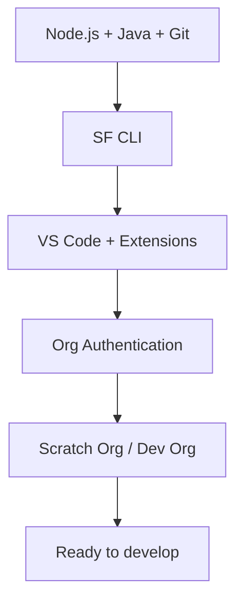

# Environment Setup

**Everything you need installed and configured before writing your first line of Salesforce code with an AI tool.**

---

A working Salesforce development environment has five layers. Each layer depends on the one below it. Work through them in order.

---

## Pages in this section

| Page | What it covers | Time |
|---|---|---|
| [prerequisites.md](./prerequisites.md) | Node.js, Java, Git, VS Code, SF CLI | 15 min |
| [org-types.md](./org-types.md) | Which Salesforce org type to use and when | 5 min read |
| [sf-cli-setup.md](./sf-cli-setup.md) | Install SF CLI, authenticate, daily commands | 10 min |
| [vscode-extensions.md](./vscode-extensions.md) | Required and recommended VS Code extensions | 5 min |
| [scratch-org-quickstart.md](./scratch-org-quickstart.md) | Create a scratch org from scratch in under 5 minutes | 5 min |

**Estimated time for full setup: 30 to 45 minutes** (faster if Node.js and Git are already installed).

---

## Minimum viable setup

If you need to get started immediately and will fill in gaps later:

1. Install SF CLI: `npm install -g @salesforce/cli`
2. Install VS Code + [Salesforce Extension Pack](https://marketplace.visualstudio.com/items?itemName=salesforce.salesforcedx-vscode)
3. Authenticate to a Developer Org: `sf org login web --alias MyDevOrg --set-default`
4. Load a context file for your AI tool (see [02-ai-tool-setup/](../02-ai-tool-setup/))

That covers the minimum. The full setup in this section adds Java (for Apex analysis), scratch org configuration (for reproducible environments), and linting (for LWC quality).

---

## Before you set up the environment

Read [00-before-you-vibe-code/](../00-before-you-vibe-code/) first if you haven't. Understanding why Salesforce development needs specific guardrails makes the setup steps make sense.
