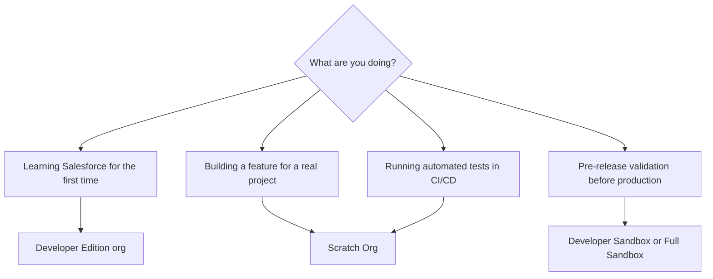

# Salesforce Org Types -- Which One to Use

**Never write code directly in production. Know which org type fits your work.**

---

## Org type comparison

| Org type | What it is | When to use | Data | Cost |
|---|---|---|---|---|
| Developer Edition (DE) | Free permanent org Salesforce provides at developer.salesforce.com | Personal learning, prototyping, trying out a new feature | Sample data included (Accounts, Contacts, Opportunities) | Free |
| Scratch Org | Temporary org (1 to 30 days) created from a JSON config file | Active feature development, CI/CD pipelines | Empty by default -- seeded via scripts or data import | Free (within Dev Hub scratch org limits) |
| Developer Sandbox | A copy of your production org's metadata | Pre-release testing, UAT in an environment that mirrors prod | Production metadata, no production data | Included with most paid Salesforce subscriptions |
| Full Sandbox | A copy of production metadata and data | Final validation before production deployment | Full copy of production data (up to a certain size) | Paid add-on to subscription |
| Trial Org | A 30-day full-featured org from Salesforce | Evaluating a specific Salesforce product, running demos | Pre-seeded with relevant sample data | Free |

---

## Which org type should you use?



---

## The case for Scratch Orgs in active development

Scratch Orgs are the recommended environment for all active development. Here's why:

**Reproducible.** A scratch org is defined entirely by a JSON config file committed to source control. Any developer on the team runs one command and gets an identical environment. No manual setup, no "works on my machine" problems.

**Disposable.** When a scratch org gets into a bad state (conflicting metadata, corrupted config, test data mess), delete it and create a new one in under two minutes. You can't do this with a sandbox.

**Forces source control discipline.** Metadata only exists in the scratch org for its lifetime (up to 30 days). If it's not in source control, it disappears when the org expires. This is a feature, not a bug. It prevents the "I made a change directly in prod" problem.

**Free.** A Dev Hub org (required to create scratch orgs) comes with a Developer Edition or any paid Salesforce subscription. Scratch org creation is limited by daily and active org counts, but those limits are generous for individual development.

---

## **Anti-Pattern**: coding directly in a sandbox shared by the whole team

```
Production org
    |
    └── Shared Dev Sandbox  <-- everyone makes changes here
            |
            No source control
            No record of who changed what
            "It worked yesterday" is your only rollback plan
```

This is the most common setup in teams that haven't adopted source-driven development. It creates deployment conflicts, overwrites other developers' work, and makes it impossible to reproduce the environment.

---

## Recommended setup for a new project

```mermaid
flowchart LR
    A[Dev Hub org\n(free DE or paid SF org)] --> B[Scratch Org per developer\nor per feature branch]
    B --> C[Source control\nGitHub / GitLab]
    C --> D[CI/CD pipeline\ncreates fresh scratch org\nruns tests\ndeploys to sandbox]
    D --> E[Developer Sandbox\nfor UAT]
    E --> F[Production]
```

Start with the left side. You don't need CI/CD to benefit from scratch orgs. A single developer with a Dev Hub and a scratch org has a better workflow than a team sharing a sandbox with no source control.

---

## Setting up a Dev Hub

A Dev Hub is any Salesforce org with the "Dev Hub" feature enabled. This gives you the ability to create scratch orgs.

1. Go to **Setup** in your Developer Edition or production org.
2. Search for **Dev Hub** in the Quick Find box.
3. Enable **Dev Hub**.
4. Optionally enable **Second-Generation Packaging** if you plan to use unlocked packages.

Once enabled, authenticate the CLI to this org as your Dev Hub:

```bash
sf org login web --alias DevHub --set-default-dev-hub
```

Then follow [scratch-org-quickstart.md](./scratch-org-quickstart.md) to create your first scratch org.
