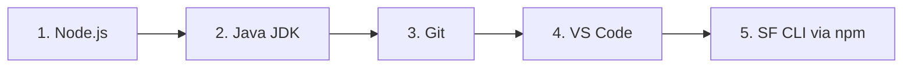

# Prerequisites

**Install these before anything else.**

---

These five tools form the base layer of every Salesforce development environment. SF CLI depends on Node.js. The Apex Language Server in VS Code depends on Java. Everything depends on Git. Install them in the order listed.

---

## Required tools

| Tool | Minimum version | Install | Why needed |
|---|---|---|---|
| Node.js | 18+ | [nodejs.org](https://nodejs.org) (LTS release) | SF CLI runs on Node. Jest (LWC unit testing) also requires Node. |
| Java JDK | 11+ | [adoptium.net](https://adoptium.net) (Temurin distribution) | The Apex Language Server in VS Code uses Java for IntelliSense, code completion, and error highlighting. |
| Git | latest | [git-scm.com](https://git-scm.com) | Version control and required by several SF CLI operations. |
| VS Code | latest | [code.visualstudio.com](https://code.visualstudio.com) | Primary editor. The Salesforce Extension Pack only publishes for VS Code. |
| SF CLI | v2 latest | `npm install -g @salesforce/cli` | All Salesforce operations: deploy, retrieve, test, org management, scratch orgs. |

---

## Install order



Install Node.js and Java first because VS Code extensions detect them at startup. Installing them after VS Code means restarting the editor before extensions pick them up.

---

## Verify your installs

Run these commands after installing each tool. All four should return version strings without errors.

```bash
node --version
# Expected: v18.x.x or higher

java -version
# Expected: openjdk version "11.x.x" or higher (output goes to stderr -- that is normal)

git --version
# Expected: git version 2.x.x

sf --version
# Expected: @salesforce/cli/2.x.x ...
```

If any command returns "command not found", see the troubleshooting table below.

---

## Common issues

| Issue | Fix |
|---|---|
| `sf: command not found` after `npm install -g @salesforce/cli` | Close and reopen your terminal. The npm global bin directory is added to PATH at session start. If it still fails, run `npm config get prefix` to find the global bin path and add it to your PATH manually. |
| Java not detected by the Apex Language Server in VS Code | Set the `JAVA_HOME` environment variable to your JDK installation directory (the folder that contains `bin/java`). Then restart VS Code. On Windows: `setx JAVA_HOME "C:\Program Files\Eclipse Adoptium\jdk-11.x.x"`. On macOS/Linux: `export JAVA_HOME=$(/usr/libexec/java_home)` in your shell profile. |
| Node version too old (v16 or lower) | Use [nvm](https://github.com/nvm-sh/nvm) (macOS/Linux) or [nvm-windows](https://github.com/coreybutler/nvm-windows) to install Node 18+ alongside your current version without uninstalling it. Run `nvm install 18 && nvm use 18`. |
| `npm install -g` fails with permission error on macOS | Don't use `sudo`. Configure npm to use a directory you own: `mkdir ~/.npm-global && npm config set prefix ~/.npm-global` then add `~/.npm-global/bin` to your PATH. |
| SF CLI installs but `sf` shows v1 (sfdx) behaviour | You may have both `sfdx` and `sf` installed. Run `npm uninstall -g sfdx-cli` to remove the old version. The new `@salesforce/cli` package is the v2 CLI. |

---

## After installing prerequisites

Next: [sf-cli-setup.md](./sf-cli-setup.md) to authenticate to a Salesforce org.

Or if you want to set up the editor first: [vscode-extensions.md](./vscode-extensions.md).
