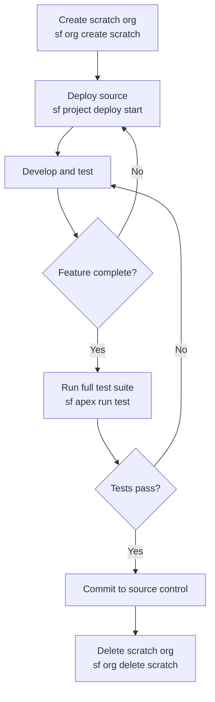

# Scratch Org Quickstart

**Create a reproducible development environment in under 5 minutes.**

---

## Prerequisites

- SF CLI installed (`sf --version` returns `@salesforce/cli/2.x.x`)
- A Dev Hub org with Dev Hub enabled (Setup > Dev Hub > Enable)
- CLI authenticated to the Dev Hub org

---

## Step 1: Authenticate to the Dev Hub

```bash
sf org login web --alias DevHub --set-default-dev-hub
```

You only need to do this once. After this, the CLI uses this org to create all scratch orgs.

---

## Step 2: Create sfdx-project.json

This file tells the CLI where your source lives and which API version to use. Create it in your project root if it doesn't exist.

```json
{
  "packageDirectories": [
    {
      "path": "force-app",
      "default": true
    }
  ],
  "namespace": "",
  "sourceApiVersion": "62.0"
}
```

Commit this file to source control. Every team member needs it.

---

## Step 3: Create a scratch org definition file

This file defines what kind of org to create. Save it as `config/project-scratch-def.json`.

```json
{
  "orgName": "My Dev Org",
  "edition": "Developer",
  "features": ["EnableSetPasswordInApi"],
  "settings": {
    "lightningExperienceSettings": {
      "enableS1DesktopEnabled": true
    }
  }
}
```

| Property | What it does |
|---|---|
| `orgName` | Display name for the org (appears in Setup and org lists) |
| `edition` | Salesforce edition to emulate. Use `Developer` for most features. Use `Enterprise` if you need approval processes or territory management. |
| `features` | Platform features to enable. `EnableSetPasswordInApi` lets you set passwords for test users via the API (required for some test patterns). |
| `settings` | Org settings to configure automatically on creation. |

Commit this file to source control. Anyone on the team can reproduce the exact same org configuration.

---

## Step 4: Create the scratch org

```bash
sf org create scratch \
  --definition-file config/project-scratch-def.json \
  --alias MyScratchOrg \
  --set-default \
  --duration-days 30
```

| Flag | What it does |
|---|---|
| `--definition-file` | Path to the scratch org definition JSON |
| `--alias` | Short name for this org in CLI commands |
| `--set-default` | Makes this the default org for commands that need `--target-org` |
| `--duration-days` | How many days before the org expires. Max is 30. |

Creation takes about 60 to 90 seconds.

---

## Step 5: Open the org in a browser

```bash
sf org open --target-org MyScratchOrg
```

This generates a one-time login URL and opens it in your default browser. No username or password needed.

---

## Step 6: Deploy your source

Push your local source files to the scratch org:

```bash
sf project deploy start --source-dir force-app --target-org MyScratchOrg
```

On a scratch org you can also use the faster `push` command that tracks only changed files:

```bash
sf project deploy start --target-org MyScratchOrg
```

---

## Step 7: Delete the org when done

Scratch orgs count against your Dev Hub's active org limit. Delete them when a feature is complete.

```bash
sf org delete scratch --target-org MyScratchOrg --no-prompt
```

---

## Full session flow



---

## Common issues

| Issue | Fix |
|---|---|
| `ERROR: The org you are trying to create requires the Dev Hub feature to be enabled` | Enable Dev Hub in your org: Setup > Dev Hub > Enable, then re-authenticate the CLI. |
| Scratch org creation fails with `EXCEEDED_ID_LIMIT` | You've hit the daily scratch org creation limit (usually 6 per day for Developer Edition Dev Hubs). Wait until midnight UTC or use a paid org Dev Hub. |
| `sf project deploy start` returns `No local changes to push` | The CLI thinks the source is already deployed. Run `sf project deploy start --source-dir force-app` to force a full deploy. |
| Org expires before the feature is done | Create a new scratch org and redeploy from source control. This is normal -- always keep your source current so recreating the org takes under two minutes. |

---

## Why commit the scratch org definition?

The definition file is the recipe for your environment. When it's committed to source control:

- New team members run `sf org create scratch` and get an identical environment without any manual setup
- CI/CD pipelines create a fresh org for every pull request, run tests, and discard it
- You can recreate a known-good environment at any point in git history

Without the definition file in source control, "works on my machine" is guaranteed to happen.
