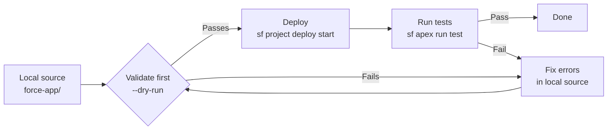

# SF CLI Setup and Authentication

**Install, authenticate, and verify the Salesforce CLI.**

---

## Install

```bash
npm install -g @salesforce/cli
```

Verify the install:

```bash
sf --version
# Expected output: @salesforce/cli/2.x.x darwin-arm64 node-v18.x.x
```

If you see `sfdx` in the version output instead of `@salesforce/cli`, you have the deprecated v1 CLI. Uninstall it and reinstall:

```bash
npm uninstall -g sfdx-cli
npm install -g @salesforce/cli
```

---

## Authenticate to a Developer Org (browser flow)

Use this for local development where you have a browser available.

```bash
sf org login web --alias MyDevOrg --set-default
```

A browser window opens. Log in to your Salesforce org. After approving access, the CLI stores the session credentials locally.

Verify authentication worked:

```bash
sf org display --target-org MyDevOrg
```

Expected output includes the org's username, instance URL, and expiry date of the access token.

---

## Authenticate via JWT (CI/CD -- no browser)

Use this in automated pipelines where no browser is available. Requires a Connected App with a certificate configured in Salesforce.

```bash
sf org login jwt \
  --username admin@myorg.com \
  --jwt-key-file server.key \
  --client-id <consumerKey> \
  --alias MyDevOrg
```

Where:
- `server.key` is the private key matching the certificate uploaded to the Connected App
- `<consumerKey>` is the Consumer Key from the Connected App detail page in Setup

For a full guide on JWT auth and Connected App setup, see [02-ai-tool-setup/ci-authentication.md](../02-ai-tool-setup/ci-authentication.md).

---

## Daily commands reference

| Command | What it does |
|---|---|
| `sf org list` | List all authenticated orgs and their aliases |
| `sf org display --target-org <alias>` | Show details for a specific org (URL, username, token expiry) |
| `sf project deploy start --source-dir force-app --target-org <alias>` | Deploy all source in force-app to the org |
| `sf project deploy start --source-dir force-app --target-org <alias> --dry-run` | Validate the deploy without committing changes |
| `sf project retrieve start --manifest manifest/package.xml --target-org <alias>` | Pull metadata from the org into local source files |
| `sf apex run test --target-org <alias> --test-level RunLocalTests --code-coverage --wait 30` | Run all local Apex tests and display coverage |
| `sf apex run test --target-org <alias> --class-names MyServiceTest --wait 10` | Run a single test class |
| `sf apex run --file scripts/apex/myScript.apex --target-org <alias>` | Execute an anonymous Apex script |
| `sf data query --query "SELECT Id, Name FROM Account LIMIT 5" --target-org <alias>` | Run a SOQL query and display results in the terminal |
| `sf org open --target-org <alias>` | Open the org in your default browser |
| `sf org logout --target-org <alias>` | Remove stored credentials for an org |

---

## Deployment flow



Always validate before deploying to a sandbox or production org. The `--dry-run` flag runs the full deployment check (including test classes) without making any changes to the org.

---

## Set a default org

Setting a default org means you can omit `--target-org` from most commands.

```bash
# Set default org
sf config set target-org MyDevOrg

# Check what the current default is
sf config get target-org
```

Use this when working on a single org for an extended session. Always double-check the default before running a deploy command -- deploying to the wrong org is a common mistake.

---

## Note on `sfdx` vs `sf`

The `sfdx` command prefix is deprecated. It still works in SF CLI v2 for backward compatibility, but Salesforce will remove it in a future release. All commands in this guide use the current `sf` prefix.

| **Wrong** (avoid) | Current |
|---|---|
| `sfdx force:source:deploy` | `sf project deploy start` |
| `sfdx force:apex:test:run` | `sf apex run test` |
| `sfdx force:org:create` | `sf org create scratch` |
| `sfdx force:data:soql:query` | `sf data query` |
