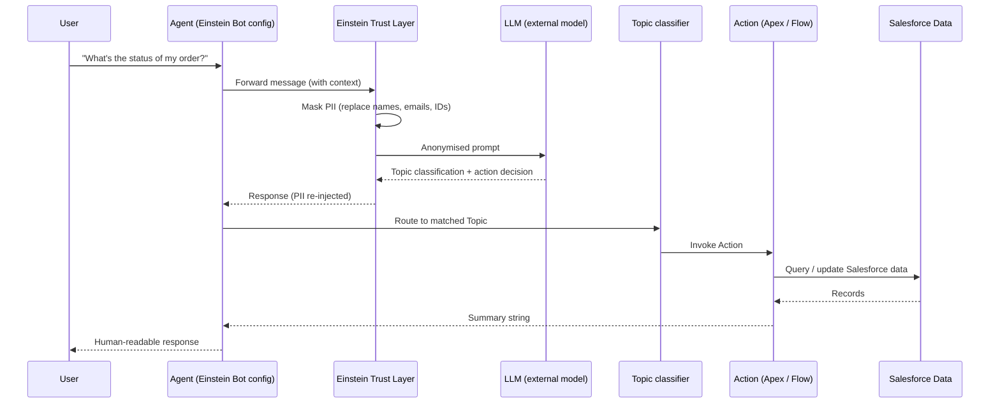

# Agentforce Architecture

**Agentforce is Salesforce's AI agent platform. Before you build one, understand how the pieces connect. The LLM never touches your data directly.**

## How the Pieces Connect



All data access happens through Apex or Flow actions, which run inside Salesforce with full security enforcement.

## The Einstein Trust Layer

Sits between your agent and the external LLM. It does two things:

1. **PII masking before sending**: Names, email addresses, phone numbers, and other sensitive data are replaced with tokens before the prompt leaves Salesforce infrastructure.
2. **Audit logging**: Every prompt and response is logged for compliance and monitoring in the Einstein Trust Layer audit trail.

Salesforce's contractual commitment is that your data never leaves their infrastructure for model training. The LLM processes the anonymised prompt and returns a response. The Trust Layer de-anonymises it before passing it back to the agent.

## Topics

A Topic is an intent classifier paired with a set of Actions. When a user sends a message, the LLM reads all your Topic descriptions and picks the best match.

The `description` field is what the LLM uses to classify. Write it like you're telling the LLM what this Topic handles:

```
// Weak description — LLM won't know when to use this
Description: "Order topic"

// Strong description — LLM knows exactly what this handles
Description: "Handle questions about existing order status, shipment tracking,
delivery dates, and order cancellation requests. Use when the user asks
about a specific order or mentions an order number."
```

A Topic also defines:
- **Instructions**: how the agent should behave within this topic (tone, escalation rules, what to say if data isn't found)
- **Actions**: which Actions are available when this topic is active

## Actions: 4 Types

| Type | Use when | Notes |
|---|---|---|
| **Invocable Apex** | Custom logic, data manipulation, callouts | Most flexible, full Apex capabilities |
| **Flow** | Simple data retrieval or updates | Easier to build, less powerful |
| **Prompt Template** | LLM-generated summaries or text | Uses Einstein generative AI, not deterministic |
| **Standard (Knowledge/Search)** | Searching Knowledge articles | Built-in, no custom code needed |

Most custom work uses Invocable Apex. Build it when you need to query related data, call external APIs, or apply business logic.

## Why @InvocableMethod Descriptions Matter

The LLM reads Action descriptions to decide which action to call within a topic. A vague description means wrong actions get called.

```apex
// Bad — LLM has no idea what this does or when to use it
@InvocableMethod(label='Get Order' description='Gets order information')
public static List<OrderResult> getOrder(List<OrderRequest> requests) { ... }

// Good — LLM knows exactly when to invoke this
@InvocableMethod(
    label='Get Order Status'
    description='Retrieves current status, estimated delivery date, and tracking number for a specific order. Use when the user provides an order number or asks about the status of a specific order.'
)
public static List<OrderResult> getOrderStatus(List<OrderRequest> requests) { ... }
```

## The Summary Pattern

Every Invocable Apex action should return a human-readable `String` summary. That's what the agent surfaces to the user, not raw records or JSON.

```apex
public class GetOrderStatusAction {

    public class OrderRequest {
        @InvocableVariable(required=true)
        public String orderNumber;
    }

    public class OrderResult {
        @InvocableVariable
        public String summary; // agent reads this and delivers to user
    }

    @InvocableMethod(
        label='Get Order Status'
        description='Retrieves current status and estimated delivery for a specific order number.'
    )
    public static List<OrderResult> execute(List<OrderRequest> requests) {
        List<OrderResult> results = new List<OrderResult>();
        for (OrderRequest req : requests) {
            Order__c order = [
                SELECT Status__c, EstimatedDelivery__c, TrackingNumber__c
                FROM Order__c
                WHERE OrderNumber__c = :req.orderNumber
                WITH SECURITY_ENFORCED
                LIMIT 1
            ];
            OrderResult result = new OrderResult();
            result.summary = 'Order ' + req.orderNumber
                + ' is currently ' + order.Status__c
                + '. Estimated delivery: ' + order.EstimatedDelivery__c.format()
                + '. Tracking number: ' + order.TrackingNumber__c + '.';
            results.add(result);
        }
        return results;
    }
}
```

Don't return raw field values and expect the LLM to format them.

## Guardrails Checklist

Before deploying an Agentforce agent, verify all of these:

- [ ] Every Topic description clearly describes what user intents it handles
- [ ] Every Action description specifies when the LLM should call it
- [ ] All Invocable Apex actions return a human-readable summary String
- [ ] All Apex actions use `WITH SECURITY_ENFORCED` or `Security.stripInaccessible()` (agents run in user context)
- [ ] The agent has a fallback Topic for unrecognised intents (avoids silent failures)
- [ ] Test the agent with at least 5 edge-case prompts in Agent Builder before activating
