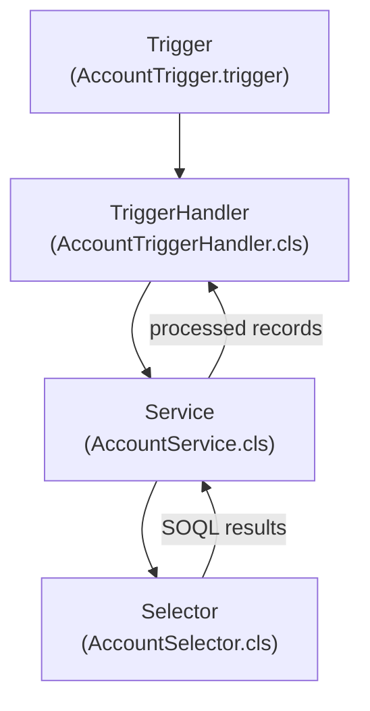

# Apex Layered Architecture

**Put logic in the wrong layer and you'll spend days debugging interactions between triggers and flows. This structure prevents that.**

## The 4 Layers



## What Each Layer Owns

| Layer | Owns | Never does |
|---|---|---|
| **Trigger** | Calls handler, passes Trigger.new / Trigger.oldMap | Logic, SOQL, DML, conditionals |
| **TriggerHandler** | Routes to service methods based on trigger context (isBefore, isAfter, isInsert, etc.) | Business logic, SOQL |
| **Service** | All business logic, DML | SOQL (delegates to Selector) |
| **Selector** | All SOQL | DML, business logic |

## Code Examples

### **Anti-Pattern**: logic in the trigger

```apex
// DON'T DO THIS
trigger AccountTrigger on Account (before insert, after update) {
    if (Trigger.isBefore && Trigger.isInsert) {
        for (Account acc : Trigger.new) {
            if (acc.BillingCountry == null) {
                acc.BillingCountry = 'US';
            }
        }
    }
    if (Trigger.isAfter && Trigger.isUpdate) {
        List<Contact> contacts = [SELECT Id FROM Contact WHERE AccountId IN :Trigger.newMap.keySet()];
        // ... more logic
    }
}
```

This buries logic in a place that can't be unit tested cleanly, can't be bypassed, and gets messy fast.

### Trigger — one line body

```apex
trigger AccountTrigger on Account (
    before insert, before update, before delete,
    after insert, after update, after delete, after undelete
) {
    new AccountTriggerHandler().run();
}
```

### TriggerHandler — routes only

```apex
public with sharing class AccountTriggerHandler extends TriggerHandler {

    private List<Account> newList;
    private Map<Id, Account> oldMap;

    public AccountTriggerHandler() {
        this.newList = (List<Account>) Trigger.new;
        this.oldMap  = (Map<Id, Account>) Trigger.oldMap;
    }

    protected override void beforeInsert() {
        AccountService.setDefaultBillingCountry(this.newList);
    }

    protected override void afterUpdate() {
        AccountService.syncContactsOnAccountRename(this.newList, this.oldMap);
    }
}
```

No SOQL. No business logic. Just routing.

### Service — logic lives here

```apex
public with sharing class AccountService {

    public static void setDefaultBillingCountry(List<Account> accounts) {
        for (Account acc : accounts) {
            if (String.isBlank(acc.BillingCountry)) {
                acc.BillingCountry = 'US';
            }
        }
        // No SOQL — data passed in. No DML on before trigger (platform handles it).
    }

    public static void syncContactsOnAccountRename(
        List<Account> newAccounts,
        Map<Id, Account> oldMap
    ) {
        Set<Id> changedIds = new Set<Id>();
        for (Account acc : newAccounts) {
            if (acc.Name != oldMap.get(acc.Id).Name) {
                changedIds.add(acc.Id);
            }
        }
        if (changedIds.isEmpty()) return;

        List<Contact> contacts = AccountSelector.getContactsByAccountIds(changedIds);
        for (Contact c : contacts) {
            c.Description = 'Account renamed to: ' + newAccounts[0].Name;
        }
        update contacts;
    }
}
```

### Selector — all SOQL here

```apex
public inherited sharing class AccountSelector {

    public static List<Contact> getContactsByAccountIds(Set<Id> accountIds) {
        return [
            SELECT Id, AccountId, Description
            FROM Contact
            WHERE AccountId IN :accountIds
            WITH SECURITY_ENFORCED
        ];
    }

    public static List<Account> getAccountsWithRevenue(Set<Id> accountIds) {
        return [
            SELECT Id, Name, AnnualRevenue, BillingCountry
            FROM Account
            WHERE Id IN :accountIds
            WITH SECURITY_ENFORCED
        ];
    }
}
```

## Why `inherited sharing` on Selectors

Selectors are called from multiple layers and contexts. A Service running `with sharing` calls a Selector. An admin batch job running `without sharing` calls the same Selector. `inherited sharing` means the Selector takes whatever sharing context its caller has, which is the right behavior. The caller decides the access level; the Selector just runs the query.

If you put `with sharing` on the Selector directly, your admin batch job will silently miss records it should be processing.

## The Bypass Pattern

Use Custom Permissions, not static booleans.

Static booleans are fragile. They reset per transaction boundary and can't be controlled from configuration without a code deploy.

```apex
// In TriggerHandler base class or at the top of each handler
protected override void beforeInsert() {
    if (FeatureManagement.checkPermission('Bypass_AccountTrigger')) return;
    AccountService.setDefaultBillingCountry(this.newList);
}
```

Create a Custom Permission called `Bypass_AccountTrigger` in your org metadata. Assign it to integration users or admin profiles that need to load data without trigger side effects. No code change needed to toggle it.

```xml
<!-- force-app/main/default/customPermissions/Bypass_AccountTrigger.customPermission-meta.xml -->
<?xml version="1.0" encoding="UTF-8"?>
<CustomPermission xmlns="http://soap.sforce.com/2006/04/metadata">
    <description>Bypasses AccountTrigger logic for data load operations</description>
    <label>Bypass Account Trigger</label>
</CustomPermission>
```
