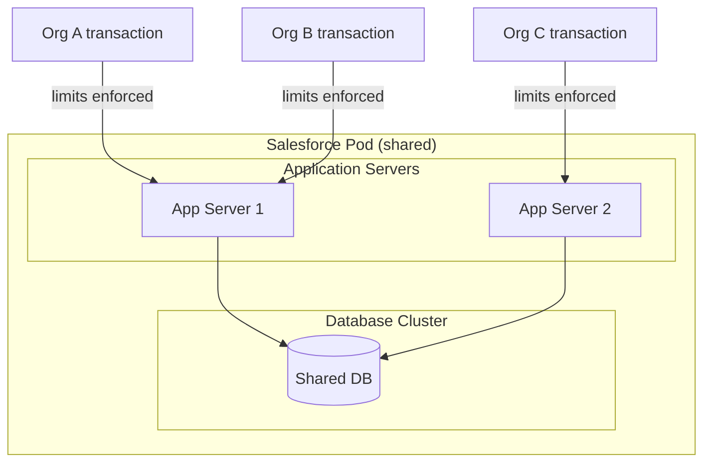

# Multi-Tenant Fundamentals

**Salesforce runs ~150,000 customer orgs on shared infrastructure. Governor limits are how they keep one org from starving everyone else.**

## What a Governor Limit Is

A hard cap on resources per transaction, enforced at runtime by the platform. You can't configure them. You can't buy more. When you hit one, Salesforce throws a `LimitException` and rolls back the transaction.

Every Apex execution context gets the same limits regardless of org size, plan tier, or load.

## Key Limits

| Resource | Limit per transaction |
|---|---|
| SOQL queries | 100 |
| SOQL rows returned | 50,000 |
| DML statements | 150 |
| DML rows processed | 10,000 |
| CPU time | 10,000 ms (synchronous), 60,000 ms (async) |
| Heap size | 6 MB (synchronous), 12 MB (async) |
| Callouts | 100 |
| Future method calls | 50 |
| Queueable jobs enqueued | 50 |

Design targets are roughly half these numbers. If your design hits 80 DML statements by design, you're one trigger handler away from a production incident.

## Why "It Works in My Dev Org" Is a Trap

Dev orgs have tiny data volumes. A SOQL query with no WHERE clause returns 12 rows in dev. In production it returns 47,000 and hits the row limit.

The limit doesn't hit at 3 records. It hits when a batch job processes 200 records and every record fires your trigger. 200 triggers × 2 SOQL queries each = 400 queries in one transaction context if you're not bulkifying. The limit is 100.

Always test with `List<SObject>` inputs of 200+ records, not single record saves.

## The Shared Resource Model

Multiple orgs run on the same pod (a cluster of application and database servers). The platform enforces limits per transaction per org, so no single org can monopolize CPU, memory, or database I/O.



Your transaction competes for the same app server threads and database connections as every other org on that pod. Governor limits are the mechanism that makes this fair.

## What "Per Transaction" Means

One Apex execution context = one set of limits. The transaction starts when something triggers Apex (a DML save, an API call, a scheduled job firing) and ends when that execution completes.

Async jobs get their own fresh transaction context. A Queueable job enqueued from a trigger executes in a separate transaction with a full new set of limits. That's one of the main reasons async exists.

```
Trigger fires (tx 1 starts)
  → calls Queueable.enqueue()        ← costs 1 queueable slot in tx 1
Trigger tx 1 completes               ← tx 1 limits consumed and released

Queueable executes (tx 2 starts)     ← fresh limits
  → makes callout
  → does DML
Queueable tx 2 completes             ← tx 2 limits consumed and released
```

Spawning async doesn't inherit the parent's limit consumption. It starts clean.

## Design Targets vs Hard Limits

| Resource | Hard limit | Design target |
|---|---|---|
| SOQL queries | 100 | < 10 per logical operation |
| DML statements | 150 | < 5 per logical operation |
| CPU time | 10,000 ms | < 3,000 ms |
| Heap | 6 MB | < 2 MB |

Aim for the design target. The gap between your design target and the hard limit is your safety margin for other code in the same transaction (other triggers, process builders, flows) that you don't control.
