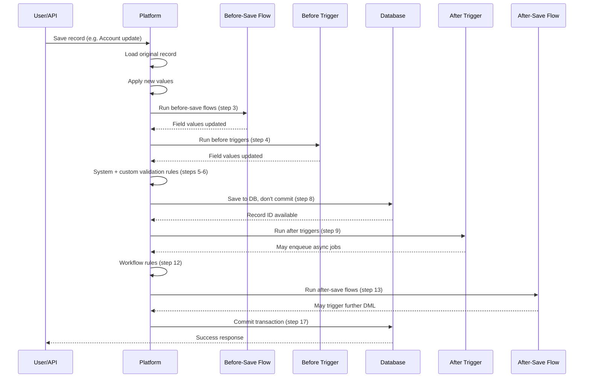

# Order of Execution

**Triggers, flows, validation rules, workflow all fire in a specific order. If you don't know this, you'll write logic that steps on itself.**

## The Full Sequence

When a record save operation runs, Salesforce processes in this order:

1. Load original record from database (or initialise for new records)
2. Load new values into the record and apply system defaults
3. **Before-save flows** (record-triggered flows set to run before save)
4. **Before triggers** (Apex triggers where `Trigger.isBefore == true`)
5. System validation (required fields, field format rules)
6. Custom validation rules
7. Duplicate rules
8. Save the record to the database (but don't commit yet)
9. **After triggers** (Apex triggers where `Trigger.isAfter == true`)
10. Assignment rules (lead/case assignment)
11. Auto-response rules
12. Workflow rules
13. **After-save flows** (record-triggered flows set to run after save)
14. Escalation rules
15. Entitlement rules
16. Roll-up summary field recalculations
17. Criteria-based sharing rule evaluation, then commit to database

## 3 Things That Surprise Most Developers

### 1. Before-save flows fire before before-triggers (step 3 vs step 4)

Most people assume triggers fire first because they're "code". They don't. A before-save flow runs at step 3, and your before-trigger runs at step 4. If both set the same field, the trigger wins. It runs after and overwrites the flow's value.

### 2. After-save flows fire after after-triggers (step 13 vs step 9)

After triggers are step 9. After-save flows are step 13. If your flow expects data that an after-trigger creates (like a child record), the flow will find it because it runs later. But if your after-trigger expects data a flow creates, it won't be there yet.

### 3. Workflow field updates restart the sequence from step 1

Workflow rules are evaluated at step 12. If a workflow field update fires, the entire save sequence restarts from step 1 for the updated record. Before and after triggers run a second time. This is a common cause of infinite loops and unexpected double-processing.

## Platform Events and Transaction Rollbacks

Platform Events published during a transaction are **not rolled back** if the transaction fails. They're committed independently of the DML transaction. If you publish a Platform Event and then hit a DML exception that rolls back everything else, the event is already published and will be delivered to subscribers.

Platform Events are meant for decoupled, fire-and-forget communication. That means you can't use them as part of an all-or-nothing transaction.

## Sequence Diagram: Typical Record Save

## Practical Rule

Decide who owns each piece of logic and document it. If a Flow sets a field, Apex doesn't also set it. If a before-trigger validates a condition, you don't need a validation rule for the same condition. Overlap causes double-processing, order-dependent bugs, and confusion for the next developer.

Use Apex triggers for complex logic that needs bulkification. Use Flows for simple field defaults and single-record operations. Never have both doing the same thing.
