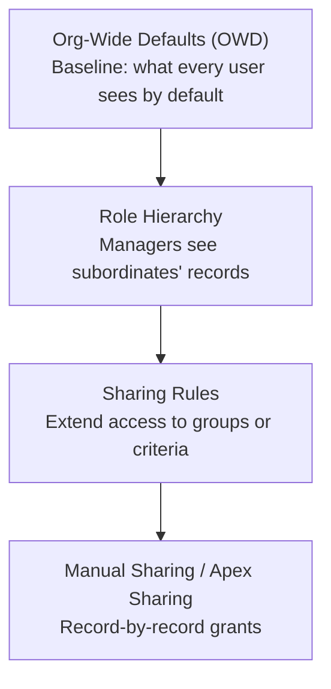

# Sharing Model

**OWD, role hierarchy, sharing rules, manual sharing — they stack. Get the order wrong and users either see too much or too little.**

## The 4 Layers



Each layer can only open access wider than the layer below it. Nothing in this model restricts access below what the Profile/PS object permissions allow. If a user can't see the object at all, sharing doesn't matter.

## OWD Settings

| Setting | Meaning |
|---|---|
| `Private` | Users can only see records they own (or shared with them via other layers) |
| `Public Read Only` | All users can see all records, but only the owner can edit |
| `Public Read/Write` | All users can see and edit all records |
| `Controlled by Parent` | Record visibility is inherited from the parent record (master-detail only) |

Set OWD as restrictive as possible, then open up with sharing rules. Granting access is easier than restricting it after the fact.

## Role Hierarchy

Sharing travels up. A user's manager in the role hierarchy automatically sees all records owned by anyone below them. The CEO at the top sees everything.

This is automatic for standard objects. For custom objects, enable the `Grant Access Using Hierarchies` setting on the object.

Role hierarchy sharing is based on record ownership, not on explicit sharing rules. If you transfer record ownership, the new owner's manager chain gains access and the old owner's chain loses it.

## Sharing Rules

Sharing rules extend access beyond OWD to users who aren't in the owner's role hierarchy.

Two types:

| Type | How it works |
|---|---|
| **Ownership-based** | Share records owned by a role/group with another role/group |
| **Criteria-based** | Share records where field values meet criteria (e.g., Status = 'Open') with a group |

Sharing rules can grant Read Only or Read/Write access. They can't grant access narrower than OWD.

## Apex Sharing Keywords

| Keyword | What it does |
|---|---|
| `with sharing` | Enforces all 4 sharing layers — users only see records they have access to |
| `without sharing` | Bypasses record visibility — user can query all records regardless of sharing |
| `inherited sharing` | Takes the calling class's sharing context |

When no keyword is specified, the default is `without sharing` for classes called from external contexts, but it's undefined when called from another Apex class. Always declare explicitly.

```apex
// Standard service class — always use with sharing
public with sharing class CaseService {
    public static List<Case> getOpenCases() {
        return [SELECT Id, Subject, Status FROM Case WHERE Status = 'Open' WITH SECURITY_ENFORCED];
        // Only returns cases the running user's sharing allows
    }
}

// Selector called from multiple contexts — inherited sharing is correct
public inherited sharing class CaseSelector {
    public static List<Case> getCasesByIds(Set<Id> caseIds) {
        return [SELECT Id, Subject, Status, OwnerId FROM Case WHERE Id IN :caseIds WITH SECURITY_ENFORCED];
        // Sharing context depends on what called this
    }
}

// Admin operation that intentionally bypasses sharing — document why
public without sharing class CaseEscalationService {
    // Runs as service account context for SLA breach escalation.
    // Needs to process all open cases regardless of assignment.
    public static void escalateBreachedCases(List<Id> caseIds) {
        // ...
    }
}
```

## When `without sharing` Is Legitimate

Don't default to `without sharing` because it's easier. Use it only when:

- **Admin operations**: batch jobs processing all records for reporting or data cleanup
- **System integrations**: inbound API processing records assigned to other users
- **Scheduled jobs running as a service account**: no human user context available
- **Trigger handlers**: trigger context doesn't have a meaningful "running user" for sharing

Always add a comment explaining why `without sharing` is intentional.

## Guest and Community User Access

External (Experience Cloud) users are controlled by the External OWD, which is separate from internal OWD and defaults to more restrictive settings.

| Internal OWD | External OWD | What this means |
|---|---|---|
| Public Read/Write | Private | Internal users see everything, guests see nothing |
| Private | Private | Both restricted to owned/shared records |

Guest users (unauthenticated site visitors) are the most restricted. They can only access records explicitly shared via Guest User sharing rules or owned by the Guest User account.

Authenticated community users follow the same 4-layer model but starting from the External OWD baseline. Internal OWD settings don't apply to them.

```apex
// Check if you're dealing with a guest user context
Boolean isGuest = Auth.CommunitiesUtil.isGuestUser();
```
