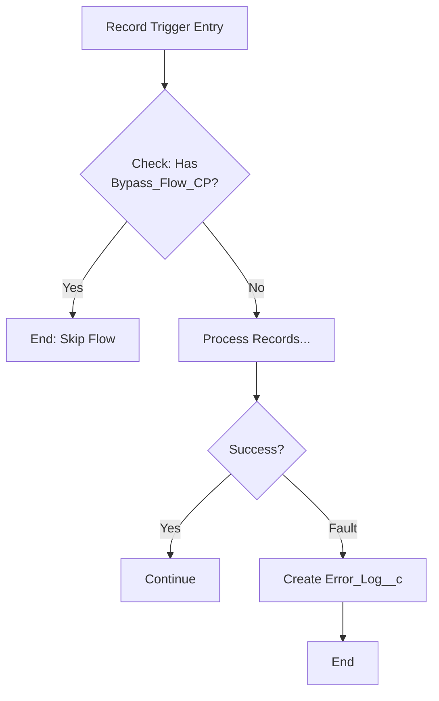

# Flow Fault Handling

**A Flow without fault paths fails silently. The user sees a generic error. You see nothing in the logs.**

---

## Every DML Element Needs a Fault Path

These elements can fail at runtime. Every one needs a fault connector:

- Create Records
- Update Records
- Delete Records
- Get Records (when configured to fail if no records found)
- Subflow elements (inherit the fault of the called flow)
- Action elements (Apex actions, email alerts, posts)

Skip the fault connector and Salesforce either shows the user an unformatted error screen or silently ends the flow, depending on the trigger type.

---

## The Silent Failure Anti-Pattern

```
[Update Records: Close Case] --> (fault) --> [End]
```

Fault path connects directly to End. Nothing logged. User sees "An error occurred". You open Flow debug logs and find nothing useful because the fault was swallowed.

---

## What the Fault Path Should Do

Write to a custom log object or publish a Platform Event. Don't just show a screen with a message.

```
[Update Records: Close Case]
    --> (success) --> [Next Step]
    --> (fault)   --> [Create Error_Log__c record]
                  --> [End]
```

For screen flows, add a fault screen to tell the user what happened. But always write the log first.

---

## Error Log Custom Object

Create `Error_Log__c` with these fields:

| Field | API Name | Type |
|---|---|---|
| Error Message | Error_Message__c | Long Text Area (32768) |
| Stack Trace | Stack_Trace__c | Long Text Area (32768) |
| Context | Context__c | Text (255) |
| Occurred At | Occurred_At__c | DateTime |

In your fault path Create Records element:

- `Error_Message__c` = `{!$Flow.FaultMessage}`
- `Context__c` = `"CaseClosureFlow - Update Records"`
- `Occurred_At__c` = `{!$Flow.CurrentDateTime}`

`{!$Flow.FaultMessage}` is the built-in Flow variable that holds the error text from the failed element. Always capture it.

---

## The Bypass Custom Permission Pattern

For record-triggered flows, check at entry and skip the entire flow if bypass is active. Don't check at each step.



Create a Custom Permission named `Bypass_CaseClosureFlow`. Assign it to a permission set for migration users or integration accounts. The first decision element checks `{!$Permission.Bypass_CaseClosureFlow}`. If true, go to End.

Bypass is data-driven and revocable without a deployment.

---

## Transform Over Loop

Use the Transform element instead of a Loop when mapping one collection to another.

**Use Loop when:**

- You need to accumulate a running total or counter
- You need a per-record decision (if X do Y, else do Z)
- You need to branch per record

**Use Transform when:**

- You're mapping Collection A to Collection B field-by-field
- You're filtering a collection by a condition in one pass
- You're merging two collections

Transform is 30-50% faster. It processes the entire collection in one step. With 1000 records, a Loop makes 1000 decision element evaluations. Transform makes one.

**Wrong:**
```
[Loop over Cases] --> [Assign: map fields to new SObject] --> [Add to collection] --> [back to Loop]
```

**Right:**
```
[Transform: Cases collection -> Custom Notification records, map Subject to Title, Id to RelatedId]
```

Use Transform any time you'd write "loop, assign, add to collection, loop again" and the logic is the same for every record.
