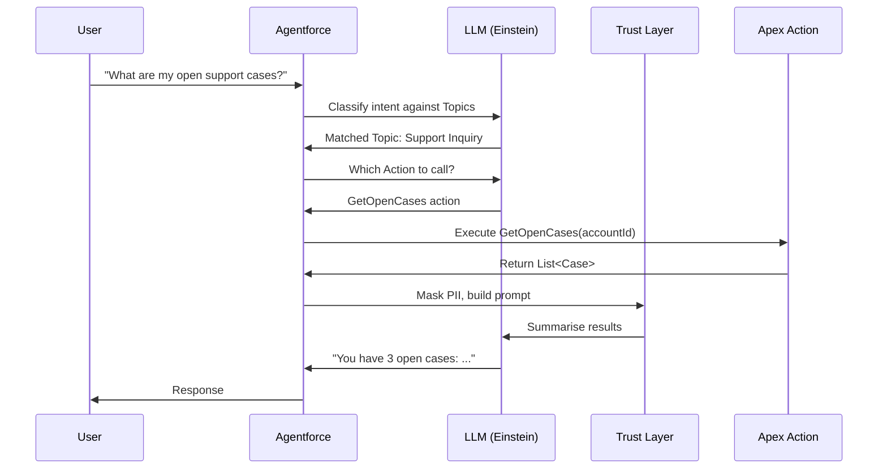

# Agentforce

**Salesforce's native AI agent platform. Topics classify intent. Actions execute work. The LLM never touches your data directly.**

---

## How It Works

A user sends a message. The LLM classifies it against the agent's Topics. The matched Topic determines which Actions are available. The LLM decides which Action to call, calls it, and uses the result to generate a response. Your data flows through Apex actions, not through the model itself.

---

## Files in This Section

| File | What It Covers |
|---|---|
| [invocable-apex-guide.md](invocable-apex-guide.md) | Writing Apex that agents can call: annotations, descriptions, request/response classes, FLS safety |
| [persona-system-prompt.md](persona-system-prompt.md) | System prompt design: length, scope, escalation rules, out-of-scope blocking |
| [einstein-trust-layer.md](einstein-trust-layer.md) | What the Trust Layer does and doesn't do, PII masking, audit trail |

---

## Key Vocabulary

| Term | What It Is |
|---|---|
| Agent | The configured AI assistant. Has a system prompt, topics, and actions. |
| Topic | A classification bucket. Defines scope and which actions are available for that intent. |
| Action | An Apex class, Flow, or other executable that the agent calls to do real work. |
| System Prompt | Instructions that define the agent's persona, scope, and rules. |
| Trust Layer | The PII masking and audit layer between Salesforce data and the LLM. |
