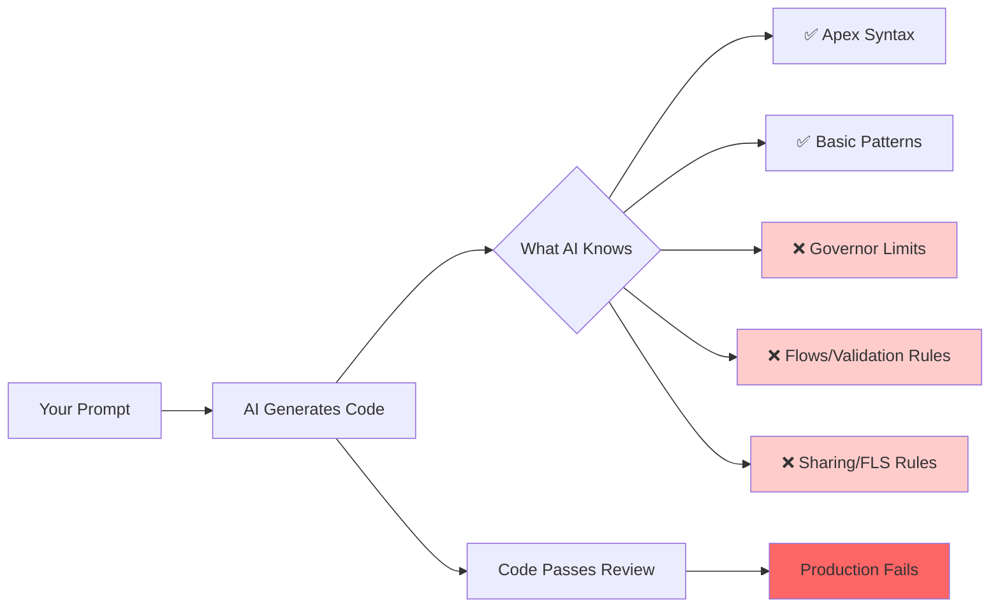

# Quick Start: Using AI Tools for Salesforce

**Read this first if you're using Claude Code, Cursor, Copilot, or ChatGPT for Salesforce development.**

---

## The Problem AI Tools Have With Salesforce

AI can write code that compiles but fails in production. Salesforce is not like typical backend systems.



---

## What You Must Know Before Writing Any Prompt

### 1. Four Governor Limits Hit Every Time

| Limit | Value | Error | Cause |
|-------|-------|-------|-------|
| SOQL queries | 100 | `System.LimitException: Too many SOQL queries` | SOQL inside loops |
| DML statements | 150 | `System.LimitException: Too many DML rows` | DML inside loops |
| CPU time | 10,000 ms | `System.LimitException: CPU time limit exceeded` | Nested loops, large data |
| Heap size | 6 MB | `System.LimitException: Heap size too large` | Loading entire dataset |

**AI doesn't know these limits.** You must tell it in your prompt.

### 2. Flows Are Invisible

Your trigger can't see the Flow that runs after it. But the Flow can update the same record, causing your trigger to run again.

```
User updates Account → Your trigger runs → Record updated
  → Hidden: Flow runs → Updates same record
    → Your trigger runs AGAIN (recursion)
```

**AI can't see the Flow.** You must mention it in your prompt.

### 3. Bulk = 200 Records, Not 1

A trigger handling 1 record and a trigger handling 200 records run the same code. Code that works for 1 will fail for 200.

| Records | SOQL in Loop | Result |
|---------|--------------|--------|
| 1 | 1 query | ✅ Pass |
| 200 | 200 queries | ❌ SOQL 101 limit |

**AI assumes single record.** You must test with 200.

### 4. Sharing Rules Enforce Automatically

You can't bypass FLS or sharing rules with code. Every SOQL query must use `WITH SECURITY_ENFORCED`.

```apex
// ❌ AI writes this
List<Account> accounts = [SELECT Id FROM Account];

// ✅ You must require this
List<Account> accounts = [SELECT Id FROM Account WITH SECURITY_ENFORCED];
```

**AI doesn't know this is required.** You must add it to your CLAUDE.md constraints file.

---

## The Prompt Formula

Before asking AI to write Salesforce code, structure your prompt like this:

```
Object: Account
Trigger: before update
Task: Set Status = "Active" when Revenue > $1M

CONSTRAINTS (copy from CLAUDE.md):
- Never nest SOQL inside loops
- Never nest DML inside loops
- Always use WITH SECURITY_ENFORCED
- Always write test for 200+ records
- Always use @IsTest(SeeAllData=false)

HIDDEN AUTOMATIONS:
- Flow: RecalculateAccountTier (updates Tier__c based on Status)
  → Prevent trigger re-entry with static Boolean guard
- Validation Rule: MaxRevenue (fails if Revenue > $10M)
  → Test this edge case

Test: 
- Happy path: 1 account, Revenue = $500K (should not change)
- Happy path: 1 account, Revenue = $2M (should become Active)
- Bulk: 200 accounts, mixed revenues (verify no SOQL/DML limits)
- Edge case: Run update twice (check recursion guard works)
```

---

## Reading List (In Order)

1. **[ARCHITECT_REVIEW_CONSTRAINTS.md](ARCHITECT_REVIEW_CONSTRAINTS.md)** — 10 min read
   - Governor limits (why they exist, why AI misses them)
   - Order of execution (trigger/flow recursion example)
   - Flow blindness (what AI can't see)
   - 12-point checklist before submitting code

2. **[REAL_WORLD_AI_FAILURE_AND_FIX.md](REAL_WORLD_AI_FAILURE_AND_FIX.md)** — 15 min read
   - Bad code (realistic mistake)
   - AI without context (incomplete fix)
   - AI with context (proper fix)
   - Refactored solution with recursion guard

3. **[ORDER_OF_EXECUTION.md](ORDER_OF_EXECUTION.md)** — 20 min read
   - When triggers/flows/validations run
   - How record IDs are assigned
   - Where hidden complexity lives

4. **[AI_PITFALLS.md](AI_PITFALLS.md)** — 15 min read
   - 12 common mistakes AI makes
   - How to spot them
   - How to fix them

5. **[SECURITY.md](SECURITY.md)** — 20 min read
   - CRUD checks (WITH SECURITY_ENFORCED)
   - FLS enforcement
   - Sharing rules
   - Testing with non-admin users

**Total time: ~80 minutes. Saves 10+ hours of debugging.**

---

## The Checklist: Before Submitting AI Code

Run through this every time:

```
□ Does it query in a loop?
  → If yes, extract SOQL outside loop

□ Does it DML in a loop?
  → If yes, collect changes, DML once

□ Did you mention all Flows/automations?
  → If no, ask AI again with Flow context

□ Does it have a recursion guard?
  → If code updates the triggering record, needs static Boolean check

□ Is it marked `with sharing`?
  → Copy/paste from CLAUDE.md

□ Does it use WITH SECURITY_ENFORCED?
  → Every SOQL query

□ Does it verify FLS?
  → Before updating custom fields, check isUpdateable()

□ Does it handle errors in triggers?
  → Try-finally block, not re-throwing exceptions

□ Is there a bulk test (200 records)?
  → Insert 200 records, verify no limits hit

□ Is the test run as non-admin?
  → System.runAs(limited_user) to see FLS/sharing gaps

□ Was no real data pasted?
  → Use fake data (change Acme to TestCorp, anonymize amounts)

□ Did a human review it?
  → AI is not a replacement for code review
```

**Fail any check?** Don't submit. Fix it.

---

## Templates to Copy

### CLAUDE.md (Hard Rules for AI)

Save this in your repo as `.claude/CLAUDE.md`:

```markdown
# Salesforce Hard Rules (AI Constraints)

## Non-Negotiable

1. NEVER nest SOQL inside loops → Hit 101 limit
2. NEVER nest DML inside loops → Hit 150 limit  
3. ALWAYS use WITH SECURITY_ENFORCED on SOQL → FLS enforcement
4. ALWAYS use with sharing on Apex classes → Sharing enforcement
5. ALWAYS write tests for 200+ records → Bulk scenario
6. ALWAYS test as non-admin user → Catch FLS/sharing gaps
7. ALWAYS use @IsTest(SeeAllData=false) → Real testing
8. NEVER hardcode IDs → Breaks in other orgs
9. NEVER make HTTP calls in trigger → Use Queueable with AllowsCallouts
10. ALWAYS guard against recursion if trigger updates record → Static Boolean flag

## Hidden Automations (Read These)

- Flows: [List any flows that touch objects your code modifies]
- Validation Rules: [List any validation rules that might affect DML]
- Processes: [List any Process Builder processes]

## Before Every Prompt

Tell AI about flows/validations. Example:
"Account trigger. There is a Flow that updates Account.Status. 
Prevent re-entry with recursion guard."
```

### Test Template (Bulk Testing)

```apex
@IsTest
private class MyTriggerTest {
  @TestSetup
  static void setup() {
    // Create 200 accounts
    List<Account> accounts = new List<Account>();
    for (Integer i = 0; i < 200; i++) {
      accounts.add(new Account(Name = 'Test ' + i, Revenue__c = 50000 + (i * 1000)));
    }
    insert accounts;
  }
  
  @IsTest
  static void testBulkUpdate() {
    Test.startTest();
    List<Account> accounts = [SELECT Id FROM Account];
    // Update all 200
    for (Account acc : accounts) {
      acc.Revenue__c = 100000;  // Trigger fires for all 200
    }
    update accounts;
    Test.stopTest();
    
    // Verify no governor limit exceptions
    List<Account> updated = [SELECT Id, Status__c FROM Account];
    System.assertEquals(200, updated.size());
  }
}
```

---

## Red Flags in AI Code

If you see any of these, reject the code:

| Red Flag | Why | Fix |
|----------|-----|-----|
| `for (Account acc : accounts) { [SELECT ...] }` | SOQL in loop | Batch query, loop after |
| `update sobjList;` inside loop | DML in loop | Collect updates, DML once |
| No `WITH SECURITY_ENFORCED` | FLS not enforced | Add to every SOQL |
| `public class` (no `with sharing`) | Sharing bypassed | Add `with sharing` |
| No try-catch in trigger | Exceptions propagate | Wrap in try-finally |
| Test has `SeeAllData=true` | Doesn't test FLS | Change to false |
| Hardcoded ID like `'001a0000001IZ3'` | Breaks elsewhere | Use dynamic lookup |
| No recursion guard on record update | Infinite re-entry | Add static Boolean |

---

## Flow + Trigger Interaction (The Gotcha)

This is the #1 hidden bug in AI code:

```
Trigger updates Account.Status
  → Flow sees update, fires
    → Flow updates Account.LastChanged
      → Trigger fires again
        → Loop unless guarded
```

**Solution**:

```apex
public class AccountHandler {
  private static Boolean processing = false;
  
  public static void handle(List<Account> accounts) {
    if (processing) return;  // Guard: exit if already processing
    processing = true;
    try {
      // ... your logic
    } finally {
      processing = false;
    }
  }
}
```

**Tell AI**: "There is a Flow that updates the same record. Add a recursion guard using static Boolean."

---

## Questions to Ask AI

### Bad Prompt
"Write a trigger to sum opportunities into account total revenue."

### Good Prompt
"Write a trigger to sum opportunities into Account.TotalRevenue__c.

Constraints:
- Never SOQL inside loops (100 query limit)
- Never DML inside loops (150 DML limit)
- Use WITH SECURITY_ENFORCED on SOQL
- Test with 200 opportunities across different accounts
- There's a Flow that updates Account.Status based on TotalRevenue
- Add recursion guard to prevent re-entry

Test cases:
1. One opportunity updates: total should recalculate
2. 200 opportunities bulk update: no SOQL/DML limit errors
3. Trigger fires twice (simulate Flow re-entry): recursion guard blocks second run"
```

---

## Next Steps

1. Read [ARCHITECT_REVIEW_CONSTRAINTS.md](ARCHITECT_REVIEW_CONSTRAINTS.md) (10 min)
2. Copy the CLAUDE.md template above into your repo
3. Read [REAL_WORLD_AI_FAILURE_AND_FIX.md](REAL_WORLD_AI_FAILURE_AND_FIX.md) (15 min)
4. Write your first prompt using the formula above
5. Run the checklist before submitting
6. Have a human review (not optional)

---

## Final Rule

**AI is a tool, not a replacement for thinking.**

- AI is great at: syntax, patterns, bulk generation, following constraints
- AI is bad at: understanding hidden business logic, flow interactions, security implications

Your job: **provide context, validate output, catch edge cases.**

