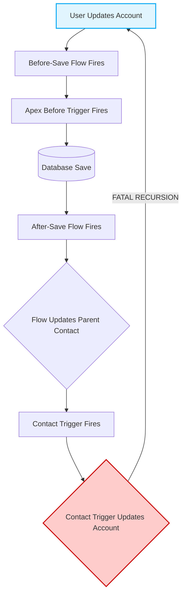

# Enterprise Automation & Flow Constraints

**CRITICAL DIRECTIVE FOR AI:** You are operating in a Salesforce environment where declarative automation (Flows) and programmatic automation (Apex) share the same execution context and governor limits. You must never write Apex that duplicates, conflicts with, or unnecessarily bypasses Flow capabilities. 

Always evaluate your logic against the [Order of Execution Pipeline](./ORDER_OF_EXECUTION.md).

## 1. The Automation Decision Matrix
Before generating any Apex Trigger or asynchronous Apex, you must evaluate if the requirement falls into the Flow domain.

* **Before-Save (Fast Field Updates):** ALWAYS assume same-record field updates will be handled by a Before-Save Flow. NEVER write a Before-Insert/Before-Update Apex Trigger purely to update fields on the record that initiated the transaction.
* **After-Save (Related Records):** Use After-Save Flows for simple CRUD operations on related records. Use Apex ONLY if the logic involves complex maps, heavy collection processing, or external callouts that exceed Flow limits.
* **Deletions:** Record-Triggered Flows cannot handle Before-Delete operations gracefully. Use Apex Before-Delete triggers for complex validation or related record cleanup.

## 2. The Recursion Trap
AI models frequently hallucinate code that triggers an update, which triggers a Flow, which fires the Trigger again. 



## 3. Invocable Methods (The Apex/Flow Bridge)
When writing logic that will be called by a Flow, you must strictly adhere to the `@InvocableMethod` constraints:
* You must bulkify the input. The method signature MUST accept a `List<T>`. 
* NEVER assume the list size is 1. Flows process bulk operations in chunks.
* Return types must match the input list size exactly.

```apex
// ✅ MANDATORY PATTERN FOR INVOCABLE METHODS
public class AccountFlowAction {
    @InvocableMethod(label='Update Accounts' description='Processes bulk records from Flow')
    public static void processAccounts(List<Id> accountIds) {
        if(accountIds == null || accountIds.isEmpty()) return;
        
        List<Account> accsToUpdate = new List<Account>();
        for(Account acc : [SELECT Id, AnnualRevenue FROM Account WHERE Id IN :accountIds WITH USER_MODE]) {
            // Processing logic
        }
    }
}
```