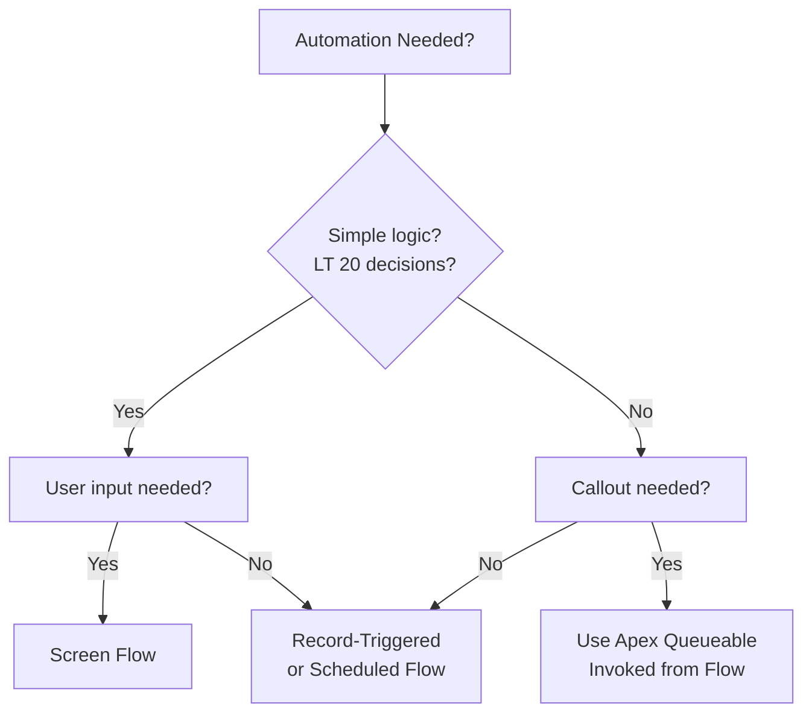

# Flow Best Practices

Flow is the primary declarative automation tool for Salesforce. This guide covers when to use Flow, its constraints, common patterns, and gotchas across all component types.

## When to Use Flow

Flow is your primary automation tool for declarative logic. Use it first. Invoke Apex from Flow only when Flow hits its constraints.



**Use Flow when**:
- Logic is simple enough to visualize (under 20 decisions)
- Business logic changes frequently (admins can update without code)
- Subflows help organize complex flows into reusable pieces
- Error recovery via fault paths is valuable
- Formula conditions are sufficient for decisions
- Multi-step user input is needed (screen flows)

**Invoke Apex Queueable from Flow when**:
- Callouts are required (Flow cannot call HTTP directly; use Queueable with `Database.AllowsCallouts`)
- Bulk operations need Apex control (Queueable chaining for 200+ record batches)
- Transaction-level control is critical (Flow's error recovery may not be sufficient)

---

## Flow Types & Their Constraints

### 1. Record-Triggered Flow

**When**: Fires when a record is inserted, updated, or deleted.

**Example**:
```
Trigger: Account insert
→ Record-Triggered Flow fires
→ Update related Opportunities
→ Send notification emails
→ Create task
```

**Key Constraints**:
- Runs asynchronously after the triggering DML (transaction is separate)
- Cannot start from a screen
- Parallel execution: if 10 accounts insert, 10 flow instances run simultaneously
- Cannot recursively call other record-triggered flows without a guard
- Receives ALL inserted/updated records (cannot filter at trigger time)
- 10-minute timeout per flow instance

**Gotcha**: 1,000 account inserts = 1,000 flow instances spinning up in parallel. Each flow querying 10 opportunities hits governor limits fast.

**Fix**: Test with bulk data (see Bulk Testing section).

### 2. Screen Flow

**When**: Multi-step user-driven form in Lightning UI.

**Example**:
```
Screen 1: Name and Email input
→ Decision: Is email valid?
→ Screen 2: Confirmation
→ Screen 3: Submit → Create Contact
```

**Key Constraints**:
- Only invoked from Lightning UI (not automatically from triggers or scheduled)
- 30-minute inactivity timeout closes the flow
- User must be in a session to interact
- Cannot start from scheduled Apex or Platform Events

### 3. Scheduled Flow

**When**: Automation runs at a specific scheduled time.

**Example**:
```
Cron: Daily at 2 AM
Action: Find all Opportunities due in 7 days → Send reminder emails
```

**Key Constraints**:
- Scheduling is fixed (no dynamic scheduling per-record)
- Must be explicitly activated to run
- Runs in its own transaction (separate from triggering records)
- 10-minute timeout per execution
- Cannot make callouts directly (use Queueable invoked from Flow)

### 4. Autolaunched Flow (Invocable)

**When**: Called from Apex, other flows, or REST API.

**Example (from Apex)**:
```apex
Map<String, Object> inputs = new Map<String, Object>();
inputs.put('accountId', acc.Id);

Flow.Interview.CalculateAnnualSpendFlow interview = 
  new Flow.Interview.CalculateAnnualSpendFlow(inputs);
interview.start();
```

**Key Constraints**:
- Must be explicitly started (not automatic)
- Input/output variables must be defined in flow
- No visual elements (logic only)
- Returns output variables to invoker

---

## Flow Limits & Constraints

### Per-Flow Governor Limits

| Limit | Value | Impact |
|-------|-------|--------|
| SOQL queries | 100 | Large loops querying each record hit this |
| Records returned per query | 50,000 | Rare, but collection sizes matter |
| Loop iterations | 10,000 | Unusual; most loops exit earlier |
| DML operations | 10,000 | Bulk inserts/updates in loops risk hitting this |
| Time execution | 10 minutes | Long-running flows timeout |
| Flow data size | ~25 MB | Large collections cause memory pressure |
| Subflow depth | No hard limit | Deeply nested subflows become unmaintainable |

### No Direct Callouts

Flows **cannot make HTTP callouts directly**. Instead:
1. Flow calls Apex invocable action
2. Apex action (marked `@InvocableMethod`) makes callout via Queueable
3. Queueable returns result to flow via output variable (if needed)

This is a hard constraint, not a best practice.

---

## Subflows: Variable Passing & Scope

### Basic Subflow Pattern

```xml
<!-- Main Flow: AccountUpdate -->
<actionCall type="subflow">
  <label>Calculate Annual Spend</label>
  <name>CalculateSpendSubflow</name>
  <inputParameters>
    <paramName>accountId</paramName>
    <paramValue>{!accountRecord.Id}</paramValue>
  </inputParameters>
  <outputParameters>
    <paramName>totalSpend</paramName>
    <paramValue>{!totalSpend}</paramValue>
  </outputParameters>
  <faultPath>
    <connector>HandleError</connector>
  </faultPath>
</actionCall>

<!-- Subflow: CalculateSpendSubflow -->
<flow:definition>
  <inputVariable name="accountId" type="id"/>
  <outputVariable name="totalSpend" type="number"/>
  
  <recordLookup>
    <inputParameters>
      <filterCondition>
        <field>AccountId</field>
        <value>{!accountId}</value>
        <operator>equals</operator>
      </filterCondition>
    </inputParameters>
    <outputVariable>opportunities</outputVariable>
  </recordLookup>
</flow:definition>
```

### Recursion Prevention — Required Pattern

**Problem**: Record-triggered flow updates record → Same flow triggers again → Infinite loop.

**Pattern**: Guard the flow start with a flag variable. Exit early if already processing.

**Step 1: Check if flow is already running**
```xml
<!-- Create a boolean variable at flow level: var_isProcessing (default: false) -->
<decision>
  <label>Is Flow Already Processing?</label>
  <condition>
    <criterion>
      <leftValueReference>{!var_isProcessing}</leftValueReference>
      <operator>EqualTo</operator>
      <rightValue>true</rightValue>
    </criterion>
  </condition>
  <trueLabel>ExitFlow</trueLabel>
  <falseLabel>ContinueProcessing</falseLabel>
</decision>
```

**Step 2: Set the guard flag before any DML**
```xml
<assignment>
  <label>Set Guard: Mark Flow as Processing</label>
  <assignment>
    <assignToReference>{!var_isProcessing}</assignToReference>
    <operator>Assign</operator>
    <value>true</value>
  </assignment>
</assignment>
```

**Step 3: Update the record (which will re-trigger the flow, but guard will block)**
```xml
<recordUpdate>
  <inputParameters>
    <name>Status__c</name>
    <value>Updated</value>
  </inputParameters>
</recordUpdate>
<!-- Flow re-triggers here, but decision at Step 1 sees var_isProcessing=true, exits -->
```

**Key points**:
- Guard variable must be at flow level (not a record field, not a custom field)
- Check guard FIRST, before expensive queries or DML
- Set guard to true IMMEDIATELY after guard check
- Exit immediately if guard is true (don't proceed to expensive work)
- No need to reset guard manually (flow instance ends after execution)

### Subflow Best Practices

✅ **Do**:
- Pass only required data (e.g., `accountId`, not the entire record object)
- Always include fault paths on subflow calls
- Name output variables clearly (e.g., `totalSpend`, not `result`)
- Log subflow errors to admin
- Test subflows independently before testing parent flow

❌ **Don't**:
- Pass entire record objects (wastes memory and performance)
- Skip fault paths (failures will go unnoticed)
- Create deeply nested subflows (more than 3 levels becomes hard to debug)
- Pass sensitive data in variable names (visible in logs)
- Assume subflow will succeed without error handling

---

## Fault Paths & Error Recovery

Every subflow call must have a fault path:

```xml
<actionCall type="subflow">
  <label>Calculate Spend</label>
  <name>CalculateSpendSubflow</name>
  <faultPath>
    <connector>HandleError</connector>  <!-- Runs if subflow fails -->
  </faultPath>
</actionCall>

<actionCall type="sendEmail">
  <label>HandleError</label>
  <inputParameters>
    <subject>Flow Error in AccountUpdate: {!$Flow.FaultMessage}</subject>
    <body>Error details: {!$Flow.FaultMessage}</body>
    <recipientList>admin@company.com</recipientList>
  </inputParameters>
</actionCall>
```

**Available fault variables**:
- `{!$Flow.FaultMessage}` — Error message
- `{!$Flow.FaultStack}` — Stack trace

**Error recovery strategies**:
1. **Log and notify**: Record error in a custom log object, email admin
2. **Manual retry**: Admin reviews error and manually retries
3. **Don't auto-retry in flows**: Use Queueable for auto-retry patterns (exponential backoff, etc.)

---

## Platform Events & Flows

Flows can subscribe to Platform Events:

```xml
<flow:definition>
  <trigger type="event">
    <eventName>Custom_Event__e</eventName>
  </trigger>
  
  <!-- Event-triggered flow -->
  <actionCall type="updateRecord">
    <label>Update Account Status</label>
  </actionCall>
</flow:definition>
```

**Key property**: Runs asynchronously. Not part of the original triggering transaction.

**Use for**: Decoupled event-driven workflows (Account updated → Platform Event published → separate flow processes the event).

---

## Flow Orchestrator Patterns

Flow Orchestrator chains multiple flows into stages:

```
Orchestrator Flow:
├── Stage 1: Approval Flow (sequential)
├── Stage 2: Record Creation Flow (sequential)
├── Stage 3: Notification Flow (sequential)
└── End
```

**Key characteristics**:
- Stages run sequentially (or parallel if configured)
- State persists between stages
- Tracks which stage completed
- Good for multi-phase workflows (approval → creation → notification)

---

## From Apex Perspective: Invoking Flows

Apex can invoke autolaunched flows:

```apex
// Simple invocation
Map<String, Object> inputs = new Map<String, Object>();
inputs.put('accountId', acc.Id);
inputs.put('year', 2024);

Flow.Interview.CalculateSpendFlow interview = 
  new Flow.Interview.CalculateSpendFlow(inputs);
interview.start();

// Get output variables
Object totalSpend = interview.getVariableValue('totalSpend');
```

**Pattern**: Use for cross-component orchestration (Apex trigger calls flow, flow updates records, returns status to Apex).

---

## From LWC Perspective: Flow Visibility & Async Behavior

**Sync Flow Types (Screen Flow)**
- LWC can invoke screen flows directly (modal/frame)
- User sees flow UI in real time
- Flow waits for user input (synchronous from user perspective)

**Async Flow Types (Record-Triggered, Scheduled, Platform Event)**
- LWC cannot see when flow runs
- Record-triggered flows run AFTER triggering transaction completes
- Changes made by async flows are not visible to LWC wire adapters until LWC refreshes

**Pattern**: When LWC triggers an update that fires a record-triggered flow:

```javascript
import { LightningElement, wire } from 'lwc';
import { getRecord } from 'lightning/uiRecordApi';

export default class AccountDetail extends LightningElement {
  @wire(getRecord, { recordId: this.accountId, fields: ACCOUNT_FIELDS })
  account;

  handleSave() {
    // LWC saves record → record-triggered flow runs ASYNCHRONOUSLY
    // Flow updates fields on the record
    // But LWC's @wire cache still shows old data
    this.saveRecord();
    
    // Option 1: Force refresh immediately after save
    return refreshApex(this.account);
    
    // Option 2: Wait 2-3 seconds for flow to finish, then refresh
    // (Not reliable; use refreshApex instead)
  }
}
```

**Key behaviors**:
- LWC `@wire(getRecord)` does NOT auto-refresh when record-triggered flow updates the record
- You must call `refreshApex()` or make a new imperative fetch
- Screen flows show changes in real time (user waits for flow to finish)
- Async flows complete in background (LWC doesn't know when they finish)

---

## Common Mistakes & Fixes

### Mistake 1: SOQL in Loops

```xml
❌ Wrong:
Loop through 100 Accounts:
  → Query Opportunities WHERE AccountId = this account
  → (100 SOQL queries hit limit)

✅ Right:
Query ALL Opportunities WHERE AccountId IN {all account IDs}
→ (1 SOQL query)
Loop and process in memory
```

### Mistake 2: Infinite Recursion

```xml
❌ Wrong:
Record-Triggered Flow on Account:
  → Updates Account.Status
  → Flow triggers again (infinite loop)

✅ Right:
Set recursion guard flag FIRST
Check if guard is set → If yes, exit
Proceed with logic
```

### Mistake 3: Missing Variable Initialization

```xml
❌ Wrong:
Decision: Is totalAmount > 100?
(totalAmount is null, decision fails)

✅ Right:
Initialize totalAmount = 0
Loop and accumulate
Then decision
```

### Mistake 4: Assuming Record Exists

```xml
❌ Wrong:
Record-Triggered Flow expects record exists
→ But delete or filter might happen first
→ Record is null, updates fail silently

✅ Right:
Decision: Is Record null?
→ If null, exit
→ If not null, proceed
```

### Mistake 5: Time-Based Delays as Real-Time Updates

```xml
❌ Wrong:
Use Scheduled Flow for "near-real-time" updates
→ Not reliable, user waits, flow runs 5 minutes later

✅ Right:
Use Record-Triggered Flow for immediate updates
Use Scheduled Flow only for batch overnight jobs
```

---

## Testing Flows

### Manual Test Checklist

1. **Happy path**: Insert/update record with valid data, verify expected result
2. **Edge cases**: Null values, empty collections, boundary values
3. **Fault paths**: Deliberately fail a subflow, verify error handling
4. **Subflow isolation**: Test subflow separately first
5. **Bulk scenarios**: Insert 200+ records, verify flow handles volume

### Assertion Pattern

```xml
Test:
1. Bulk insert 200 Accounts
2. Record-triggered flow fires 200 times (parallel)
3. Query to verify all related Opportunities updated
4. Assert no SOQL/DML limit errors
5. Assert all Opportunity fields have expected values
```

### Common Test Issues

- **Problem**: Bulk test inserts 200 records, flow expects single record
- **Fix**: Loop inside flow or design flow to handle collections

- **Problem**: Manual test works, bulk test fails
- **Fix**: Record-triggered flows run in parallel; use bulk testing to catch concurrency issues

---

## Production Readiness Checklist

- ✅ All subflows have fault paths
- ✅ Fault paths log errors (send email, or create log record)
- ✅ Recursion guard in place (if flow updates triggering record)
- ✅ Bulk tested with 200+ records
- ✅ SOQL queries counted (< 100 per flow)
- ✅ DML operations counted (< 10,000 per flow)
- ✅ No queries inside loops (batch query, then loop)
- ✅ Variable names verified (no typos in references)
- ✅ Decision logic handles null values
- ✅ Output variables named clearly
- ✅ No reliance on time-based delays for critical workflows
- ✅ Cross-component integration tested (if Apex invokes flow or flow invokes Apex action)
