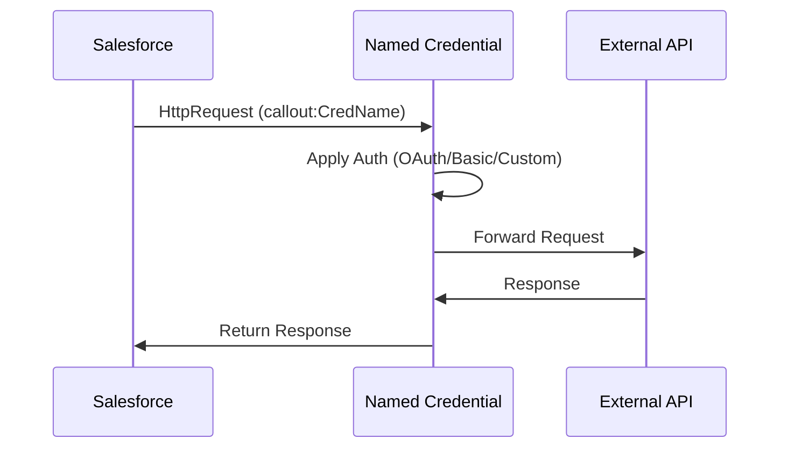
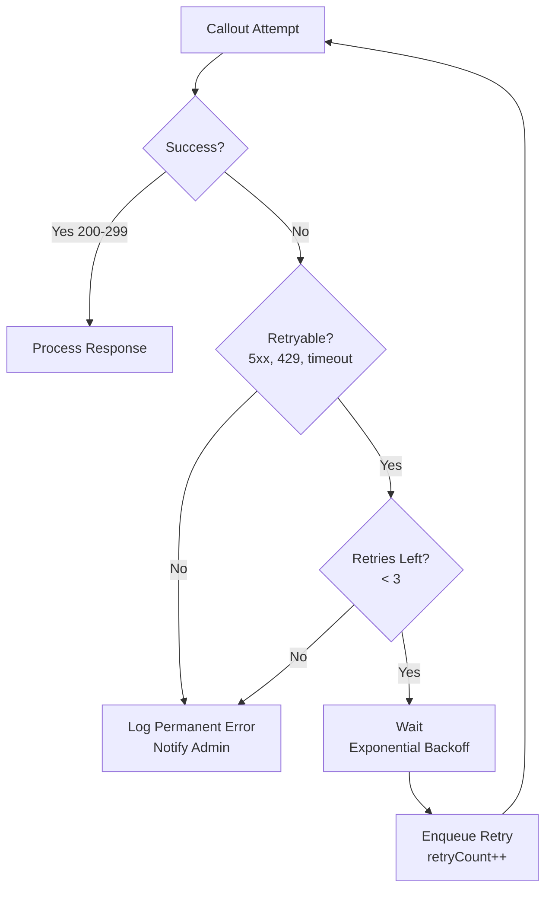

# Integration Patterns

Integration covers HTTP callouts, authentication, retry logic, and error handling for external system connections.

## Core Constraint: No Callouts in Trigger Context

Triggers cannot make HTTP callouts. This is a hard rule.

```apex
// ❌ Wrong
trigger AccountTrigger on Account (after insert) {
  callExternalSystem(Trigger.new);  // Fails at runtime
}

// ✅ Right
trigger AccountTrigger on Account (after insert) {
  System.enqueueJob(new UpdateExternalSystemQueueable(Trigger.new));
}
```

Triggers are synchronous. Callouts are asynchronous. Salesforce blocks callouts in trigger context to prevent deadlocks and timeouts.

---

## Callout Architecture Overview



---

## Callout Patterns by Component Type

Each component type follows a different pattern to make callouts:

```mermaid
flowchart TD
    A["Apex Trigger/<br/>Process"]
    B["Flow"]
    C["LWC Component"]
    
    A -->|enqueueJob| D["Queueable<br/>with AllowsCallouts"]
    B -->|invoke| E["Apex Invocable Action"]
    C -->|@AuraEnabled| F["Apex Controller"]
    
    D -->|implements<br/>Queueable| G["HTTP Callout"]
    E -->|creates| H["Queueable<br/>with AllowsCallouts"]
    F -->|enqueueJob| H
    
    H -->|send request| I["Named Credential<br/>applies auth"]
    I -->|HTTP| J["External API"]
    
    style D fill:#e1f5ff
    style H fill:#e1f5ff
    style I fill:#fff9c4
    style J fill:#f3e5f5
```

**Key point**: All three components ultimately use Queueable with `Database.AllowsCallouts` to make the actual HTTP request. The difference is how they *reach* the Queueable.

- **Apex**: Direct (Trigger → Queueable → HTTP)
- **Flow**: Indirect (Flow → Invocable Action → Queueable → HTTP)
- **LWC**: Indirect (LWC → Controller → Queueable → HTTP)

---

## Named Credentials

Named Credentials securely store authentication details. All outbound callouts should use Named Credentials instead of hardcoding auth headers.

### Types of Named Credentials

**REST Named Credential** (Apex callouts):
- Supports Basic Auth, Custom Header, OAuth 2.0
- Used in Apex via `callout:CredentialName` endpoint syntax
- Automatically injects auth header into request

**External Credential** (Enhanced OAuth support):
- Modern replacement for Named Credentials
- Supports Named Principal (shared service account) or User Principal (per-user auth)
- Used in same way: `callout:CredentialName/path`

### When to Use Each

| Type | Use When | Example |
|------|----------|---------|
| REST Named Cred + Basic Auth | Username/password API | Integration with legacy system |
| REST Named Cred + Custom Header | API Key only | Stripe, Twilio API keys |
| Named Credential + OAuth 2.0 | Delegated auth (all users share account) | Google Drive (service account) |
| External Credential + User Principal | Per-user OAuth (each user authenticates) | Google Workspace access as individual users |

### Setup REST Named Credential

1. Setup > Integrations > Named Credentials
2. New
3. **Label**: `ExternalSystem`
4. **Name**: `ExternalSystem` (used in code as `callout:ExternalSystem`)
5. **URL**: `https://api.example.com`
6. **Auth Type**: Select one:
   - Basic Auth: Username + Password
   - Custom Header: API Key in X-API-Key header
   - OAuth 2.0: Requires Auth Provider below
7. **Auth Provider** (if OAuth): Create or select
8. **Scope**: (if OAuth) Specify scopes per API docs (e.g., `https://www.googleapis.com/auth/contacts`)
9. Save

### Setup External Credential (OAuth)

1. Setup > Integrations > External Credentials
2. New
3. **Name**: `Google_Contacts_OAuth`
4. **Auth Type**: `OAuth 2.0`
5. **Principal Type**: Choose one:
   - Named Principal: All users use same auth (service account)
   - User Principal: Each user authenticates individually
6. **Principal**: Create or select
7. **Auth Provider**: Select from list
8. Save

### In Apex: Using Named Credentials

```apex
public class SyncAccountsQueueable implements Queueable, Database.AllowsCallouts {
  private List<Account> accounts;
  
  public void execute(QueueableContext context) {
    try {
      for (Account acc : accounts) {
        HttpRequest req = new HttpRequest();
        req.setEndpoint('callout:ExternalSystem/api/accounts');  // Uses Named Cred auth
        req.setMethod('POST');
        req.setHeader('Content-Type', 'application/json');
        req.setTimeout(60000);
        
        req.setBody(JSON.serialize(new Map<String, Object>{
          'name' => acc.Name,
          'externalId' => acc.External_Id__c
        }));
        
        Http http = new Http();
        HttpResponse res = http.send(req);
        
        if (res.getStatusCode() >= 400) {
          throw new CalloutException('API error: ' + res.getStatusCode());
        }
      }
    } catch (Exception ex) {
      handleError(ex);
    }
  }
  
  private void handleError(Exception ex) {
    // Log and notify admin
  }
}
```

**Key points**:
- Endpoint uses `callout:CredentialName/path` syntax
- Auth headers are added automatically
- Credentials are encrypted in Salesforce
- No hardcoded credentials in code

---

## Remote Site Settings & CSP Trusted Sites

If Named Credentials don't cover your use case, configure these networking rules.

### Remote Site Settings (for Apex)

Setup > Integrations > Remote Site Settings

- **Remote Site Name**: `Google_API`
- **Remote Site URL**: `https://www.googleapis.com` (must match exactly)
- **Disable Protocol Security**: False (keep security enabled)

Used when making HTTP callouts without Named Credentials (not recommended).

### CSP Trusted Sites (for LWC/browser)

Setup > Security > CSP Trusted Sites

- **Trusted Site Name**: `Google_API`
- **Trusted Site URL**: `https://www.googleapis.com`
- **CSP Directive**: `connect-src` (allows fetch/XHR from LWC)

Used when LWC makes fetch calls to external APIs.

---

## Callouts from Different Components

### Apex Callouts (Queueable Pattern)

```apex
// Triggered from trigger or anywhere else
trigger AccountTrigger on Account (after insert) {
  System.enqueueJob(new SyncAccountsQueueable(Trigger.new));
}

// Queueable with Database.AllowsCallouts
public class SyncAccountsQueueable implements Queueable, Database.AllowsCallouts {
  private List<Account> accounts;
  
  public void execute(QueueableContext context) {
    HttpRequest req = new HttpRequest();
    req.setEndpoint('callout:ExternalSystem/sync');
    req.setMethod('POST');
    req.setBody(JSON.serialize(accounts));
    
    Http http = new Http();
    HttpResponse res = http.send(req);
  }
}
```

**Pattern**: Trigger → Queueable → Callout

### Flow Callouts (via Apex Invocable Action)

Flows cannot make direct callouts. Instead, invoke an Apex action:

```apex
public class ExternalSyncAction {
  @InvocableMethod(label='Sync to External System')
  public static List<String> syncAccounts(List<ExternalSyncRequest> requests) {
    // Create Queueable to make callout
    System.enqueueJob(new ExternalSyncQueueable(requests));
    return new List<String>{'Queued'};
  }
}

public class ExternalSyncQueueable implements Queueable, Database.AllowsCallouts {
  private List<ExternalSyncRequest> requests;
  
  public void execute(QueueableContext context) {
    HttpRequest req = new HttpRequest();
    req.setEndpoint('callout:ExternalSystem/sync');
    req.setMethod('POST');
    req.setBody(JSON.serialize(requests));
    
    Http http = new Http();
    HttpResponse res = http.send(req);
    
    if (res.getStatusCode() < 400) {
      // Success
    } else {
      throw new CalloutException('Sync failed: ' + res.getStatusCode());
    }
  }
}
```

**In Flow**:
1. Add action element
2. Call ExternalSyncAction
3. Add fault path to handle error (callout fails)

**Pattern**: Flow → Apex Invocable Action → Queueable → Callout

### LWC Callouts (via Apex Controller)

LWC can make callouts only via server-side Apex controller (not direct fetch to external APIs without CSP setup):

```javascript
// LWC Component
import { LightningElement } from 'lwc';
import syncExternalAccount from '@salesforce/apex/AccountController.syncExternalAccount';

export default class AccountSync extends LightningElement {
  async handleSync() {
    try {
      const result = await syncExternalAccount({ accountId: this.recordId });
      console.log('Sync queued:', result);
    } catch (error) {
      console.error('Error:', error);
    }
  }
}
```

```apex
// Apex Controller
public with sharing class AccountController {
  @AuraEnabled
  public static String syncExternalAccount(String accountId) {
    Account acc = [SELECT Id, Name, External_Id__c FROM Account WHERE Id = :accountId];
    System.enqueueJob(new SyncAccountQueueable(acc));
    return 'Sync queued for account: ' + acc.Name;
  }
}

public class SyncAccountQueueable implements Queueable, Database.AllowsCallouts {
  private Account account;
  
  public void execute(QueueableContext context) {
    HttpRequest req = new HttpRequest();
    req.setEndpoint('callout:ExternalSystem/account');
    req.setMethod('POST');
    req.setBody(JSON.serialize(account));
    
    Http http = new Http();
    HttpResponse res = http.send(req);
  }
}
```

**Pattern**: LWC → Apex Controller (sync) → Queueable (async) → Callout

---

## Retry Logic

Retry only on transient errors (timeout, network, rate limit). Never retry on auth/validation errors.



### Apex Retry Pattern (Queueable)

```apex
public class ExternalSyncQueueable implements Queueable, Database.AllowsCallouts {
  private List<Account> accounts;
  private Integer retryCount = 0;
  private static final Integer MAX_RETRIES = 3;
  
  public ExternalSyncQueueable(List<Account> accounts) {
    this.accounts = accounts;
  }
  
  public ExternalSyncQueueable(List<Account> accounts, Integer retryCount) {
    this.accounts = accounts;
    this.retryCount = retryCount;
  }
  
  public void execute(QueueableContext context) {
    try {
      callExternalSystem();
    } catch (Exception ex) {
      handleError(ex);
    }
  }
  
  private void callExternalSystem() {
    HttpRequest req = new HttpRequest();
    req.setEndpoint('callout:ExternalSystem/sync');
    req.setMethod('POST');
    req.setHeader('Content-Type', 'application/json');
    req.setTimeout(60000);
    req.setBody(JSON.serialize(accounts));
    
    Http http = new Http();
    HttpResponse res = http.send(req);
    
    if (res.getStatusCode() >= 400) {
      throw new CalloutException('Status: ' + res.getStatusCode() + ' Body: ' + res.getBody());
    }
  }
  
  private void handleError(Exception ex) {
    Boolean isRetryable = isRetryableError(ex.getMessage());
    Boolean hasRetries = retryCount < MAX_RETRIES;
    
    if (isRetryable && hasRetries) {
      // Exponential backoff: 5, 25, 125 seconds
      Integer delaySeconds = (Integer) Math.pow(5, retryCount + 1);
      System.enqueueJob(
        new ExternalSyncQueueable(accounts, retryCount + 1),
        System.now().addSeconds(delaySeconds)
      );
    } else {
      logPermanentError(ex);
      notifyAdmin(ex);
    }
  }
  
  private Boolean isRetryableError(String message) {
    return message.contains('timeout') || 
           message.contains('connection') || 
           message.contains('503') || 
           message.contains('429');
  }
  
  private void logPermanentError(Exception ex) {
    ErrorLog__c log = new ErrorLog__c();
    log.Message__c = ex.getMessage();
    log.Stack_Trace__c = ex.getStackTraceString();
    log.Type__c = 'Integration Error';
    log.Retry_Count__c = retryCount;
    insert log;
  }
  
  private void notifyAdmin(Exception ex) {
    Messaging.SingleEmailMessage msg = new Messaging.SingleEmailMessage();
    msg.setToAddresses(new String[]{'admin@company.com'});
    msg.setSubject('Integration Failure: External Sync Failed After Retries');
    msg.setPlainTextBody('Permanent failure after ' + retryCount + ' retries.\n\n' + 
                         'Error: ' + ex.getMessage());
    Messaging.sendEmail(new Messaging.SingleEmailMessage[]{msg});
  }
}
```

### Flow Retry Pattern (Fault Path)

Flows handle retries via fault paths. Unlike Apex, don't auto-retry. Let admins decide:

```xml
<!-- In Flow: Invocable Action Call -->
<actionCall type="invocableAction">
  <label>Call External Sync</label>
  <name>ExternalSyncAction</name>
  <inputParameters>
    <name>accountIds</name>
    <value>{!accountIds}</value>
  </inputParameters>
  <faultPath>
    <connector>LogError</connector>
  </faultPath>
</actionCall>

<!-- Error Handler -->
<actionCall type="sendEmail">
  <label>LogError</label>
  <inputParameters>
    <subject>Flow Error: External Sync Failed</subject>
    <body>Error: {!$Flow.FaultMessage}</body>
    <recipientList>admin@company.com</recipientList>
  </inputParameters>
</actionCall>
```

---

## HTTP Request Patterns

### GET Request

```apex
HttpRequest req = new HttpRequest();
req.setEndpoint('callout:ExternalSystem/accounts/123');
req.setMethod('GET');
req.setHeader('Accept', 'application/json');
req.setTimeout(60000);

Http http = new Http();
HttpResponse res = http.send(req);

if (res.getStatusCode() == 200) {
  Map<String, Object> result = (Map<String, Object>) JSON.deserializeUntyped(res.getBody());
}
```

### POST with JSON Body

```apex
HttpRequest req = new HttpRequest();
req.setEndpoint('callout:ExternalSystem/accounts');
req.setMethod('POST');
req.setHeader('Content-Type', 'application/json');
req.setTimeout(60000);

Map<String, Object> payload = new Map<String, Object>{
  'name' => 'Acme Corp',
  'industry' => 'Technology'
};

req.setBody(JSON.serialize(payload));

Http http = new Http();
HttpResponse res = http.send(req);

Integer statusCode = res.getStatusCode();
String responseBody = res.getBody();
```

### Response Parsing

```apex
public class ApiResponse {
  public Integer statusCode;
  public String body;
  public Map<String, Object> parsedBody;
  
  public ApiResponse(HttpResponse res) {
    this.statusCode = res.getStatusCode();
    this.body = res.getBody();
    
    if (statusCode >= 200 && statusCode < 300) {
      this.parsedBody = (Map<String, Object>) JSON.deserializeUntyped(body);
    }
  }
  
  public Boolean isSuccess() {
    return statusCode >= 200 && statusCode < 300;
  }
  
  public Boolean isRetryable() {
    return statusCode >= 500 || statusCode == 429 || statusCode == 408;
  }
}
```

---

## JSON Serialization & Deserialization

### Safe Serialization

```apex
// ✅ Safe: JSON.serialize handles nulls
String json = JSON.serialize(payload);

// For explicit null handling:
Map<String, Object> payload = new Map<String, Object>();
payload.put('name', acc.Name);
payload.put('externalId', acc.External_Id__c != null ? acc.External_Id__c : '');
String json = JSON.serialize(payload);
```

### Safe Deserialization

```apex
// ❌ Risky: throws exception if JSON doesn't match class structure
ExternalUser user = (ExternalUser) JSON.deserialize(body, ExternalUser.class);

// ✅ Safe: catch deserialization errors
try {
  ExternalUser user = (ExternalUser) JSON.deserialize(body, ExternalUser.class);
} catch (Exception ex) {
  System.debug('JSON deserialization failed: ' + ex.getMessage());
  // Handle gracefully
}

// For untyped JSON (safer when API response is unpredictable):
Map<String, Object> result = (Map<String, Object>) JSON.deserializeUntyped(body);
String name = (String) result.get('name');
```

### Wrapper Classes

```apex
public class ExternalAccountPayload {
  public String name;
  public String externalId;
  public String industry;
  
  public ExternalAccountPayload(Account acc) {
    this.name = acc.Name;
    this.externalId = acc.External_Id__c;
    this.industry = acc.Industry;
  }
}

// Usage
String json = JSON.serialize(new ExternalAccountPayload(acc));
```

---

## Timeout Handling

Salesforce enforces a 120-second timeout for all HTTP callouts. Set your timeout lower to leave buffer:

```apex
private static final Integer TIMEOUT_MS = 60000;  // 60 seconds

public void execute(QueueableContext context) {
  HttpRequest req = new HttpRequest();
  req.setTimeout(TIMEOUT_MS);
  
  try {
    Http http = new Http();
    HttpResponse res = http.send(req);
  } catch (System.CalloutException ex) {
    if (ex.getMessage().contains('Timeout')) {
      handleTimeoutError(ex);
    }
  }
}
```

**Best practice**: If external API needs longer than 60 seconds, split the request into multiple smaller calls or use async polling.

---

## Rate Limiting & Backpressure

### Batching Strategy

```apex
public void execute(QueueableContext context) {
  List<Account> batch = new List<Account>();
  
  for (Account acc : accounts) {
    batch.add(acc);
    
    if (batch.size() == 10) {  // Send in batches of 10
      callBulkApi(batch);
      batch.clear();
    }
  }
  
  if (!batch.isEmpty()) {
    callBulkApi(batch);
  }
}

private void callBulkApi(List<Account> batch) {
  HttpRequest req = new HttpRequest();
  req.setEndpoint('callout:ExternalSystem/bulk');
  req.setBody(JSON.serialize(batch));
  
  Http http = new Http();
  HttpResponse res = http.send(req);
}
```

### Queue Depth Check

```apex
public void execute(QueueableContext context) {
  AsyncApexJob[] jobs = [SELECT Id FROM AsyncApexJob 
                         WHERE JobType = 'Queueable' AND Status = 'Queued' LIMIT 1];
  
  if (jobs.size() < 5) {
    callExternalSystem();
  } else {
    // Queue is full, re-enqueue with delay
    System.enqueueJob(new SyncQueueable(...), System.now().addSeconds(30));
  }
}
```

---

## Error Handling Patterns

### Graceful Degradation

```apex
try {
  callExternalSystem();
} catch (Exception ex) {
  System.debug('External sync failed, continuing: ' + ex.getMessage());
  // Continue processing local records
  // External sync will retry on next scheduled job
}
```

### Deadletter Queue

```apex
private void handleError(Exception ex, Account account) {
  DeadLetterQueue__c dlq = new DeadLetterQueue__c();
  dlq.Account_Id__c = account.Id;
  dlq.Error_Message__c = ex.getMessage();
  dlq.Status__c = 'Pending Retry';
  insert dlq;
  
  // Scheduled job processes deadletter queue later
}
```

### Circuit Breaker

```apex
private Boolean isCircuitOpen() {
  ErrorMetric__c metric = [SELECT Count__c FROM ErrorMetric__c 
                           WHERE Type__c = 'Integration' LIMIT 1];
  
  if (metric.Count__c > 10) {
    System.debug('Circuit open: too many failures. Blocking new calls.');
    return true;
  }
  
  return false;
}
```

---

## Testing Integrations

```apex
@IsTest
private class ExternalSyncQueueableTest {
  @IsTest
  static void testSuccessfulCallout() {
    Account acc = new Account(Name = 'Test Acme', External_Id__c = 'EXT123');
    insert acc;
    
    Test.startTest();
    Test.setMock(HttpCalloutMock.class, new ExternalSystemMock(200, '{"success": true}'));
    System.enqueueJob(new ExternalSyncQueueable(new List<Account>{acc}));
    Test.stopTest();
    
    // Verify success (no exception thrown)
  }
  
  @IsTest
  static void testRetryOnTimeout() {
    Account acc = new Account(Name = 'Test Acme', External_Id__c = 'EXT123');
    insert acc;
    
    Test.startTest();
    Test.setMock(HttpCalloutMock.class, new TimeoutMock());
    System.enqueueJob(new ExternalSyncQueueable(new List<Account>{acc}, 0));
    Test.stopTest();
    
    // Verify retry enqueued (check AsyncApexJob)
  }
  
  @IsTest
  static void testPermanentErrorNotification() {
    Account acc = new Account(Name = 'Test Acme', External_Id__c = 'EXT123');
    insert acc;
    
    Test.startTest();
    Test.setMock(HttpCalloutMock.class, new ExternalSystemMock(403, '{"error": "Forbidden"}'));
    System.enqueueJob(new ExternalSyncQueueable(new List<Account>{acc}, 3));
    Test.stopTest();
    
    // Verify error logged and admin notified
    ErrorLog__c log = [SELECT Message__c FROM ErrorLog__c LIMIT 1];
    System.assert(log.Message__c.contains('403'));
  }
}

global class ExternalSystemMock implements HttpCalloutMock {
  private Integer statusCode;
  private String body;
  
  global ExternalSystemMock(Integer statusCode, String body) {
    this.statusCode = statusCode;
    this.body = body;
  }
  
  global HttpResponse respond(HttpRequest req) {
    HttpResponse res = new HttpResponse();
    res.setStatusCode(statusCode);
    res.setBody(body);
    return res;
  }
}

global class TimeoutMock implements HttpCalloutMock {
  global HttpResponse respond(HttpRequest req) {
    throw new System.CalloutException('Timeout');
  }
}
```

---

## Production Readiness Checklist

- ✅ No callouts in trigger context (using Queueable)
- ✅ Named Credentials configured and tested (no hardcoded auth)
- ✅ Timeout set to 60 seconds max
- ✅ Retry logic for transient errors only (timeout, 5xx, 429)
- ✅ Error logging and admin notifications in place
- ✅ JSON serialization handles nulls
- ✅ Deserialization wrapped in try-catch
- ✅ Rate limiting or batching strategy implemented
- ✅ Bulk tested (200+ records)
- ✅ All HTTP mocks in tests (no real API calls)
- ✅ Remote Site Settings or CSP Trusted Sites configured for URLs
- ✅ Deadletter queue or circuit breaker for repeated failures
