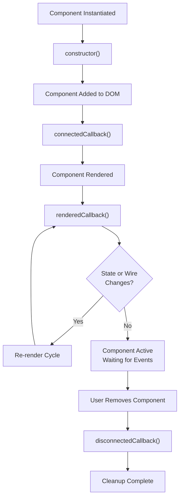

# LWC Best Practices

Lightning Web Components (LWC) are the modern framework for Salesforce UIs. This guide covers lifecycle, state management, wire adapters, error handling, and cross-component integration.

## Component Lifecycle



### 1. constructor()

Runs once when the component class is instantiated. Use for setting default values.

```javascript
export default class MyComponent extends LightningElement {
  counter = 0;
  items = [];
  
  constructor() {
    super();
    this.counter = 0;  // Initialize default state
  }
}
```

**Use for**: Default values, primitive initialization.

**Don't use for**: DOM access, Apex calls, async operations (DOM not ready yet).

### 2. connectedCallback()

Runs when the component is added to the DOM. Use for setup that requires the DOM to exist.

```javascript
export default class MyComponent extends LightningElement {
  @track data;
  @track isLoading = false;
  
  connectedCallback() {
    this.loadData();
    this.subscribeToUpdates();
  }
  
  async loadData() {
    this.isLoading = true;
    try {
      this.data = await getAccountData();
    } catch (error) {
      console.error('Load failed:', error);
    } finally {
      this.isLoading = false;
    }
  }
  
  subscribeToUpdates() {
    // Safe to access DOM or subscribe to channels here
  }
}
```

**Use for**: Apex calls, loading initial data, subscribing to events, DOM queries.

**Don't use for**: renderedCallback tasks (template not fully updated yet).

### 3. renderedCallback()

Runs after every render cycle, when the DOM is fully updated. Use for DOM manipulation that depends on the current template state.

```javascript
export default class MyComponent extends LightningElement {
  @track isLoading = false;
  
  renderedCallback() {
    // DOM is fully updated here
    const submitButton = this.template.querySelector('[data-id="submit"]');
    
    if (submitButton) {
      submitButton.focus();
    }
  }
}
```

**Use for**: Focus management, scrolling, animations, measuring DOM, final DOM checks.

**Don't use for**: Apex calls in loops (causes excessive re-renders and performance issues).

**Important**: renderedCallback can fire multiple times per render cycle. Use flags to prevent duplicate work.

```javascript
renderedCallback() {
  if (this.hasSetFocus) {
    return;
  }
  
  const input = this.template.querySelector('input');
  if (input) {
    input.focus();
    this.hasSetFocus = true;
  }
}
```

### 4. disconnectedCallback()

Runs when the component is removed from the DOM. Use for cleanup.

```javascript
export default class MyComponent extends LightningElement {
  unsubscribeHandler;
  
  connectedCallback() {
    // Subscribe to channel
    this.unsubscribeHandler = subscribe(null, MY_CHANNEL, (message) => {
      this.handleMessage(message);
    });
  }
  
  disconnectedCallback() {
    // Always unsubscribe to prevent memory leaks
    if (this.unsubscribeHandler) {
      unsubscribe(this.unsubscribeHandler);
    }
  }
}
```

**Use for**: Unsubscribing from channels, clearing timers, removing event listeners.

---

## State Management with @track

The `@track` decorator makes a property reactive. When tracked properties change, the component re-renders.

### Primitives and Immutability

```javascript
export default class MyComponent extends LightningElement {
  @track firstName = 'John';
  @track count = 0;
  
  handleChange(event) {
    // Primitives are simple: assign directly
    this.firstName = event.target.value;  // Triggers re-render
    this.count = this.count + 1;  // Triggers re-render
  }
}
```

### Objects and Arrays (Immutable Update)

```javascript
export default class MyComponent extends LightningElement {
  @track user = { name: 'John', email: 'john@example.com' };
  @track items = [];
  
  addItem(item) {
    // ❌ Wrong: mutation doesn't guarantee re-render
    this.items.push(item);
    
    // ✅ Right: create new array (immutable pattern)
    this.items = [...this.items, item];
  }
  
  updateUser(newName) {
    // ❌ Wrong: mutating object property
    this.user.name = newName;
    
    // ✅ Right: create new object
    this.user = { ...this.user, name: newName };
  }
  
  removeItem(index) {
    // ✅ Right: filter creates new array
    this.items = this.items.filter((_, i) => i !== index);
  }
}
```

**Key rule**: For objects and arrays, create a new instance when updating. Mutation alone may not trigger re-rendering.

### From Order of Execution Perspective

When a trigger or flow updates a record, LWC sees the change asynchronously:

1. **Trigger fires** (synchronous) → updates Account record
2. **Flow runs** (asynchronous) → updates Account record
3. **LWC wire adapter cached** (still shows old data)
4. **User must refresh** or wire adapter must re-execute

```javascript
export default class AccountDetail extends LightningElement {
  @track accountId;
  @track account;
  
  @wire(getRecord, { recordId: '$accountId', fields: [NAME_FIELD] })
  wiredAccount({ data, error }) {
    if (data) {
      this.account = data;
    }
  }
  
  async handleSave() {
    try {
      await updateAccount({ accountId: this.accountId, name: this.newName });
      
      // Trigger ran and updated the record
      // But LWC doesn't see the change yet (different transaction)
      
      // Force refresh of wire data
      await refreshApex(this.wiredAccount);
      
    } catch (error) {
      console.error('Update failed:', error);
    }
  }
}
```

---

## Wire Adapters for Reactive Data Loading

Wire adapters (decorated with `@wire`) automatically fetch data and refresh when dependencies change.

### Basic Wire Adapter (No Parameters)

```javascript
import { LightningElement, wire } from 'lwc';
import getAccounts from '@salesforce/apex/AccountController.getAccounts';

export default class AccountList extends LightningElement {
  accounts;
  error;
  
  @wire(getAccounts)
  wiredAccounts({ data, error }) {
    if (data) {
      this.accounts = data;
      this.error = undefined;
    } else if (error) {
      this.error = error;
      this.accounts = undefined;
    }
  }
}
```

### Wire Adapter with Reactive Parameters

```javascript
export default class AccountDetail extends LightningElement {
  @track accountId;  // Changes to this trigger wire re-execution
  account;
  error;
  
  @wire(getAccount, { accountId: '$accountId' })  // $ makes parameter reactive
  wiredAccount({ data, error }) {
    if (data) {
      this.account = data;
    } else if (error) {
      this.error = error;
    }
  }
}
```

The `$` prefix makes the parameter reactive. When `accountId` changes, the wire automatically calls `getAccount` again.

### Record Data with Lightning Data Service (LDS)

```javascript
import { LightningElement, wire } from 'lwc';
import { getRecord, getFieldValue } from 'lightning/uiRecordApi';
import NAME_FIELD from '@salesforce/schema/Account.Name';
import PHONE_FIELD from '@salesforce/schema/Account.Phone';

export default class AccountDetail extends LightningElement {
  @track recordId = '001a0000001Igf';
  
  @wire(getRecord, { recordId: '$recordId', fields: [NAME_FIELD, PHONE_FIELD] })
  account;
  
  get accountName() {
    return getFieldValue(this.account.data, NAME_FIELD);
  }
  
  get accountPhone() {
    return getFieldValue(this.account.data, PHONE_FIELD);
  }
}
```

### Imperative Apex Calls (vs. Wire)

Use imperative calls when you need control over when the call executes:

```javascript
import createAccount from '@salesforce/apex/AccountController.createAccount';

export default class CreateAccountForm extends LightningElement {
  @track accountName = '';
  
  async handleCreate() {
    try {
      const result = await createAccount({ name: this.accountName });
      console.log('Account created:', result);
    } catch (error) {
      console.error('Create failed:', error);
    }
  }
}
```

**Wire vs. Imperative**:
| Pattern | When to Use |
|---------|------------|
| @wire | Declarative, reactive to parameter changes, caching, automatic re-fetch |
| Imperative (await) | User-triggered actions, conditional calls, error control |

### Refreshing Cached Data

When a wire call is cached, refreshing it requires explicit action:

```javascript
import { refreshApex } from '@salesforce/apex';

export default class AccountList extends LightningElement {
  @wire(getAccounts)
  wiredAccounts;
  
  async handleAccountUpdated() {
    // Refresh the cached wire data
    await refreshApex(this.wiredAccounts);
  }
}
```

---

## Error Handling

### Server-Side Errors (Apex)

```javascript
export default class MyComponent extends LightningElement {
  @track isLoading = false;
  error;
  
  async handleSave(name) {
    try {
      this.isLoading = true;
      this.error = null;
      
      await createAccount({ name: name });
      
      // Success
      this.dispatchEvent(
        new ShowToastEvent({
          title: 'Success',
          message: 'Account created',
          variant: 'success'
        })
      );
    } catch (error) {
      // Server-side error
      this.error = error.body?.message || 'Unknown error';
      
      this.dispatchEvent(
        new ShowToastEvent({
          title: 'Error',
          message: this.error,
          variant: 'error'
        })
      );
    } finally {
      this.isLoading = false;
    }
  }
}
```

### Wire Adapter Errors

```javascript
export default class AccountList extends LightningElement {
  accounts;
  error;
  
  @wire(getAccounts)
  wiredAccounts({ data, error }) {
    if (data) {
      this.accounts = data;
      this.error = undefined;
    } else if (error) {
      // Wire error (network, security, etc.)
      this.error = error.body?.message || 'Failed to load accounts';
      this.accounts = undefined;
    }
  }
  
  get hasError() {
    return this.error !== undefined;
  }
}
```

### Client-Side Errors (User Input)

```javascript
export default class FormComponent extends LightningElement {
  @track email = '';
  emailError;
  
  handleEmailChange(event) {
    this.email = event.target.value;
    this.emailError = null;
  }
  
  handleSubmit() {
    // Validate before sending
    if (!this.isValidEmail(this.email)) {
      this.emailError = 'Invalid email address';
      return;
    }
    
    this.submitForm();
  }
  
  isValidEmail(email) {
    return /^[^\s@]+@[^\s@]+\.[^\s@]+$/.test(email);
  }
}
```

---

## Accessibility (a11y)

### Semantic HTML

```html
<!-- ❌ Wrong: div not accessible -->
<div onclick={handleClick} role="button">Click me</div>

<!-- ✅ Right: button is semantic -->
<button onclick={handleClick}>Click me</button>
```

### Label Form Inputs

```html
<!-- ❌ Wrong: no label -->
<input type="text" placeholder="Name">

<!-- ✅ Right: label associated -->
<label for="nameInput">Name</label>
<input id="nameInput" type="text">
```

### Alt Text for Images

```html
<!-- ✅ Informative alt text -->


<!-- ✅ Decorative image, empty alt -->

```

### Color Not Only Indicator

```html
<!-- ❌ Wrong: only red color indicates error -->
<span style="color: red;">Error</span>

<!-- ✅ Right: text and icon -->
<span class="error-icon">⚠️</span> <span>Error message</span>
```

### Keyboard Navigation

```javascript
export default class Modal extends LightningElement {
  handleKeyDown(event) {
    if (event.key === 'Escape') {
      this.closeModal();
    }
    
    if (event.key === 'Tab') {
      // Focus management if needed
    }
  }
}
```

---

## DOM Access Patterns

### Use this.template Scope

```javascript
export default class MyComponent extends LightningElement {
  handleClick() {
    // ✅ Right: scoped to component
    const button = this.template.querySelector('button');
    
    // ❌ Wrong: searches entire document
    const button = document.querySelector('button');
  }
}
```

### Safe Queries with Null Check

```javascript
renderedCallback() {
  const input = this.template.querySelector('[data-id="email"]');
  
  if (input) {  // Always check existence
    input.focus();
  }
}
```

### Avoid innerHTML (XSS Risk)

```javascript
// ❌ Wrong: innerHTML can execute scripts
connectedCallback() {
  const div = this.template.querySelector('div');
  div.innerHTML = userContent;  // XSS vulnerability
}

// ✅ Right: Use LWC binding (auto-escaped)
@track message = userContent;  // Safe in template
```

---

## Conditional Rendering

### if:true and if:false

```html
<template if:true={isLoading}>
  <div class="spinner">Loading...</div>
</template>

<template if:false={isLoading}>
  <table>
    <template for:each={accounts} for:item="account">
      <tr key={account.id}>
        <td>{account.name}</td>
      </tr>
    </template>
  </table>
</template>
```

### Toggling Visibility

```javascript
export default class MyComponent extends LightningElement {
  @track showDetails = false;
  
  toggleDetails() {
    this.showDetails = !this.showDetails;
  }
}
```

---

## Looping Best Practices

### Key Attribute for Identity

```html
<template for:each={items} for:item="item">
  <div key={item.id} data-id={item.id}>
    {item.name}
  </div>
</template>
```

The `key` must be unique for each item. Without it, LWC can't track which items changed and may re-use DOM nodes incorrectly.

### Pre-process Complex Data

```javascript
export default class MyComponent extends LightningElement {
  @track items = [];
  
  // ❌ Wrong: calling method in template loop
  // <p>{getFormattedDate(item.date)}</p>
  
  // ✅ Right: pre-compute in getter
  get formattedItems() {
    return this.items.map(item => ({
      ...item,
      formattedDate: this.formatDate(item.date)
    }));
  }
  
  formatDate(date) {
    return new Intl.DateTimeFormat('en-US').format(new Date(date));
  }
}
```

---

## Common Mistakes

### Mistake 1: Array Mutation Without Re-render

```javascript
// ❌ Wrong: mutation alone may not trigger re-render
this.items.push(newItem);

// ✅ Right: create new array
this.items = [...this.items, newItem];
```

### Mistake 2: Missing $ in Wire Parameters

```javascript
// ❌ Wrong: accountId doesn't react to changes
@wire(getAccount, { accountId: accountId })

// ✅ Right: accountId reacts
@wire(getAccount, { accountId: '$accountId' })
```

### Mistake 3: Not Handling Wire Errors

```javascript
// ❌ Wrong: no error handling
@wire(getAccounts)
wiredAccounts(data) {
  this.accounts = data;
}

// ✅ Right: handle both data and error
@wire(getAccounts)
wiredAccounts({ data, error }) {
  if (data) {
    this.accounts = data;
  } else if (error) {
    this.error = error;
  }
}
```

### Mistake 4: Memory Leaks from Subscriptions

```javascript
// ❌ Wrong: subscription never cleaned up
connectedCallback() {
  subscribe(null, MY_CHANNEL, this.handleMessage);
}

// ✅ Right: unsubscribe on disconnect
unsubscribeHandler;

connectedCallback() {
  this.unsubscribeHandler = subscribe(null, MY_CHANNEL, (msg) => {
    this.handleMessage(msg);
  });
}

disconnectedCallback() {
  unsubscribe(this.unsubscribeHandler);
}
```

### Mistake 5: renderedCallback Loops

```javascript
// ❌ Wrong: renderedCallback makes Apex call every render
renderedCallback() {
  getAccountData();  // Called repeatedly!
}

// ✅ Right: use connectedCallback or wire for data
connectedCallback() {
  this.loadData();  // Called once
}
```

---

## Testing LWC with Jest

See the LWC Jest testing guide for detailed patterns (mocking wire adapters, Apex calls, DOM assertions).

---

## Production Readiness Checklist

- ✅ Uses `@wire` for data loading (reactive)
- ✅ Error handling for all Apex calls (data and error cases)
- ✅ `@track` for reactive state (with immutable updates for objects/arrays)
- ✅ No hardcoded IDs (resolve dynamically via Apex)
- ✅ Accessibility: labels, alt text, semantic HTML
- ✅ Keyboard navigation working (Escape, Tab, etc.)
- ✅ No XSS vulnerabilities (no innerHTML, use textContent or template binding)
- ✅ DOM access in renderedCallback, not connectedCallback
- ✅ Memory cleanup in disconnectedCallback (unsubscribe, clear timers)
- ✅ Loops have unique `key` attributes
- ✅ All wire calls handle error case
- ✅ Responsive design (works on mobile)
- ✅ Refreshing cached data when needed (await refreshApex)
