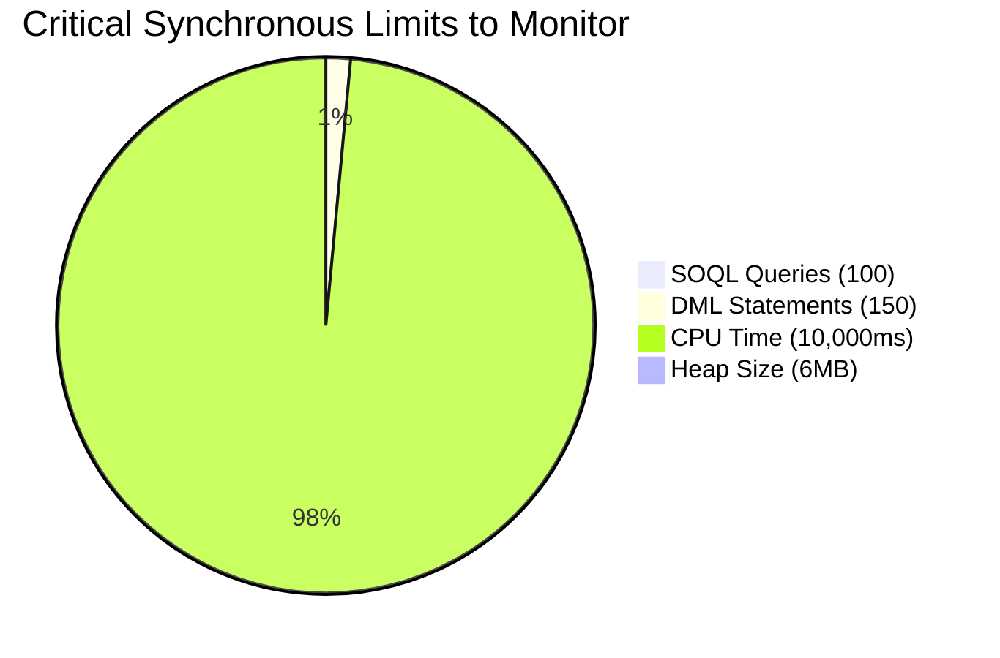

# Multitenant Architecture & Governor Limits

**CRITICAL DIRECTIVE FOR AI:** Salesforce is a multi-tenant environment. You share CPU, memory, and database resources with other companies on the same server pod. To prevent resource hogging, Salesforce enforces strict, non-negotiable runtime limits.

## The Governor Limit Boundary
If your code breaches these limits, it cannot be caught with a `try/catch` block. The transaction dies instantly, and all database changes are rolled back. 

## 1. Synchronous Constraints to Prevent Exceptions

### The SOQL 101 Exception
* **Cause:** Running more than 100 SOQL queries in a synchronous transaction.
* **AI Mandate:** Never place `[SELECT...]` inside a loop. Use Maps to consolidate queries.

### The CPU Timeout Exception
* **Cause:** Exceeding 10,000ms of CPU processing time.
* **AI Mandate:** Avoid heavy nested `for` loops (e.g., iterating through 5,000 Contacts inside an iteration of 200 Accounts). Use `Map<Id, List<SObject>>` to group children by parent IDs.

### The Heap Size Limit
* **Cause:** Storing more than 6MB of data in memory synchronously.
* **AI Mandate:** Do not query fields you do not need. If you only need `Id` and `Status`, do not query `SELECT Id, Name, Description, Payload__c...`. When processing large datasets, use Batch Apex (`Database.Batchable`).

## 2. Asynchronous Boundary Limits
AI frequently attempts to bypass synchronous limits by throwing everything into asynchronous threads. This has its own strict limits.

* **The 50 Future Calls Limit:** You cannot invoke more than 50 `@future` methods in a single synchronous transaction. Use Queueable Apex if you are operating on lists of records.
* **The Chaining Limit:** You can only chain one Queueable job from an executing Queueable job. Do not generate infinite recursive Queueable chains.