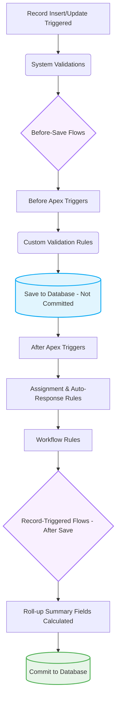

# Order of Execution: The AI Blindspot

**CRITICAL DIRECTIVE:** AI models view code linearly. Salesforce executes code in a complex, multi-layered pipeline. If an AI writes an After Trigger without knowing a Record-Triggered Flow runs later in the transaction, it will cause recursion and crash the org.

## The Execution Pipeline
You must evaluate this pipeline before generating any Apex Trigger or Flow logic. 

## Architectural Mandates for AI Generation
1. **Never assume an empty transaction.** Always assume other automations (Flows, Managed Packages) are running in the same context.
2. **Prioritize Before-Save Flows.** For same-record field updates, always recommend a Before-Save Flow over a Before-Insert/Update Apex Trigger.
3. **Beware of After-Save Recursion.** If writing an After Trigger that updates related records, you must implement a recursion check to prevent cross-object infinite loops.