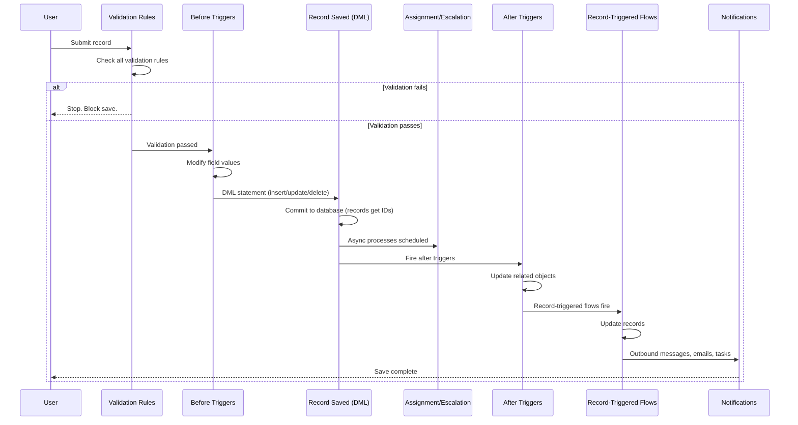
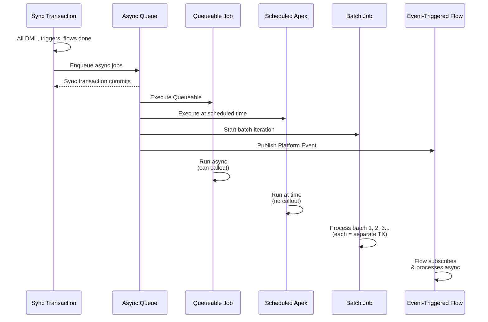
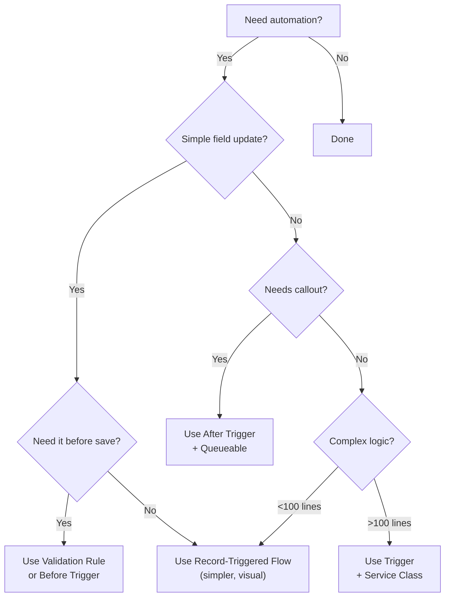

# Order of Execution in Salesforce

When you save a record in Salesforce, a series of processes fire in a specific order. Different components (Apex, Flows, validation, async jobs) run at different points. This order determines what data is available, whether updates are allowed, and which records interact.

## Synchronous Execution Path (Single Transaction)



## Synchronous Execution Order (Same Transaction)

### 1. Validation Rules (Before triggers)

**Timing**: Immediately when DML statement executes  
**Scope**: All records in the DML batch  
**Behavior**: If any rule fails, entire transaction stops. No records insert/update/delete.

```apex
// Validation rule example: Account.Revenue > 0
// If revenue <= 0, save fails before triggers run
```

**From LWC**: When you call a save method (e.g., `navigator.force.createRecord()`), validation rules fire before any Apex trigger. If validation fails, the error bubbles to the UI without ever entering Apex.

**From Flow**: Record-triggered flows on create/update also check validation rules first. Flow-based validation rules (if configured on the object) block the DML before the flow even starts.

### 2. Before-Insert/Update Triggers

**Timing**: After validation rules pass, before DML commit  
**Context**: Records are in memory, no IDs yet (for insert). For update, old field values also available.  
**Can do**: Modify field values on Trigger.new  
**Cannot do**: Update related objects (they don't have IDs yet), query the records being inserted, callout

```apex
trigger AccountTrigger on Account (before insert, before update) {
  for (Account acc : Trigger.new) {
    acc.Revenue__c = 50000;  // Modify before save. Saves automatically.
  }
  // No explicit update needed. Modifications auto-persist.
}
```

**From LWC**: LWC doesn't have before-trigger visibility. If a trigger modifies fields before save, the LWC receives the modified values back in the success response.

**From Flow**: Flows cannot run before DML. Flows run after records are saved and have IDs. If you need before-DML logic, use Apex triggers or validation rules.

### 3. DML Commits to Database

**Timing**: Records insert/update/delete to database  
**Result**: Records now have IDs (for inserts). Fields are committed.

At this exact moment:
- LWC code awaiting a save response can now receive the new ID
- Related lookup fields now become valid references
- Rollup summary fields on parent objects start recalculating
- The transaction is still open (not yet committed if more Apex runs after)

### 4. Assignment Rules & Escalation Rules

**Timing**: Immediately after DML (after records have IDs)  
**Scope**: Cases and Leads only (declarative automation, no Apex)  
**Behavior**: Auto-assign or auto-escalate based on conditions

Example: New Lead created, Assignment Rule fires, assigns to queue.

**From Apex**: Assignment rules fire after after-insert triggers complete, so an after-insert trigger can see the assignment field already populated before the trigger finishes.

**From LWC**: When creating a Case via LWC, you won't see the auto-assigned Owner in the response unless you query after the save completes (separate callout).

### 5. After-Insert/Update/Delete Triggers

**Timing**: After DML and assignment rules complete  
**Context**: Records now have IDs, assignment rules applied  
**Can do**: Read new field values, perform DML on related objects, query related records  
**Cannot do**: Modify the primary record (it's already committed), add more DML to the current record without a separate update statement

```apex
trigger AccountTrigger on Account (after insert, after update) {
  List<Contact> contacts = new List<Contact>();
  
  for (Account acc : Trigger.new) {
    // acc.Id now exists
    Contact con = new Contact(LastName = acc.Name, AccountId = acc.Id);
    contacts.add(con);
  }
  
  insert contacts;  // Can do DML on related objects
}
```

**From LWC**: After-trigger logic is complete by the time the save response reaches the LWC, so the LWC doesn't see intermediate states.

**From Flow**: Record-triggered flows fire after after-triggers. If an after-trigger updates a field, the flow can read the updated value.

### 6. Record-Triggered Flows

**Timing**: After all after-insert/update/delete triggers complete  
**Context**: All Apex automation is done. Records are fully updated.  
**Scope**: Parallel execution (no guaranteed order if multiple flows on same object)  
**Can do**: Read updated field values, update related records, call subflows, send actions

```
Trigger: Update Account.Industry based on parent Account
Flow: Update all Contacts under this Account to same Industry
```

**From LWC**: LWC doesn't wait for flows. Flows may still be running async after the save response returns.

**From other Flows**: If Flow A updates a record and Flow B is also triggered on that record, both fire (no guaranteed order).

### 7. Notifications (Outbound Messages, Emails, Tasks)

**Timing**: After all DML, triggers, flows complete  
**Scope**: Workflow actions, flow actions, or Apex sending  
**Behavior**: Email alerts sent, tasks created, external systems notified

These are the last things in the synchronous transaction. After notifications complete, the transaction is fully done.

## Asynchronous Execution Path (Separate Transactions)

After the synchronous transaction completes and commits, async jobs fire in their own isolated transactions with separate governor limits.



### Queueable

**Timing**: Fires within seconds of `System.enqueueJob()` call (not immediate)  
**Context**: Separate transaction with fresh governor limits  
**Can do**: Perform DML, call APIs, chain into itself, use `Database.AllowsCallouts` for HTTP callouts  
**Cannot do**: Call directly from trigger context without wrapping in Queueable (if you need a callout)

```apex
// From trigger
trigger OpportunityTrigger on Opportunity (after insert) {
  System.enqueueJob(new UpdateRevenueQueueable(Trigger.newMap.keySet()));
}

// Queueable executes separately
public class UpdateRevenueQueueable implements Queueable, Database.AllowsCallouts {
  private Set<Id> oppIds;
  
  public UpdateRevenueQueueable(Set<Id> ids) {
    this.oppIds = ids;
  }
  
  public void execute(QueueableContext ctx) {
    // Separate transaction, can callout
    HttpResponse resp = new Http().send(new HttpRequest());
    // Update records based on response
    update updateList;
    
    // Can chain: enqueue another job
    if (needsMore) {
      System.enqueueJob(new AnotherQueueable());
    }
  }
}
```

**From LWC**: LWC doesn't wait for Queueable to complete. The LWC save returns before Queueable runs.

### Scheduled Apex

**Timing**: Fires at the scheduled time (cron expression)  
**Context**: Separate transaction, isolated from any DML  
**Can do**: Query, DML, enqueue Queueable (which can then callout)  
**Cannot do**: Directly callout from execute() method

```apex
global class DailyReportSchedulable implements Schedulable {
  global void execute(SchedulableContext ctx) {
    // Runs at scheduled time
    List<Account> accs = [SELECT Id FROM Account];
    
    // Can enqueue a job that callouts
    System.enqueueJob(new CalloutQueueable(accs));
  }
}

// Schedule it
System.schedule('Daily Report', '0 0 0 * * ?', new DailyReportSchedulable());
```

### Batch Apex

**Timing**: Fires when enqueued, processes in batches  
**Context**: Each batch is a separate transaction with separate governor limits  
**Behavior**: Processes records in chunks (default 200 per batch)  
**Can do**: Query all records, DML in chunks, handle large datasets (runs for hours if needed)  
**Cannot do**: Directly callout (use finish() to enqueue Queueable)

```apex
global class UpdateAccountsBatch implements Database.Batchable<sObject> {
  global Database.QueryLocator start(Database.BatchableContext ctx) {
    return Database.getQueryLocator([SELECT Id FROM Account]);
  }
  
  global void execute(Database.BatchableContext ctx, List<Account> batch) {
    // Each batch is separate TX with own limits
    for (Account acc : batch) {
      acc.Industry = 'Technology';
    }
    update batch;
  }
  
  global void finish(Database.BatchableContext ctx) {
    // Can callout via Queueable
    System.enqueueJob(new NotifyExternalQueueable());
  }
}

// Run it
Database.executeBatch(new UpdateAccountsBatch(), 200);
```

### Platform Events (Event-Triggered Flows)

**Timing**: Published in sync transaction, flow fires async after commit  
**Context**: Separate transaction, async  
**Behavior**: Flow subscribes to event, fires when event is published  
**Can do**: Update records, call subflows, actions

```apex
// From trigger (sync TX)
trigger OpportunitTrigger on Opportunity (after insert) {
  EventBus.publish(new OpportunityCreated__e(
    OppId = opp.Id,
    Amount = opp.Amount
  ));
  // Event published, but flow hasn't run yet
}

// Flow subscribes (async TX)
// Event-triggered flow: OpportunityCreated__e
// Action: Update related Account with total amount
```

**From LWC**: LWC publishes event via REST (if set up), or calls Apex that publishes. LWC doesn't wait for event-triggered flows.

### Order of Async Execution

**Not guaranteed**. Queueable, Scheduled, Batch, and event-triggered flows may complete in any order. If you need one to finish before another, manually wait or use Platform Events to trigger the next step.

## Common Execution Gotchas

### Gotcha 1: Trigger + Flow Update Same Field

**Problem**: Trigger and flow both update the same field. Execution order is trigger first, then flow. But if flow fails, trigger changes are already committed.

```apex
// Trigger: after update
trigger AccountTrigger on Account (after update) {
  for (Account acc : Trigger.new) {
    acc.Revenue__c = 50000;
  }
  update Trigger.new;  // Committed
}

// Flow: also tries to update Revenue__c
// If flow fails partway through, trigger's update is already done
```

**Fix**: Pick one location (trigger or flow). Don't split logic. Triggers for complex logic, flows for simple updates.

**From LWC**: LWC sees final state (flow + trigger both applied). If flow fails, LWC doesn't know (it only sees the trigger's result unless you query again).

### Gotcha 2: Cannot Query Records Being Inserted (Before Triggers)

```apex
// ❌ Wrong: before-insert trigger
trigger OpportunityTrigger on Opportunity (before insert) {
  List<Opportunity> opps = [SELECT Id FROM Opportunity WHERE Id IN :Trigger.new];
  // Result: Empty list. Records don't exist yet.
}

// ✅ Right: use Trigger.new directly
trigger OpportunityTrigger on Opportunity (before insert) {
  for (Opportunity opp : Trigger.new) {
    opp.StageName = 'Prospecting';  // Modify in memory
  }
  // Auto-saves. No explicit update needed.
}
```

**Why**: Before-insert triggers run before DML commits. The records don't have IDs yet, so they can't exist in the database.

### Gotcha 3: Recursion via Flows and Field Updates

**Scenario**: Trigger updates a field. Record-triggered flow fires and updates the same field. If that update matches the trigger's original criteria, the trigger fires again.

```
Trigger on Account (after update): Sets IsProcessed = false
Flow: Sees update, sets IsProcessed = true
// Does IsProcessed = true trigger an update? No, not in this TX.
// But on next user action, it might.
```

**Fix**: Add guard fields (e.g., `Block_Recursion__c`). Set it at the start of your automation. Check it before running logic.

```apex
trigger AccountTrigger on Account (after update) {
  for (Account acc : Trigger.new) {
    if (acc.Block_Recursion__c) continue;  // Skip if already processing
    
    acc.Block_Recursion__c = true;
    // Logic here
  }
  update Trigger.new;
}
```

### Gotcha 4: Rollup Summary + Trigger Infinite Loops

**Rollup Summary fields recalculate when child records change**. If an after-update trigger updates child records based on the parent's rollup value, the rollup recalculates, triggering the parent's update trigger again.

```
Parent: Amount = $1000 (rollup)
Trigger: If Amount > 500, update child Status = "High"
Result: Child updated → Rollup recalcs → Amount still $1000 → Trigger fires again (no loop, but repeated)
```

**Fix**: Only update children in after-insert triggers (not after-update). Or use a flag to skip on recursion.

### Gotcha 5: Validation Rules Don't Run on After-Trigger DML

**Validation rules run on the initial save. If an after-trigger updates the record, validation rules do NOT re-run.**

```apex
// Initial save: Name = "Test"
// Validation rule: Name != ""  ✓ Passes

// After-trigger fires and updates Name = ""
update accounts;  // ⚠️ Validation rule does NOT block. Already ran.
```

**Fix**: Add manual validation in the after-trigger:

```apex
trigger AccountTrigger on Account (after update) {
  for (Account acc : Trigger.new) {
    if (String.isEmpty(acc.Name)) {
      throw new DmlException('Name cannot be empty');
    }
  }
}
```

## Trigger vs Flow Decision Tree



**In practice**:
- **Validation Rule**: Prevent invalid data before anything runs
- **Before Trigger**: Modify fields before DML (Apex only)
- **Record-Triggered Flow**: Simple updates after DML (visual, no code)
- **After Trigger**: Complex logic, update related objects (Apex)
- **Queueable**: Need callout, need async processing (Apex)
- **Scheduled/Batch**: Run on schedule or process large datasets

## Testing Order of Execution

```apex
@IsTest
private class OrderOfExecutionTest {
  @IsTest
  static void testTriggerThenFlow() {
    Account acc = new Account(Name = 'Test', Revenue__c = 0);
    insert acc;
    
    // Query after all sync automation completes
    Account result = [SELECT Revenue__c FROM Account WHERE Id = :acc.Id];
    
    // Assert reflects trigger + flow changes
    System.assertEquals(50000, result.Revenue__c);
  }
  
  @IsTest
  static void testAsyncProcessing() {
    Account acc = new Account(Name = 'Test');
    insert acc;
    
    // Enqueue a queueable from trigger
    Test.startTest();
    insert new Account(Name = 'Trigger Another Queueable');
    Test.stopTest();
    
    // After Test.stopTest(), async jobs are executed
    Account updated = [SELECT Industry FROM Account WHERE Id = :acc.Id];
    System.assertEquals('Technology', updated.Industry);
  }
}
```

**Key**: Use `Test.startTest()` and `Test.stopTest()` to execute async jobs in test context.

## Quick Reference: Component Capabilities

| Component | Sync/Async | Can Read | Can Write | Can Callout | Timing |
|-----------|-----------|----------|-----------|------------|--------|
| Validation Rule | Sync | Fields | None (blocks) | No | Before triggers |
| Before Trigger | Sync | Trigger.new | Trigger.new (implicit save) | No | Before DML |
| Assignment Rule | Sync | Record fields | Owner field only | No | After DML |
| After Trigger | Sync | All fields + related | Related records (not primary) | No via Queueable | After DML |
| Record Flow | Sync | All fields | All fields | No | After DML |
| Queueable | Async | All records | All records | Yes | Soon (seconds) |
| Scheduled Apex | Async | All records | All records | No (chain Queueable) | At schedule time |
| Batch Apex | Async | All records | All records per batch | No (chain Queueable) | When enqueued |
| Platform Events | Async | Event data | Via event flow | No | When published |

