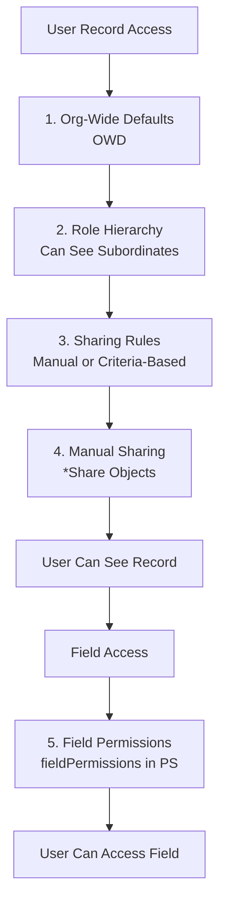

# Permission Model

The permission model controls who sees and accesses what in Salesforce. It applies across Apex, Flow, and LWC.

## Permission Model Hierarchy



Each layer is cumulative: user must pass OWD, then role hierarchy, then sharing, then field permissions.

---

## Org-Wide Defaults (OWD)

OWD sets the baseline sharing level. It's the first gate.

| OWD Setting | Who Can See | Who Can Edit | Use Case |
|---|---|---|---|
| Public Read/Write | Everyone | Everyone | Open records, no privacy |
| Public Read Only | Everyone | Owner | Everyone sees, owner edits |
| Private | Owner only | Owner | Most restrictive, sharing required |
| Controlled by Parent | Inherits from parent | Inherits from parent | Child records follow parent |

**Best practice**: Set OWD to Private as default. Grant access via sharing rules and permissions.

---

## Permission Sets

Permission Sets grant permissions to users. Multiple PermissionSets stack on the same user.

### Components Controlled by PermissionSet

| Component | Example |
|-----------|---------|
| Object Permissions | Create, Read, Update, Delete Account |
| Field Permissions | Read/Edit CustomField__c |
| Custom Permissions | Can_Export_Data |
| Apex Classes | AccountService, DataProcessor |
| Lightning Components | Lightning Web Components, Aura |
| Custom Metadata | Configuration records |
| Tab Visibility | Account, Contact, Custom Tabs |

### Creating a PermissionSet

1. Setup > Users > Permission Sets
2. New > PermissionSet
3. **Label**: `Account_Admin`
4. **Name**: `Account_Admin`
5. Save
6. In the PermissionSet, add:
   - **Object Permissions**: Account (Create, Read, Update, Delete)
   - **Field Permissions**: For each custom field (Create, Read, Update checkboxes)
   - **Custom Permissions**: Add custom permissions
   - **Apex Classes**: Add classes this role can execute
   - **Custom Metadata Types**: Add metadata types
   - **Tabs**: Set visibility (Default On, Default Off, Hidden)

### Critical: fieldPermissions for Custom Fields

Every custom field requires a fieldPermissions entry in the PermissionSet OR the user cannot access it.

```xml
<!-- PermissionSet metadata: fieldPermissions for custom field -->
<fieldPermissions>
    <enabled>true</enabled>
    <field>Account.CustomField__c</field>
    <readable>true</readable>
    <editable>true</editable>
</fieldPermissions>
```

**If missing**:
- WITH USER_MODE throws error: "No such column"
- Security.stripInaccessible() silently strips the field
- User cannot access the field

### Assigning PermissionSet to User

```apex
PermissionSetAssignment psa = new PermissionSetAssignment(
  PermissionSetId = [SELECT Id FROM PermissionSet WHERE Name = 'Account_Admin' LIMIT 1].Id,
  AssigneeId = userId
);
insert psa;
```

---

## Custom Permissions

Custom Permissions are flags you define and check in code.

### Create a Custom Permission

1. Setup > Custom Code > Custom Permissions
2. New > Label: `Can_Export_Data`, Name: `Can_Export_Data`
3. Save
4. Assign to PermissionSet: Edit PermissionSet > Custom Permissions > Add

### Using in Apex

```apex
public with sharing class DataExportService {
  public static String exportAccounts() {
    if (!FeatureManagement.checkPermission('Can_Export_Data')) {
      throw new SecurityException('You lack permission to export');
    }
    
    List<Account> accounts = [SELECT Id, Name FROM Account WITH SECURITY_ENFORCED];
    
    String csv = 'Id,Name\n';
    for (Account acc : accounts) {
      csv += acc.Id + ',' + acc.Name + '\n';
    }
    return csv;
  }
}
```

### Using in LWC

```javascript
import checkPermission from '@salesforce/apex/PermissionService.checkPermission';

export default class DataExport extends LightningElement {
  async handleExport() {
    const hasPermission = await checkPermission('Can_Export_Data');
    if (!hasPermission) {
      this.dispatchEvent(
        new ShowToastEvent({
          message: 'You lack permission to export',
          variant: 'error'
        })
      );
      return;
    }
  }
}
```

---

## Sharing Rules

Sharing Rules grant access to records based on criteria or group membership.

### Criteria-Based Sharing Rule

Setup > Sharing Settings > [Object] > Manage > New Sharing Rule

**Example**: "All Sales team members see Accounts in California"

```apex
// In Apex (if setting up programmatically):
List<AccountShare> shares = new List<AccountShare>();

// Find all CA accounts
List<Account> caAccounts = [SELECT Id FROM Account WHERE BillingState = 'CA'];

// Share with each sales member
for (Account acc : caAccounts) {
  for (User salesMember : [SELECT Id FROM User WHERE Department = 'Sales']) {
    AccountShare share = new AccountShare();
    share.AccountId = acc.Id;
    share.UserOrGroupId = salesMember.Id;
    share.AccountAccessLevel = 'Read';  // Read, Edit, or All
    shares.add(share);
  }
}

insert shares;
```

### Group-Based Sharing Rule

Setup > Manage Public Groups → Create group with users

Then share with the group:

```apex
public class GrantAccessToGroup {
  public static void shareAccountWithGroup(Id accountId) {
    Group financeGroup = [SELECT Id FROM Group WHERE Name = 'Finance Team' LIMIT 1];
    
    AccountShare share = new AccountShare();
    share.AccountId = accountId;
    share.UserOrGroupId = financeGroup.Id;  // Can be User or Group
    share.AccountAccessLevel = 'Edit';
    insert share;
  }
}
```

---

## Role Hierarchy

Role Hierarchy grants access to subordinates' records. Higher roles see all records below them.

```
CEO
├── VP Sales
│   ├── Sales Manager 1
│   │   ├── Sales Rep 1
│   │   └── Sales Rep 2
│   └── Sales Manager 2
└── VP Finance
    ├── Controller
    └── Accountant
```

**Effect**: VP Sales sees all Accounts owned by Sales Managers and Reps. She cannot see Finance team's records.

Set in Setup > Users > Manage Roles.

---

## Flow Security

Flows inherit user context depending on flow type.

### Record-Triggered Flow

- **Context**: Runs as system user (ignores OWD)
- **FLS**: Enforced
- **Access**: Can see all records triggering the flow, but FLS strips inaccessible fields

### Screen Flow

- **Context**: Runs as logged-in user (OWD enforced)
- **FLS**: Enforced
- **Access**: User sees only records they have access to

### Scheduled Flow

- **Context**: Runs as system user (ignores OWD)
- **FLS**: Enforced
- **Access**: Can access all records, but FLS enforced on fields

### Autolaunched Flow

- **Context**: Runs as system user (ignores OWD)
- **FLS**: Enforced
- **Access**: Called from Apex or API, can access all records

### Controlling Flow Visibility

1. **Permission Set**: Add flow to PermissionSet > Lightning Flows
2. **Custom Permission**: Grant only to users with specific permission
3. **Flow Access**: Add to PermissionSet and assign to roles

---

## LWC Security

LWC doesn't have direct visibility permissions. All security is enforced via the Apex controller.

```javascript
// LWC: AccountList.js
import getAccounts from '@salesforce/apex/AccountController.getAccounts';

export default class AccountList extends LightningElement {
  @wire(getAccounts)
  wiredAccounts({ data, error }) {
    this.accounts = data;
  }
}
```

```apex
// Apex Controller: enforces all security
public with sharing class AccountController {
  @AuraEnabled(cacheable=true)
  public static List<Account> getAccounts() {
    // with sharing: respects OWD and user permissions
    // WITH SECURITY_ENFORCED: enforces CRUD
    // stripInaccessible: enforces FLS
    return [SELECT Id, Name FROM Account WITH SECURITY_ENFORCED];
  }
}
```

**LWC sees only what Apex returns**. If Apex enforces security, LWC is secure.

---

## Permission Testing with System.runAs

Always test services with a limited user, not System Admin.

```apex
@IsTest
private class PermissionTest {
  @TestSetup
  static void setupUsers() {
    User limitedUser = new User(
      FirstName = 'Limited',
      LastName = 'User',
      Email = 'limited@example.com',
      Username = 'limited@example.com.' + System.now().millisecond(),
      ProfileId = [SELECT Id FROM Profile WHERE Name = 'Standard User' LIMIT 1].Id,
      Alias = 'lim',
      TimeZoneSidKey = 'America/Los_Angeles',
      LocaleSidKey = 'en_US',
      EmailEncodingKey = 'UTF-8',
      LanguageLocaleKey = 'en_US'
    );
    insert limitedUser;
    
    // Assign permission set
    PermissionSetAssignment psa = new PermissionSetAssignment(
      PermissionSetId = [SELECT Id FROM PermissionSet WHERE Name = 'Account_Admin' LIMIT 1].Id,
      AssigneeId = limitedUser.Id
    );
    insert psa;
  }
  
  @IsTest
  static void testAccessWithPermissionSet() {
    User limitedUser = [SELECT Id FROM User WHERE Email = 'limited@example.com' LIMIT 1];
    
    System.runAs(limitedUser) {
      // Test as limited user (has Account_Admin PermissionSet)
      List<Account> accounts = AccountService.getAccounts();
      System.assertNotEquals(null, accounts);
    }
  }
  
  @IsTest
  static void testAccessWithoutPermissionSet() {
    User noPermUser = new User(
      FirstName = 'No',
      LastName = 'Perm',
      Email = 'noperm@example.com',
      Username = 'noperm@example.com.' + System.now().millisecond(),
      ProfileId = [SELECT Id FROM Profile WHERE Name = 'Standard User' LIMIT 1].Id,
      Alias = 'nop',
      TimeZoneSidKey = 'America/Los_Angeles',
      LocaleSidKey = 'en_US',
      EmailEncodingKey = 'UTF-8',
      LanguageLocaleKey = 'en_US'
    );
    insert noPermUser;
    
    System.runAs(noPermUser) {
      // User has NO Account_Admin PermissionSet
      try {
        AccountService.getAccounts();
      } catch (Exception ex) {
        System.assert(ex.getMessage().contains('INSUFFICIENT_ACCESS'));
      }
    }
  }
}
```

---

## Profiles vs. PermissionSets

| Profiles | PermissionSets |
|----------|-----------------|
| Required (every user has exactly one) | Optional (user can have multiple) |
| Sets baseline permissions | Additive (on top of profile) |
| Hard to maintain | Easy to maintain and test |
| Changes affect all users with that profile | Changes affect only assigned users |

**Modern approach**: Use a basic profile (Standard User, Custom) + PermissionSets for features.

---

## Production Readiness Checklist

- ✅ OWD set to Private for sensitive objects (share via rules)
- ✅ Role Hierarchy configured (access delegation)
- ✅ PermissionSets created and assigned (not Profiles for features)
- ✅ fieldPermissions include all custom fields (no FLS violations)
- ✅ Custom Permissions defined for sensitive operations
- ✅ Sharing Rules configured (criteria or group-based)
- ✅ Apex services use `with sharing` by default
- ✅ Tests run as non-admin (System.runAs with PermissionSet)
- ✅ Flow FLS enforced (even in system-context flows)
- ✅ LWC controllers enforce security (WITH SECURITY_ENFORCED, stripInaccessible)
- ✅ Manual shares tested (AccountShare, ContactShare, etc.)
- ✅ Role Hierarchy does not grant unnecessary access
- ✅ Tab visibility set correctly (Available/None in PermissionSet)
