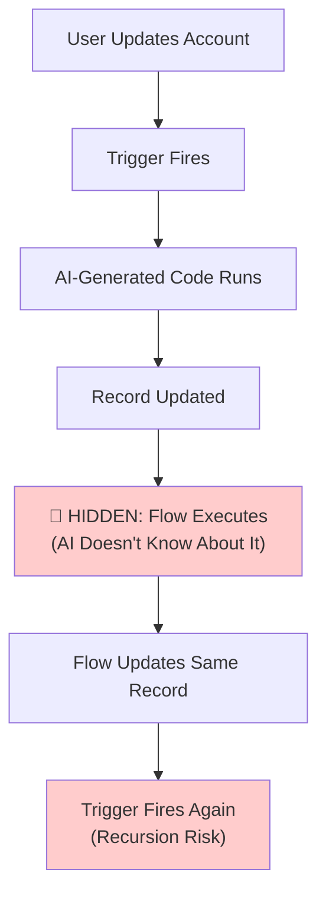
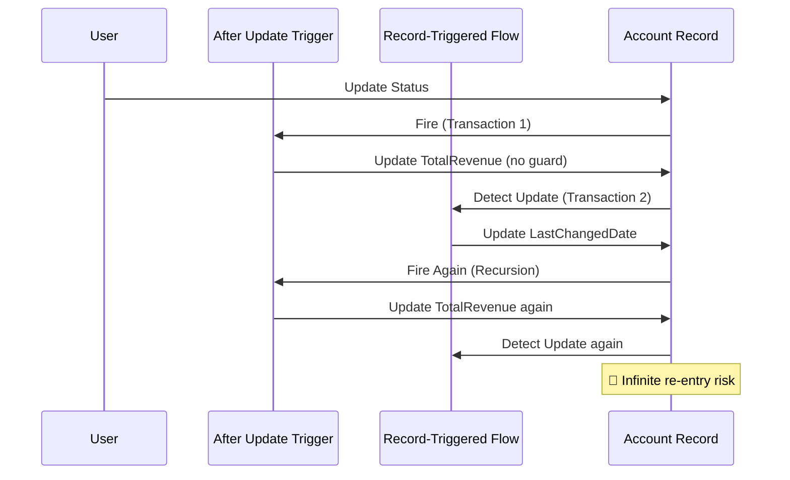
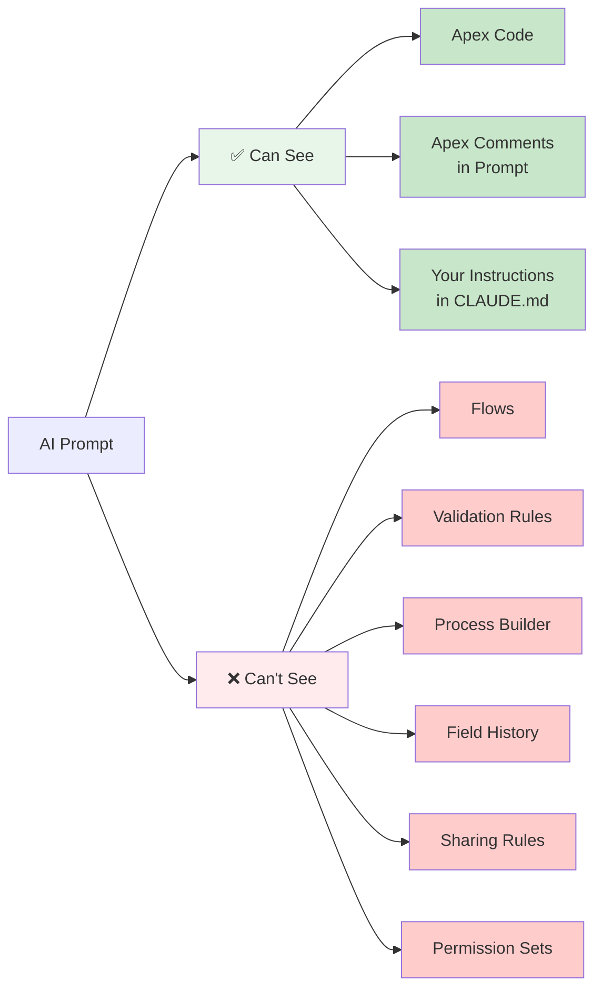
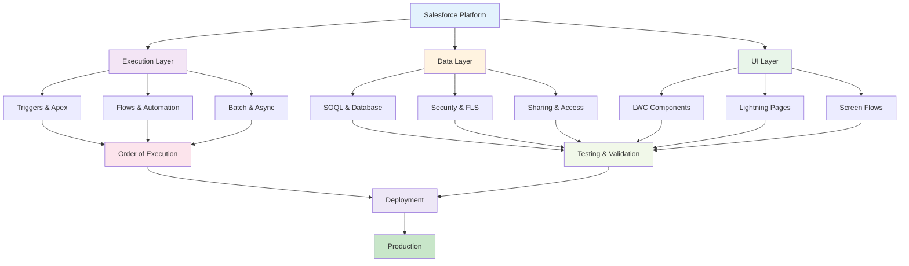

<div align="center">

# SF-AI-Knowledgehub

**Exploring AI-assisted Salesforce development with persistent context and memory.**

A collection of patterns, templates, and guardrails for Salesforce developers experimenting with AI tools. Not production-ready. This is a learning project.

[](LICENSE)
[](CONTRIBUTING.md)

</div>

---

## Why This Project

Most Salesforce developers hit the same wall with AI tools. Every new prompt, the AI forgets Salesforce rules. SOQL in loops. Hardcoded IDs. FLS gaps. You debug the same mistakes over and over.

The bigger issue: there's no way to carry lessons from one project to the next. You spend 4 hours debugging a query limit issue in March. In June, someone writes the same pattern. In September, it happens again. Each time you explain it. Each time someone debugs it.

This project asks: what if you could encode those lessons upfront, load them into your AI tool, and catch the mistakes before code review?

---

## What This Project Explores

This isn't about replacing engineers with AI. It's about answering four specific questions:

1. **Can context templates teach guardrails?** If you put Salesforce rules in a CLAUDE.md file, will the AI actually follow them?
2. **What if the AI remembered your past projects?** What would it look like to carry debugging lessons and patterns forward?
3. **Do better prompts actually reduce back-and-forth?** Or does the AI still miss security issues, bulk test failures, and order-of-execution problems?
4. **Can teams share pattern libraries?** What would it take to build a shared library of trigger patterns, SOQL optimizations, and deployment lessons?

The patterns here come from real Salesforce projects (10+ years of implementations). The templates have been tested. But the overall system—how these pieces fit together in an AI workflow—that's still experimental.

---

## What This Isn't

- **Not a deployment tool.** This teaches AI tools how to write correct code, not how to replace architects or senior engineers.
- **Not battle-tested at scale.** These patterns work for the projects they came from. Your org may have different constraints.
- **Not a substitute for code review.** You still need actual humans reviewing security, FLS checks, sharing rules, and deployment order.
- **Not official Salesforce guidance.** These are community patterns. Always verify against [developer.salesforce.com](https://developer.salesforce.com).
- **Memory systems are experimental.** Session memory works within a single project. Cross-project memory is harder and still being figured out.
- **Different AI tools work differently.** A pattern that works in Claude Code might need tweaking for Cursor or Copilot.

For a full breakdown of what's implemented, what's experimental, and what gaps exist, see [LIMITATIONS_AND_STATE.md](LIMITATIONS_AND_STATE.md).

---

## How to Use This Responsibly

This is a learning tool, not production infrastructure.

- **Validate everything manually.** AI makes mistakes. Review the code, test edge cases, check FLS and sharing rules before deploying anywhere.
- **Don't paste production data or credentials.** Keep your org context local. Never share real data in prompts or commit credentials to git.
- **Test in scratch orgs and dev orgs only.** This is for experimenting with workflows, not for live customer systems.
- **Use this to amplify good judgment, not replace it.** When in doubt, ask a senior engineer.

---

## ⚠️ Critical: What AI Misses About Salesforce

Before you write any prompt, understand these four blind spots:

### 1. AI Can't See Flows (They're Invisible)

Flows, validation rules, and processes run in the same transaction as your trigger. AI only sees Apex code.



**Fix**: Tell AI about the Flow in your prompt. See [ARCHITECT_REVIEW_CONSTRAINTS.md](ARCHITECT_REVIEW_CONSTRAINTS.md).

### 2. Bulk = 200 Records, Not 1

Governor limits are per-transaction. A trigger handling 200 records at once will hit limits that single-record code never touches.

| Scenario | SOQL Queries | AI Code | Result |
|----------|--------------|---------|---------|
| 1 account updates | 1 query in loop | Works | ✅ Pass |
| 200 accounts update | 200 queries in loop | Same code | ❌ SOQL 101 limit error |

**Why AI Misses It**: Thinks "the user probably updates one at a time" (wrong).

### 3. Sharing Rules Enforce at Database Level

You can't bypass FLS or sharing rules with code. `with sharing` on your class and `WITH SECURITY_ENFORCED` on SOQL are mandatory.

```apex
// ❌ AI often skips this
List<Account> accounts = [SELECT Id, Name FROM Account];

// ✅ Required
public with sharing class AccountService {
  public static List<Account> getAccounts() {
    return [SELECT Id, Name FROM Account WITH SECURITY_ENFORCED];
  }
}
```

**Why AI Misses It**: No concept of multi-tenant security. Assumes "the code runs with admin permissions" (wrong).

### 4. Order of Execution Has Hidden Complexity

Triggers, Flows, validations, and async processes run in a specific order. A change in one triggers another.

**See**: [ORDER_OF_EXECUTION.md](ORDER_OF_EXECUTION.md) for the full execution path.

---

## Recursion Risk: Trigger + Flow Conflict

This is the most common hidden bug. AI generates it regularly.



**How to Fix**:

```apex
// In Trigger: Guard against re-entry
public class AccountTriggerHandler {
  private static Boolean processing = false;
  
  public static void handleAfterUpdate(List<Account> accounts) {
    if (processing) return;  // Already running, exit
    
    processing = true;
    try {
      // ... your logic
      update accounts;
    } finally {
      processing = false;
    }
  }
}
```

**See**: [ARCHITECT_REVIEW_CONSTRAINTS.md](ARCHITECT_REVIEW_CONSTRAINTS.md#2-order-of-execution-where-hidden-complexity-lives) for details.

---

## Before Accepting AI Code: 12-Point Checklist

| Check | Why |
|-------|-----|
| Does it query in a loop? | SOQL 101 limit (100 queries per transaction) |
| Does it DML in a loop? | DML 150 limit (150 DML statements per transaction) |
| Will 200 records break it? | Standard bulk size in Salesforce |
| Did you mention Flows/validations? | Invisible to AI; must be in prompt |
| Does it have a recursion guard? | Trigger + Flow can re-enter infinitely |
| Is it marked `with sharing`? | Default: enforce sharing rules |
| Does it use `WITH SECURITY_ENFORCED`? | Default: enforce FLS |
| Did you test with non-admin user? | FLS/sharing only visible with limited user |
| Is there a try-catch in trigger? | Exceptions in triggers roll back all DML |
| Did you test with 200 records? | Single-record code often fails at scale |
| Was no real org data pasted? | Privacy/compliance risk |
| Did a human review it? | AI catches obvious bugs, not logic gaps |

**Fail any check?** Don't submit. Fix it first.

**See**: [ARCHITECT_REVIEW_CONSTRAINTS.md](ARCHITECT_REVIEW_CONSTRAINTS.md#checklist-before-accepting-ai-generated-code) for full checklist.

---

## What AI Can See vs. What It Can't



**Bottom line**: If it's not in Apex code or your prompt, AI won't know about it. That's a prompt problem, not an AI problem.

---

## Real Example: Debugging a Query Limit Bug

Your trigger hits 101 queries in production. Here's what happens with and without context.

**Without context files:**
```
Dev: "My trigger queries inside a loop. Fix it."
AI: Rewrites with a map. But forgets WITH SECURITY_ENFORCED.
Result: Code review catches the FLS bug. Two iterations. No bulk test written.
```

**With CLAUDE.md loaded:**
```
AI reads the hard rules:
- Never SOQL or DML inside loops
- Always use WITH SECURITY_ENFORCED  
- Always write a 200-record bulk test

AI rewrites the query, adds WITH SECURITY_ENFORCED, writes the bulk test.
Result: Catches the FLS issue and the query limit before code review. One iteration.
```

That's what this project does. One less round-trip. Fewer surprises in production.

---

## What's Here

### Salesforce Development Ecosystem



**Navigation**: Start with your role above → Read core concepts → Reference guides as needed → See templates for CLAUDE.md

### Core Documentation

| File | What It Covers |
|------|---|
| **[Vibe Coding Salesforce](vibe-coding-salesforce.md)** | How to use AI effectively in Salesforce. Safe patterns, constraints, workflows, component coverage. Start here if you're using Claude Code or other AI tools. |
| **[Getting Started](GETTING_STARTED.md)** | Setup in 5 steps. Scratch orgs, templates, verification. |
| **[ARCHITECTURE.md](ARCHITECTURE.md)** | Core patterns: 10 rules, layered Apex, bulkification, security, deployment order. |
| **[PATTERNS.md](PATTERNS.md)** | 8 reusable code examples. Trigger handlers, selectors, tests, LWC, Queueable. |
| **[DEPLOYMENT.md](DEPLOYMENT.md)** | How to deploy. 16-phase order, CI/CD workflows, GitHub Actions templates. |
| **[USE_CASES.md](USE_CASES.md)** | Real scenarios. Debugging memory, SOQL optimization, trigger pattern reuse. |
| **[Real-World Example: SOQL Limit Error](REAL_WORLD_EXAMPLE_SOQL_LIMIT.md)** | Step-by-step walkthrough: AI without context vs. AI with Salesforce constraints. Shows why context matters. |
| **[AI Tool Quick Start](AI_TOOL_QUICK_START.md)** | ⚠️ **START HERE if using Claude Code, Cursor, or ChatGPT.** Prompt formula, reading list, checklist, templates (CLAUDE.md), red flags. 80 min to master Salesforce constraints. |
| **[Real-World AI Failure & Fix](REAL_WORLD_AI_FAILURE_AND_FIX.md)** | Trigger + Flow recursion scenario. Shows bad code, AI response without context, improved response with context, refactored solution. |
| **[Architect Review: Constraints](ARCHITECT_REVIEW_CONSTRAINTS.md)** | Deep dive: Governor limits (SOQL 100, DML 150), execution order, Flow blindness, security model, 12-point checklist. Reference for architects and seniors. |
| **[LIMITATIONS_AND_STATE.md](LIMITATIONS_AND_STATE.md)** | What works, what's experimental, what isn't covered. |

### Salesforce Core Concepts (9 Documents)

| File | What It Covers |
|------|---|
| **[Order of Execution](ORDER_OF_EXECUTION.md)** | Trigger, flow, validation rule timing. Interaction matrix. When to use trigger vs. flow vs. process. |
| **[Flow Best Practices](FLOW_BEST_PRACTICES.md)** | Subflows, error paths, async patterns, recursion prevention, performance limits. |
| **[Integration Patterns](INTEGRATION.md)** | Callouts, Named Credentials, retry logic, timeout handling, rate limiting. |
| **[Security Guardrails](SECURITY.md)** | CRUD, FLS, sharing rules, data masking, custom permissions, hardcoded ID prevention. |
| **[LWC Best Practices](LWC_BEST_PRACTICES.md)** | Lifecycle, state management, error handling, accessibility, DOM access patterns. |
| **[Testing Strategy](TESTING_STRATEGY.md)** | Unit vs. integration testing, bulk testing, async testing, 90%+ coverage patterns. |
| **[Permission Model Design](PERMISSIONS.md)** | Permission Sets, custom permissions, field permissions, role hierarchy, testing with limited users. |
| **[AI Pitfalls Matrix](AI_PITFALLS.md)** | What AI commonly gets wrong in Salesforce (12 pitfalls with fixes). |
| **[Multi-Tenant Architecture](MULTITENANT.md)** | Resource contention, pod allocation, scaling, why limits exist, designing for scale. |

### Reference Guides (5 Quick Lookups)

| File | What It Covers |
|------|---|
| **[SF CLI Cheatsheet](reference/sf-cli-cheatsheet.md)** | Common CLI commands, flags, troubleshooting, useful aliases. |
| **[SOQL Anti-Patterns](reference/soql-anti-patterns.md)** | Query optimization, selective filters, aggregate functions, index usage. |
| **[Batch Apex Patterns](reference/batch-apex-patterns.md)** | Decision tree: Batch vs. Queueable vs. Scheduled. Examples with error handling. |
| **[LWC Security](reference/lwc-security.md)** | XSS prevention, sanitization, safe DOM patterns, input validation. |
| **[Test Data Patterns](reference/test-data-patterns.md)** | Factories, bulk setup, System.runAs(), assertions, edge cases. |

### Utilities

| Directory | Contents |
|-----------|----------|
| **templates/** | Ready-to-copy context files (CLAUDE.md, .cursorrules, etc.) |
| **skills/** | AI tool-agnostic skill guides for each component type |

---

## How to Use This by Role

### Apex Developer

Start with: [ARCHITECTURE.md](ARCHITECTURE.md) → [ORDER_OF_EXECUTION.md](ORDER_OF_EXECUTION.md) → [TESTING_STRATEGY.md](TESTING_STRATEGY.md)

Then reference: [SOQL Anti-Patterns](reference/soql-anti-patterns.md), [Batch Apex Patterns](reference/batch-apex-patterns.md), [SECURITY.md](SECURITY.md)

### LWC Developer

Start with: [LWC_BEST_PRACTICES.md](LWC_BEST_PRACTICES.md) → [reference/lwc-security.md](reference/lwc-security.md) → [TESTING_STRATEGY.md](TESTING_STRATEGY.md)

Then reference: [SECURITY.md](SECURITY.md), [reference/test-data-patterns.md](reference/test-data-patterns.md)

### Flow Developer

Start with: [FLOW_BEST_PRACTICES.md](FLOW_BEST_PRACTICES.md) → [ORDER_OF_EXECUTION.md](ORDER_OF_EXECUTION.md) → [SECURITY.md](SECURITY.md)

Then reference: [TESTING_STRATEGY.md](TESTING_STRATEGY.md), [PERMISSIONS.md](PERMISSIONS.md), [AI_PITFALLS.md](AI_PITFALLS.md)

### Integration Developer

Start with: [INTEGRATION.md](INTEGRATION.md) → [SECURITY.md](SECURITY.md) → [reference/batch-apex-patterns.md](reference/batch-apex-patterns.md)

Then reference: [TESTING_STRATEGY.md](TESTING_STRATEGY.md), [MULTITENANT.md](MULTITENANT.md)

### Architect

Start with: [MULTITENANT.md](MULTITENANT.md) → [ORDER_OF_EXECUTION.md](ORDER_OF_EXECUTION.md) → [PERMISSIONS.md](PERMISSIONS.md)

Then reference: [ARCHITECTURE.md](ARCHITECTURE.md), [DEPLOYMENT.md](DEPLOYMENT.md), [SECURITY.md](SECURITY.md)

### Using AI Tools (Claude Code, Cursor, Copilot)

⚠️ **Start with: [AI_TOOL_QUICK_START.md](AI_TOOL_QUICK_START.md) (80 minutes)**
- Prompt formula (what to tell AI)
- Reading list (governor limits, flow blindness, recursion)
- Checklist (before submitting any code)
- Templates (CLAUDE.md, test class)
- Red flags (what to reject)

Then: [ARCHITECT_REVIEW_CONSTRAINTS.md](ARCHITECT_REVIEW_CONSTRAINTS.md) → [REAL_WORLD_AI_FAILURE_AND_FIX.md](REAL_WORLD_AI_FAILURE_AND_FIX.md) → [Vibe Coding Salesforce](vibe-coding-salesforce.md)

Reference: [SECURITY.md](SECURITY.md), [TESTING_STRATEGY.md](TESTING_STRATEGY.md), [AI_PITFALLS.md](AI_PITFALLS.md), [ORDER_OF_EXECUTION.md](ORDER_OF_EXECUTION.md), [reference/soql-anti-patterns.md](reference/soql-anti-patterns.md)

---

## The 10 Core Rules

These come from real Salesforce projects. Most are lessons learned the hard way.

1. **No SOQL or DML inside loops.** You'll hit the 101 query limit.
2. **Bulkify for 200+ records.** Dev has 50. Production has 50,000.
3. **Use `with sharing` on every Apex class.** It respects your org's sharing rules.
4. **Use Permission Sets, not Profiles.** Profiles are legacy.
5. **Use `WITH SECURITY_ENFORCED` in every SOQL query.** FLS doesn't enforce itself.
6. **No hardcoded IDs or credentials.** It works in dev. Breaks everywhere else.
7. **One trigger per object.** Extend the handler, never create a second trigger.
8. **No callouts from trigger context.** Use Queueable with Database.AllowsCallouts instead.
9. **90%+ test coverage plus a 200-record bulk test.** Code coverage percentage is misleading without bulk tests.
10. **Validate before you deploy.** It catches surprises.

See [ARCHITECTURE.md](ARCHITECTURE.md) for the full reasoning.

---

## How to Use This

**Using AI tools (Claude Code, Cursor, Copilot)?**

1. Read **[Vibe Coding Salesforce](vibe-coding-salesforce.md)** (15 minutes). Learn safe patterns and workflows.
2. Copy [templates/CLAUDE.md](templates/CLAUDE.md) into your project. Load it into your AI tool.
3. Reference [PATTERNS.md](PATTERNS.md) and [ARCHITECTURE.md](ARCHITECTURE.md) in your AI prompts.

**First time here?**

1. Read [GETTING_STARTED.md](GETTING_STARTED.md) (5 minutes). Copy a template into your project.
2. Read [ARCHITECTURE.md](ARCHITECTURE.md) (30 minutes). Understand the 10 core rules and why they matter.
3. Read [USE_CASES.md](USE_CASES.md). See how patterns help in real scenarios.

**Building something?**

1. Look at [PATTERNS.md](PATTERNS.md) for reusable code examples. Copy what fits.
2. Check [ARCHITECTURE.md](ARCHITECTURE.md) for security, bulkification, and testing rules.
3. Use [DEPLOYMENT.md](DEPLOYMENT.md) when you're ready to deploy.

**Reference materials**

- [reference/governor-limits.md](reference/governor-limits.md) — Quick lookup for query limits, DML limits, etc.
- [reference/deployment-order.md](reference/deployment-order.md) — What deploys before what.
- [reference/common-errors.md](reference/common-errors.md) — What went wrong and how to fix it.

**Contributing?**

Found a pattern that works? Security lesson? See [CONTRIBUTING.md](CONTRIBUTING.md).

---

## Who Built This

Sai Shyam (Salesforce Technical Lead, 10+ years of implementations) designed the patterns. Claude helped structure and write the docs.

This is a side project, not an official Salesforce product. It's open source so other teams can learn from it and improve it.

---

## License

MIT. See [LICENSE](LICENSE).

---

> **Not official Salesforce documentation.** Always verify patterns against [developer.salesforce.com](https://developer.salesforce.com). Use at your own discretion in production contexts.
