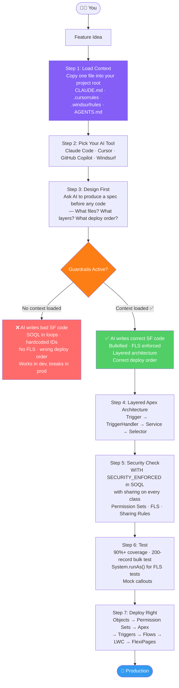

<div align="center">

# SF-AI-Knowledgehub

**SF architecture playbook for AI-assisted development.**
Context templates for Claude Code, Cursor, Copilot, and Windsurf with multi-tenant guardrails, security model, Agentforce patterns, and DevOps workflows baked in.

[](#whats-inside)
[](#whats-inside)
[](#quick-start)
[](LICENSE)
[](CONTRIBUTING.md)

</div>

---

## The Problem

Your AI tool doesn't know Salesforce. It'll write SOQL in loops, skip FLS checks, hardcode IDs, and deploy in the wrong order. Copy one file from this repo and it knows the rules before prompt one.

---

## Quick Start

Pick your tool and copy the matching file into your project:

| Tool | File to copy | Where it goes |
|------|-------------|---------------|
| Claude Code | [CLAUDE.md](templates/CLAUDE.md) | project root |
| Cursor | [.cursorrules](templates/.cursorrules) | project root |
| GitHub Copilot | [copilot-instructions.md](templates/copilot-instructions.md) | `.github/` folder |
| Windsurf | [.windsurfrules](templates/.windsurfrules) | project root |
| Any tool | [AGENTS.md](templates/AGENTS.md) | project root |

```bash
# Example: Claude Code setup
cp templates/CLAUDE.md /path/to/your/sf-project/CLAUDE.md
```

---

## How Vibe Coding Salesforce Works

Most developers jump straight to prompting. That's where things go wrong. The diagram below shows the right flow — context first, then code.



The left path (no context) is where most vibe coding disasters happen. The right path is what this repo enables.

---

## What's Inside

| Section | What you get |
|---------|-------------|
| 00 Before You Vibe Code | Why context matters, multi-tenant risks, pre-flight checklist |
| 01 Environment Setup | Prerequisites, org types, SF CLI, VS Code, scratch orgs |
| 02 AI Tool Setup | Claude Code, Cursor, Copilot, Windsurf config guides |
| 03 Architecture Guardrails | Multi-tenant, layered Apex, order of execution, async, SOQL |
| 04 Security Model | Permission Sets, FLS/CRUD, sharing model |
| 05 Development Patterns | Apex, LWC, Flow, Integration patterns |
| 06 Agentforce | Topics, Actions, InvocableApex, Trust Layer |
| 07 DevOps | Deployment strategy, GitHub Actions CI/CD |
| Templates | Ready-to-copy context files for every AI tool |
| Reference | Governor limits, deployment order, common errors, metadata types |

---

## The 10 Guardrails

1. **No SOQL or DML inside loops**: hits the 101 query limit at 101 records
2. **Bulkify for 200+ records**: dev orgs have tiny data, production doesn't
3. **`with sharing` on every Apex class**: respects record visibility rules
4. **Permission Sets, not Profiles**: Profiles are legacy, PS is the roadmap
5. **`WITH SECURITY_ENFORCED` in every SOQL query**: FLS doesn't enforce itself
6. **No hardcoded IDs or credentials**: works in dev, breaks in every other org
7. **One trigger per object**: extend the handler, never create a second trigger
8. **No callouts from trigger context**: use Queueable with Database.AllowsCallouts
9. **90%+ test coverage, 200-record bulk test**: coverage numbers lie without bulk tests
10. **Validate before you deploy**: dry-run first, always

Full rationale: [03-architecture-guardrails](03-architecture-guardrails/README.md)

---

## Built By

Co-built by **[Sai Shyam](https://www.linkedin.com/in/meda-sai-shyam/)** and Claude.

Sai Shyam is a Salesforce Technical Lead with 10+ years of enterprise implementations. He contributed the architecture patterns, security model, deployment lessons, and Agentforce patterns that form the backbone of this repo. Claude helped structure and write the documentation.

[](https://github.com/mssm-sftechstack)
[](https://www.linkedin.com/in/meda-sai-shyam/)

---

## Contributing

See [CONTRIBUTING.md](CONTRIBUTING.md) to add patterns, share deployment lessons, or improve existing content.

---

## License

MIT. See [LICENSE](LICENSE).

---

> Independent community knowledge, not official Salesforce documentation. Always verify against [developer.salesforce.com](https://developer.salesforce.com).
