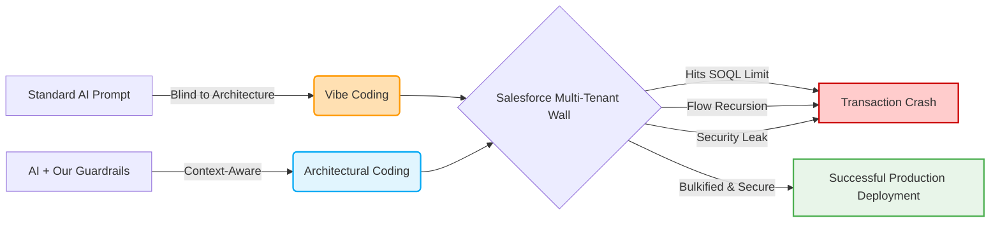

# SF AI Knowledge Hub: Stop Vibe Coding in Salesforce

AI is incredible at writing boilerplate code, but it is terrible at being a Salesforce Architect. 

If you use tools like GitHub Copilot, Cursor, or Claude to write Apex or LWC without giving them explicit architectural context, you are building a time bomb. Out of the box, LLMs do not understand the multi-tenant architecture. They do not know your org's specific Order of Execution. They cannot see your active Record-Triggered Flows, and they frequently hallucinate solutions that instantly blow up governor limits.



This repository is your safeguard. It provides plug-and-play context templates for your AI coding assistants, ensuring the code they generate respects Salesforce governor limits, bulkification rules, and strict security guidelines.

## 🚀 Quick Start: Give Your AI Context

Stop pasting your org details into every new chat prompt. Drop these rule files directly into your project root.

* **Cursor Users:** Copy `templates/.cursorrules` to your root directory.
* **GitHub Copilot Users:** Copy `templates/copilot-instructions.md` and reference it in your settings.
* **Claude Code / Windsurf:** Copy `templates/CLAUDE.md` to your root directory.

Once installed, your AI will automatically reference Salesforce best practices before generating a single line of code.

## 🛑 Real World Example: The Limit Trap

Why does this matter? Let us look at a standard prompt: *"Write an Apex method to update related Contacts when an Account is updated."*

### What AI Writes (Without Context)
The AI writes logic that works perfectly in a local Node environment but fails spectacularly in a multi-tenant Salesforce org. Notice the SOQL query and DML statement inside the `for` loop, plus the complete lack of field-level security checks.

```apex
public static void updateRelatedContacts(List<Account> accounts) {
    for (Account acc : accounts) {
        // FATAL: SOQL inside a for loop
        List<Contact> contacts = [SELECT Id FROM Contact WHERE AccountId = :acc.Id];
        
        for (Contact con : contacts) {
            con.Description = 'Account Updated';
            // FATAL: DML inside a for loop
            update con; 
        }
    }
}
```

### What AI Writes (With Our Repository Context)
By feeding the AI our architectural guidelines, it automatically bulkifies the transaction, prevents governor limit exceptions, and respects user security contexts.

```apex
public static void updateRelatedContacts(List<Account> accounts) {
    if (accounts == null || accounts.isEmpty()) return;

    List<Contact> contactsToUpdate = new List<Contact>();
    
    // SAFE: Bulkified SOQL with User Mode security enforcement
    for (Contact con : [SELECT Id, AccountId FROM Contact WHERE AccountId IN :accounts WITH USER_MODE]) {
        con.Description = 'Account Updated';
        contactsToUpdate.add(con);
    }
    
    // SAFE: Bulkified DML outside the loop
    if (!contactsToUpdate.isEmpty()) {
        update as user contactsToUpdate;
    }
}
```

## 📚 The Core Playbooks

This repository contains 12 core documents that map out exactly how to build safely in the Salesforce ecosystem using AI. 

### 🏛️ Core Architecture
* **[ARCHITECTURE.md](./ARCHITECTURE.md)**: The 5 golden rules of multi-tenant AI generation.
* **[ORDER_OF_EXECUTION.md](./ORDER_OF_EXECUTION.md)**: How Triggers, Flows, and Validations interact.
* **[MULTITENANT_AND_GOVERNOR_LIMITS.md](./MULTITENANT_AND_GOVERNOR_LIMITS.md)**: Synchronous limits (SOQL 101, CPU) and Asynchronous boundaries (Future/Queueable limits).
* **[LARGE_DATA_VOLUME_CONSTRAINTS.md](./LARGE_DATA_VOLUME_CONSTRAINTS.md)**: Index forcing (Selective SOQL), Heap Size bypasses for 50k+ records, and parent data skew lock prevention.

### 🛡️ Security & Access
* **[ZERO_TRUST_SECURITY_MODEL.md](./ZERO_TRUST_SECURITY_MODEL.md)**: Enforcing CRUD, FLS, sharing rules, and preventing Dynamic SOQL Injection.
* **[PERMISSIONS_AND_SHARING_CONSTRAINTS.md](./PERMISSIONS_AND_SHARING_CONSTRAINTS.md)**: The Profile ban and composable security logic.
* **[LWC_SECURITY_AND_LIMITS.md](./LWC_SECURITY_AND_LIMITS.md)**: Client-side constraints, wire adapter reactivity, and Shadow DOM rules.
* **[REGULATORY_AND_COMPLIANCE_CONSTRAINTS.md](./REGULATORY_AND_COMPLIANCE_CONSTRAINTS.md)**: Shield Encryption awareness, GDPR hard-deletions, and preventing PII/PHI leaks in debug logs.

### ⚙️ Automation & Integration
* **[FLOW_AND_AUTOMATION_CONSTRAINTS.md](./FLOW_AND_AUTOMATION_CONSTRAINTS.md)**: Preventing Apex/Flow recursion and structuring Invocable Methods.
* **[INTEGRATION_AND_CALLOUT_CONSTRAINTS.md](./INTEGRATION_AND_CALLOUT_CONSTRAINTS.md)**: Avoiding uncommitted work pending, managing callout limits, and bulk payloads.

### 🛠️ Development Standards
* **[ZERO_TOLERANCE_TESTING_MODEL.md](./ZERO_TOLERANCE_TESTING_MODEL.md)**: Forcing AI to write actual assertions, bulk tests, negative tests, and HTTP Callout Mocks.
* **[PATTERNS_AND_ANTI_PATTERNS.md](./PATTERNS_AND_ANTI_PATTERNS.md)**: Trigger frameworks, Selectors, and standardizing AI output.
* **[DEPLOYMENT_AND_DEVOPS_CONSTRAINTS.md](./DEPLOYMENT_AND_DEVOPS_CONSTRAINTS.md)**: Metadata dependency hierarchies and destructive changes.
* **[HUMAN_CODE_REVIEW_CHECKLIST.md](./HUMAN_CODE_REVIEW_CHECKLIST.md)**: The mandatory manual PR audit checklist for developers verifying AI code.

### 🚨 Real World Learning
* **[REAL_WORLD_AI_FAILURE_AND_FIX.md](./REAL_WORLD_AI_FAILURE_AND_FIX.md)**: A log of dangerous AI hallucinations (like loop traps and memory leaks) and how to fix them.

## 🤝 The Golden Rule for Developers

AI models are co-pilots. They are not the pilot. Even with these strict context files in place, it remains the primary responsibility of the individual developer to manually review every line of generated code. You must verify that the logic adheres to your specific instance limits and data model.

## Contributing

Did your AI assistant write something completely unhinged that caused a recursion loop? We want to see it. 

Submit a pull request to add your experience to our `REAL_WORLD_AI_FAILURE_AND_FIX.md` document so the rest of the community can learn what prompts to avoid. Read our full [Contributing Guide](./CONTRIBUTING.md) for more details.