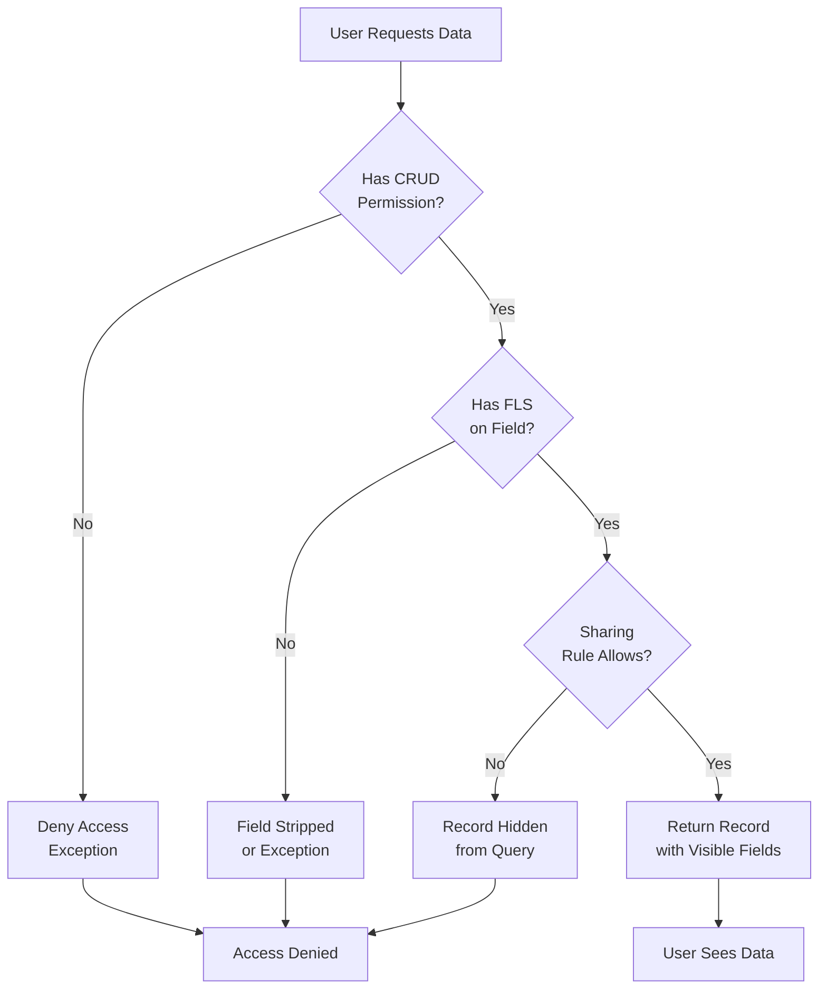

# Security Guardrails

Security covers CRUD checks, Field-Level Security (FLS), sharing rules, data masking, and permission enforcement across Apex, Flow, and LWC.

## Access Control Flow

All data access follows this sequence:



The order is: CRUD check → FLS check → Sharing check. If any fails, access is denied.

---

## Core Rules

### Rule 1: CRUD Checks in Apex

Every SOQL query and DML operation must check Create, Read, Update, Delete permissions.

```apex
// ❌ Wrong: No CRUD check
List<Account> accounts = [SELECT Id, Name FROM Account];
update accounts;

// ✅ Right: WITH SECURITY_ENFORCED (throws exception if denied)
List<Account> accounts = [SELECT Id, Name FROM Account WITH SECURITY_ENFORCED];

// ✅ Right: Security.stripInaccessible (removes inaccessible fields)
List<Account> accounts = [SELECT Id, Name FROM Account];
accounts = (List<Account>) Security.stripInaccessible(AccessType.READABLE, accounts).getResults();
```

**Two approaches**:

| Approach | Behavior | When to Use |
|----------|----------|-------------|
| WITH SECURITY_ENFORCED | Throws exception if user lacks access | Required access, audit trail needed |
| stripInaccessible | Silently removes inaccessible fields | Graceful degradation, showing partial data OK |

**Which to choose**:
- Use **WITH SECURITY_ENFORCED** when user MUST have access to proceed
- Use **stripInaccessible** when you can show user partial data

### Rule 2: FLS on Writes (Apex)

When updating records, enforce FLS to prevent writes to fields user cannot edit.

```apex
// ❌ Wrong: No FLS check
account.Name = 'New Name';
account.Sensitive__c = 'Secret Data';
update account;  // Update succeeds even if user lacks FLS on Sensitive__c

// ✅ Right: Validate updateable status
Schema.SObjectField[] fieldsToUpdate = new Schema.SObjectField[]{
  Account.Name,
  Account.Sensitive__c
};

for (Schema.SObjectField field : fieldsToUpdate) {
  if (!field.getDescribe().isUpdateable()) {
    throw new SecurityException('Field ' + field + ' is not updateable for this user');
  }
}

account.Name = 'New Name';
account.Sensitive__c = 'Secret Data';
update account;

// ✅ Alternative: stripInaccessible for writes
account.Name = 'New Name';
account.Sensitive__c = 'Secret Data';
// Strip fields user can't update
Map<String, Object> updateMap = (Map<String, Object>) 
  Security.stripInaccessible(AccessType.UPDATEABLE, new List<SObject>{account}).getResults().get(0);
update account;
```

### Rule 3: Sharing Rules (Org-Wide Defaults)

Sharing rules determine which records a user can see. Sharing is enforced by default in `with sharing` Apex classes.

```apex
// ✅ Respects sharing rules (default behavior)
public with sharing class AccountService {
  public static List<Account> getVisibleAccounts() {
    return [SELECT Id, Name FROM Account];
    // Returns only accounts user has access to via sharing rules
  }
}

// ❌ Bypasses sharing rules (dangerous, use sparingly)
public without sharing class AdminAccountService {
  public static List<Account> getAllAccounts() {
    return [SELECT Id, Name FROM Account];
    // Returns all accounts, ignoring sharing (admin only)
  }
}
```

**Best practice**: All Apex classes use `with sharing` by default. Only use `without sharing` for specific admin operations, and document why.

---

## CRUD/FLS/Sharing by Component

### Apex: CRUD + FLS + Sharing All Required

```apex
public with sharing class AccountService {
  // Test with FeatureManagement.checkPermission or stripInaccessible
  public static List<Account> getAccounts() {
    // Enforces sharing automatically (with sharing class)
    // Enforces CRUD via WITH SECURITY_ENFORCED
    List<Account> accounts = [SELECT Id, Name, Phone FROM Account WITH SECURITY_ENFORCED];
    
    // Enforce FLS on reads
    accounts = (List<Account>) Security.stripInaccessible(AccessType.READABLE, accounts).getResults();
    
    return accounts;
  }
  
  public static void updateAccount(Id accountId, String newName) {
    Account acc = [SELECT Id, Name FROM Account WHERE Id = :accountId WITH SECURITY_ENFORCED];
    
    // Enforce FLS on writes
    if (!Account.Name.getDescribe().isUpdateable()) {
      throw new SecurityException('Name field is not updateable');
    }
    
    acc.Name = newName;
    update acc;
  }
}
```

### Flow: FLS + Sharing (No Direct CRUD Check)

Flows enforce FLS automatically. Sharing is enforced if the flow runs as the logged-in user.

**FLS enforcement in Flow**:
- Record-Triggered Flows: Automatically respect FLS on fields accessed
- Screen Flows: Automatically respect FLS on fields shown to user
- Subflows: FLS inherited from parent context

**Sharing enforcement in Flow**:
- Record-Triggered Flows: Run as system (can see all records)
- Screen Flows: Run as logged-in user (sharing rules apply)
- Scheduled Flows: Run as system (can see all records)

**Best practice**: If Flow needs to enforce user sharing, use Apex service with `with sharing` and invoke from Flow.

```xml
<!-- Flow: Create Account (respects FLS) -->
<flow:definition>
  <recordCreate>
    <label>Create Account</label>
    <inputAssignments>
      <assignToReference>{!newAccount.Name}</assignToReference>
      <value>{!inputName}</value>
    </inputAssignments>
    <!-- FLS is automatically enforced -->
    <!-- If user lacks permission to create Account, flow fails -->
  </recordCreate>
</flow:definition>
```

### LWC: FLS + Sharing via Apex Controller

LWC cannot directly enforce CRUD/FLS/Sharing. All data access must go through Apex.

```javascript
// ❌ Wrong: Direct data access (no FLS/CRUD/Sharing)
// LWC cannot fetch directly from Salesforce data

// ✅ Right: Apex controller with proper security
import { LightningElement, wire } from 'lwc';
import getAccounts from '@salesforce/apex/AccountController.getAccounts';

export default class AccountList extends LightningElement {
  @wire(getAccounts)
  wiredAccounts;
}
```

```apex
// Apex Controller: enforces all security
public with sharing class AccountController {
  @AuraEnabled(cacheable=true)
  public static List<Account> getAccounts() {
    // with sharing: enforces sharing rules
    // WITH SECURITY_ENFORCED: enforces CRUD
    // stripInaccessible: enforces FLS
    List<Account> accounts = [SELECT Id, Name, Phone FROM Account WITH SECURITY_ENFORCED];
    return (List<Account>) Security.stripInaccessible(AccessType.READABLE, accounts).getResults();
  }
}
```

---

## Field-Level Security (FLS) Testing

### Test Setup with PermissionSet

```apex
@IsTest
private class AccountServiceTest {
  @TestSetup
  static void setupTestData() {
    // Create test user with standard permissions
    User testUser = new User(
      FirstName = 'Test',
      LastName = 'User',
      Email = 'testuser@example.com',
      Username = 'testuser@example.com.' + System.now().millisecond(),
      ProfileId = [SELECT Id FROM Profile WHERE Name = 'Standard User' LIMIT 1].Id,
      Alias = 'tstu',
      TimeZoneSidKey = 'America/Los_Angeles',
      LocaleSidKey = 'en_US',
      EmailEncodingKey = 'UTF-8',
      LanguageLocaleKey = 'en_US'
    );
    insert testUser;
    
    // Assign permission set with custom field access
    PermissionSetAssignment psa = new PermissionSetAssignment(
      PermissionSetId = [SELECT Id FROM PermissionSet WHERE Name = 'Account_Admin'].Id,
      AssigneeId = testUser.Id
    );
    insert psa;
  }
  
  @IsTest
  static void testFLSEnforcement() {
    User testUser = [SELECT Id FROM User WHERE Email = 'testuser@example.com' LIMIT 1];
    Account acc = [SELECT Id FROM Account LIMIT 1];
    
    System.runAs(testUser) {
      acc.Name = 'Updated Name';
      acc.Sensitive__c = 'Secret Data';
      
      try {
        update acc;
        System.assert(true, 'Update succeeded (user has FLS)');
      } catch (DmlException ex) {
        System.assert(ex.getMessage().contains('INSUFFICIENT_ACCESS'),
                     'Expected FLS violation');
      }
    }
  }
  
  @IsTest
  static void testStripInaccessible() {
    User testUser = [SELECT Id FROM User WHERE Email = 'testuser@example.com' LIMIT 1];
    
    Account acc = new Account(
      Name = 'Test Account',
      Sensitive__c = 'Should be hidden',
      Phone = '555-1234'
    );
    insert acc;
    
    System.runAs(testUser) {
      List<Account> accounts = [SELECT Id, Name, Sensitive__c, Phone FROM Account WHERE Id = :acc.Id];
      
      // Strip fields user can't read
      accounts = (List<Account>) Security.stripInaccessible(AccessType.READABLE, accounts).getResults();
      
      Account result = accounts[0];
      // Sensitive__c is null if user lacks FLS
      System.assert(result.Name == 'Test Account');
    }
  }
}
```

---

## Sharing Rules: Org-Wide Defaults & Manual Sharing

### Org-Wide Defaults (OWD)

OWD sets the baseline sharing level for all records:

| Setting | Permission | Effect |
|---------|-----------|--------|
| Public Read/Write | Everyone can see and edit | Least restrictive |
| Public Read Only | Everyone can see, owner can edit | Limited write access |
| Private | Only owner can see | Most restrictive |
| Controlled by Parent | Inherits from parent record | For child objects |

### Manual Sharing with AccountShare

```apex
public with sharing class AccountSharingService {
  public static void shareAccountWithUser(Id accountId, Id userId, String accessLevel) {
    AccountShare share = new AccountShare();
    share.AccountId = accountId;
    share.UserOrGroupId = userId;
    share.AccountAccessLevel = accessLevel;  // Read, Edit, or All
    insert share;
  }
  
  public static void shareAccountWithTeam(Id accountId, List<Id> userIds) {
    List<AccountShare> shares = new List<AccountShare>();
    
    for (Id userId : userIds) {
      AccountShare share = new AccountShare();
      share.AccountId = accountId;
      share.UserOrGroupId = userId;
      share.AccountAccessLevel = 'Read';
      shares.add(share);
    }
    
    insert shares;
  }
}
```

### Testing Sharing Rules

```apex
@IsTest
static void testAccountSharing() {
  User owner = createTestUser('Owner');
  User viewer = createTestUser('Viewer');
  
  Id accountId;
  System.runAs(owner) {
    Account acc = new Account(Name = 'Private Account');
    insert acc;
    accountId = acc.Id;
    
    // Viewer cannot see account yet (OWD is Private)
    System.runAs(viewer) {
      List<Account> visibleAccounts = [SELECT Id FROM Account WHERE Id = :accountId];
      System.assertEquals(0, visibleAccounts.size(), 'Viewer should not see account');
    }
  }
  
  // Owner shares account with viewer
  AccountShare share = new AccountShare(
    AccountId = accountId,
    UserOrGroupId = viewer.Id,
    AccountAccessLevel = 'Read'
  );
  insert share;
  
  System.runAs(viewer) {
    // Now viewer can see account
    List<Account> visibleAccounts = [SELECT Id FROM Account WHERE Id = :accountId];
    System.assertEquals(1, visibleAccounts.size(), 'Viewer should now see account');
  }
}
```

---

## Hardcoded IDs: The Silent Killer

Never hardcode Record Type IDs, custom metadata type IDs, or other org-specific values. Resolve dynamically.

### Apex: Hardcoded Record Type ID

```apex
// ❌ Wrong: Hardcoded ID breaks in other orgs
public void createAccount() {
  Account acc = new Account(
    Name = 'Acme',
    RecordTypeId = '012a0000000IZ3AAM'  // This ID is specific to one org
  );
  insert acc;
}

// ✅ Right: Resolve Record Type dynamically
public void createAccount() {
  Map<String, RecordTypeInfo> rtByName = Schema.SObjectType.Account.getRecordTypeInfosByDeveloperName();
  
  if (!rtByName.containsKey('Standard_Account')) {
    throw new ConfigException('Record Type Standard_Account not found');
  }
  
  Id recordTypeId = rtByName.get('Standard_Account').getRecordTypeId();
  
  Account acc = new Account(
    Name = 'Acme',
    RecordTypeId = recordTypeId
  );
  insert acc;
}
```

### Flow: Hardcoded Record Type ID

```xml
<!-- ❌ Wrong: Hardcoded Record Type ID -->
<recordCreate>
  <recordTypeId>012a0000000IZ3AAM</recordTypeId>
  <!-- This ID doesn't exist in other orgs -->
</recordCreate>

<!-- ✅ Right: Use Record Type Name (declarative, no ID needed) -->
<recordCreate>
  <recordTypeDisplayName>Standard Account</recordTypeDisplayName>
</recordCreate>
```

### LWC: Hardcoded Metadata Reference

```javascript
// ❌ Wrong: Hardcoded values
const ACCOUNT_RECORD_TYPE = '012a0000000IZ3AAM';
const CUSTOM_SETTING_ID = '001a0000000XYZ';

// ✅ Right: Call Apex to get dynamic values
import getRecordTypeId from '@salesforce/apex/AccountController.getRecordTypeId';

export default class AccountForm extends LightningElement {
  recordTypeId;
  
  async connectedCallback() {
    this.recordTypeId = await getRecordTypeId('Standard_Account');
  }
}
```

```apex
public class AccountController {
  @AuraEnabled(cacheable=true)
  public static String getRecordTypeId(String recordTypeName) {
    Map<String, RecordTypeInfo> rtByName = Schema.SObjectType.Account.getRecordTypeInfosByDeveloperName();
    
    if (!rtByName.containsKey(recordTypeName)) {
      throw new ConfigException('Record Type ' + recordTypeName + ' not found');
    }
    
    return rtByName.get(recordTypeName).getRecordTypeId();
  }
}
```

---

## SQL Injection Prevention

Salesforce SOQL is safe from injection when using bind variables. Never concatenate user input into SOQL.

```apex
// ❌ Wrong: Vulnerable to SOQL injection
String searchName = 'Test\' OR Name != NULL; --';
String query = 'SELECT Id FROM Account WHERE Name = \'' + searchName + '\'';
List<Account> accounts = Database.query(query);  // SOQL injection!

// ✅ Right: Use bind variables (safe)
String searchName = 'Test';
List<Account> accounts = [SELECT Id FROM Account WHERE Name = :searchName];
```

**Rule**: Always use bind variables (`:variable`) in SOQL. Never concatenate user input.

---

## XSS Prevention in LWC

### Template Binding (Safe)

```html
<!-- ✅ Safe: Template binding automatically escapes HTML -->
<template>
  <div class="user-name">{userName}</div>
  <!-- If userName = '<script>alert(1)</script>', it renders as text, not executed -->
</template>
```

### innerHTML (Unsafe)

```javascript
// ❌ Wrong: innerHTML executes scripts
const div = this.template.querySelector('.content');
div.innerHTML = userProvidedContent;  // If content has <script>, it runs

// ✅ Right: textContent doesn't execute scripts
div.textContent = userProvidedContent;  // Renders as plain text
```

### Sanitizing User Input

```javascript
import { sanitizeUrl } from 'c/sanitizer';

export default class UserContent extends LightningElement {
  userUrl;
  
  connectedCallback() {
    // Sanitize URL to prevent javascript: protocol
    this.userUrl = sanitizeUrl(this.unsafeUrl);
  }
}
```

```html
<!-- Template binding is safe -->
<a href={userUrl}>{userUrl}</a>
```

---

## Custom Permissions

Use custom permissions to restrict access to sensitive operations.

### Setup

1. Setup > Custom Code > Custom Permissions
2. New > Label: `Can_Export_Data`, Name: `Can_Export_Data`
3. Add to PermissionSet assigned to users

### In Apex

```apex
public with sharing class DataExportService {
  public static String exportAccountsToCSV() {
    if (!FeatureManagement.checkPermission('Can_Export_Data')) {
      throw new SecurityException('You lack permission to export data');
    }
    
    List<Account> accounts = [SELECT Id, Name, Phone FROM Account WITH SECURITY_ENFORCED];
    
    String csv = 'Id,Name,Phone\n';
    for (Account acc : accounts) {
      csv += acc.Id + ',' + acc.Name + ',' + (acc.Phone ?? '') + '\n';
    }
    
    return csv;
  }
}
```

### In LWC

```javascript
import checkPermission from '@salesforce/apex/PermissionService.checkPermission';

export default class DataExport extends LightningElement {
  async handleExport() {
    const hasPermission = await checkPermission('Can_Export_Data');
    
    if (!hasPermission) {
      this.showError('You lack permission to export data');
      return;
    }
    
    // Proceed with export
  }
}
```

---

## Data Masking & PII Protection

### Masking Sensitive Fields

```apex
public with sharing class AccountService {
  public static List<Account> getAccountsWithMasking() {
    List<Account> accounts = [SELECT Id, Name, Phone, SSN__c FROM Account];
    
    for (Account acc : accounts) {
      // Mask phone (keep last 4 digits)
      if (acc.Phone != null && acc.Phone.length() > 4) {
        acc.Phone = '***-' + acc.Phone.substring(acc.Phone.length() - 4);
      }
      
      // Don't expose SSN in response
      acc.SSN__c = null;
    }
    
    return accounts;
  }
}
```

### No PII in Logs

```apex
private static void logError(Exception ex, Id accountId) {
  ErrorLog__c log = new ErrorLog__c();
  log.Message__c = ex.getMessage();
  log.Account_Id__c = accountId;  // Log ID, not sensitive data
  
  // ❌ Never log sensitive data
  // log.Email__c = account.Email;
  // log.SSN__c = account.SSN__c;
  
  insert log;
}
```

### Restricting Sensitive Field Access

```apex
public with sharing class SensitiveDataService {
  public static Map<Id, Account> getAccountsWithSSN() {
    // Check custom permission before exposing PII
    if (!FeatureManagement.checkPermission('View_PII')) {
      throw new SecurityException('You lack permission to view PII');
    }
    
    return new Map<Id, Account>([SELECT Id, Name, SSN__c FROM Account]);
  }
}
```

---

## Production Security Checklist

- ✅ All SOQL/DML have CRUD checks (WITH SECURITY_ENFORCED or stripInaccessible)
- ✅ All Apex classes use `with sharing` (document exceptions for `without sharing`)
- ✅ FLS enforced on writes (verify isUpdateable before update)
- ✅ No hardcoded IDs (Record Types, Custom Metadata resolved dynamically)
- ✅ No string concatenation in SOQL (use bind variables)
- ✅ No direct LWC data access (all through Apex controller with security)
- ✅ Sensitive fields masked or restricted (custom permissions)
- ✅ No PII in logs or error messages
- ✅ XSS prevention in LWC (textContent instead of innerHTML)
- ✅ Tests run as non-admin user with PermissionSet
- ✅ Sharing rules tested (System.runAs with different users)
- ✅ Flow respects FLS (automatic, but verify in test)
