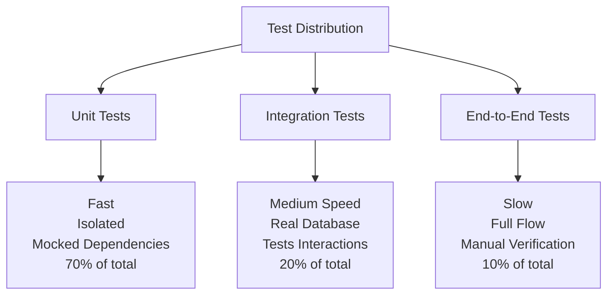
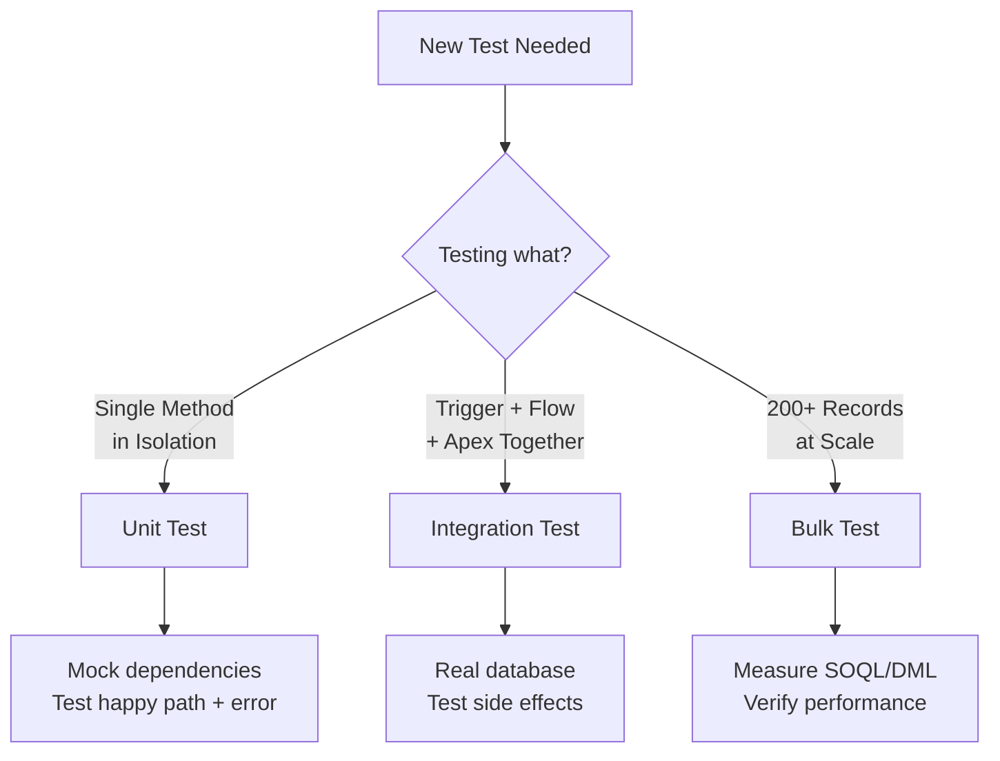

# Testing Strategy

Testing covers unit, integration, and bulk testing for Apex, Flow, and LWC. Minimum 90%+ coverage across all components.

## Test Pyramid



**Distribution**:
- **70% Unit Tests**: Test individual methods with mocked dependencies
- **20% Integration Tests**: Test trigger + flow + Apex together
- **10% End-to-End Tests**: Full workflows tested manually or in staging

## When to Use Unit vs. Integration vs. Bulk



---

## 90%+ Coverage Requirement

Coverage percentage is misleading. A class with 95% coverage can still have critical bugs if the untested 5% is error handling or edge cases.

**Real Coverage = All Code Lines + All Branches (if/else/catch) + Edge Cases**

### What NOT Covered by 95% Line Coverage

```apex
public class AccountService {
  public static Decimal calculateRevenue(List<Account> accounts) {
    if (accounts == null || accounts.isEmpty()) {
      return 0;  // Edge case: null/empty list
    }
    
    Decimal total = 0;
    for (Account acc : accounts) {
      if (acc.Revenue__c != null) {  // Edge case: null field
        total += acc.Revenue__c;
      }
    }
    
    try {
      update accounts;
    } catch (DmlException ex) {  // Error path: needs test
      System.debug('Update failed: ' + ex.getMessage());
      throw ex;
    }
    
    return total;
  }
}
```

**Happy path only test** (covers 95% of lines, misses critical cases):
```apex
@IsTest
static void testCalculateRevenue() {
  List<Account> accounts = new List<Account>{
    new Account(Name = 'Acme', Revenue__c = 100000)
  };
  insert accounts;
  
  Decimal result = AccountService.calculateRevenue(accounts);
  System.assertEquals(100000, result);
}
```

**Full coverage test** (covers 100% of code paths):
```apex
@IsTest
static void testCalculateRevenueWithNullAccounts() {
  Decimal result = AccountService.calculateRevenue(null);
  System.assertEquals(0, result);
}

@IsTest
static void testCalculateRevenueWithEmptyList() {
  Decimal result = AccountService.calculateRevenue(new List<Account>{});
  System.assertEquals(0, result);
}

@IsTest
static void testCalculateRevenueWithNullField() {
  List<Account> accounts = new List<Account>{
    new Account(Name = 'Acme', Revenue__c = null)
  };
  insert accounts;
  
  Decimal result = AccountService.calculateRevenue(accounts);
  System.assertEquals(0, result);
}

@IsTest
static void testCalculateRevenueUpdateFailure() {
  List<Account> accounts = new List<Account>{
    new Account(Name = 'Acme', Revenue__c = 100000)
  };
  insert accounts;
  
  try {
    // Force update to fail by removing Name
    for (Account acc : accounts) {
      acc.Name = null;
    }
    AccountService.calculateRevenue(accounts);
    System.assert(false, 'Should fail with DML exception');
  } catch (DmlException ex) {
    System.assert(ex.getMessage().contains('Required'));
  }
}
```

---

## Apex Unit Testing

### Basic Pattern: Arrange-Act-Assert

```apex
@IsTest
private class AccountServiceTest {
  @IsTest
  static void testCalculateAnnualRevenue() {
    // Arrange: Create test data
    Account acc = new Account(
      Name = 'Acme',
      Revenue__c = 100000
    );
    
    // Act: Call method
    Decimal revenue = AccountService.calculateAnnualRevenue(acc);
    
    // Assert: Verify result
    System.assertEquals(100000, revenue, 'Revenue should match input');
  }
}
```

### TestSetup vs. Inline Data

```apex
@IsTest
private class AccountServiceTest {
  @TestSetup
  static void setupTestData() {
    // Data created once, shared across all test methods
    List<Account> accounts = new List<Account>();
    for (Integer i = 0; i < 10; i++) {
      accounts.add(new Account(Name = 'Account ' + i));
    }
    insert accounts;
  }
  
  @IsTest
  static void testQueryAccounts() {
    Account acc = [SELECT Id FROM Account LIMIT 1];
    System.assertNotEquals(null, acc.Id);
  }
  
  @IsTest
  static void testUpdateAccounts() {
    List<Account> accounts = [SELECT Id FROM Account];
    
    for (Account acc : accounts) {
      acc.Revenue__c = 50000;
    }
    update accounts;
    
    System.assertEquals(10, [SELECT COUNT() FROM Account WHERE Revenue__c = 50000]);
  }
}
```

### Testing Error Paths

```apex
@IsTest
static void testUpdateWithoutPermission() {
  User testUser = createTestUser('Standard User');
  Account acc = new Account(Name = 'Acme');
  insert acc;
  
  // Run as non-admin user
  System.runAs(testUser) {
    acc.Name = 'Updated';
    
    try {
      update acc;
      System.assert(false, 'Should fail due to FLS');
    } catch (DmlException ex) {
      System.assert(ex.getMessage().contains('INSUFFICIENT_ACCESS'));
    }
  }
}

@IsTest
static void testNullValueHandling() {
  try {
    AccountService.calculateRevenue(null);
    System.assert(false, 'Should throw exception for null input');
  } catch (NullPointerException ex) {
    System.assert(true);
  }
}
```

### Permission Testing with System.runAs

Permission-enforcing services (those using `with sharing` or `Security.stripInaccessible()`) must be tested as non-admin users:

```apex
@IsTest
private class SensitiveDataServiceTest {
  @TestSetup
  static void setupUsers() {
    User testUser = new User(
      FirstName = 'Test',
      LastName = 'User',
      Email = 'testuser@example.com',
      Username = 'testuser@example.com.' + System.now().millisecond(),
      ProfileId = [SELECT Id FROM Profile WHERE Name = 'Standard User' LIMIT 1].Id,
      Alias = 'tstu',
      TimeZoneSidKey = 'America/Los_Angeles',
      LocaleSidKey = 'en_US',
      EmailEncodingKey = 'UTF-8',
      LanguageLocaleKey = 'en_US'
    );
    insert testUser;
    
    // Assign permission set
    PermissionSetAssignment psa = new PermissionSetAssignment(
      PermissionSetId = [SELECT Id FROM PermissionSet WHERE Name = 'Data_Admin'].Id,
      AssigneeId = testUser.Id
    );
    insert psa;
  }
  
  @IsTest
  static void testAccessWithPermissionSet() {
    User testUser = [SELECT Id FROM User WHERE Email = 'testuser@example.com' LIMIT 1];
    
    System.runAs(testUser) {
      // Call service that checks FLS/CRUD
      List<Account> accounts = SensitiveDataService.getAccounts();
      System.assertNotEquals(null, accounts);
    }
  }
}
```

---

## Apex Bulk Testing (200+ Records)

Bulk tests ensure code handles at scale without hitting governor limits.

```apex
@IsTest
private class AccountServiceBulkTest {
  @IsTest
  static void testUpdateBulkAccounts() {
    // Create 200 accounts
    List<Account> accounts = new List<Account>();
    for (Integer i = 0; i < 200; i++) {
      accounts.add(new Account(Name = 'Account ' + i));
    }
    insert accounts;
    
    Test.startTest();
    
    // Update all (should be bulkified)
    for (Account acc : accounts) {
      acc.Revenue__c = 50000;
    }
    update accounts;
    
    Test.stopTest();
    
    // Verify all updated
    Integer count = [SELECT COUNT() FROM Account WHERE Revenue__c = 50000];
    System.assertEquals(200, count, 'All 200 accounts should update');
    
    // Verify governor limits respected
    System.assert(Limits.getQueries() < 50, 'Too many SOQL queries: ' + Limits.getQueries());
    System.assert(Limits.getDmlRows() <= 200, 'Too much DML');
  }
  
  @IsTest
  static void testBulkInsertWithTrigger() {
    List<Account> accounts = new List<Account>();
    for (Integer i = 0; i < 200; i++) {
      accounts.add(new Account(Name = 'Account ' + i));
    }
    
    Test.startTest();
    insert accounts;
    Test.stopTest();
    
    // Verify trigger fired for all 200 records
    List<Task> tasks = [SELECT COUNT() FROM Task];
    System.assertEquals(200, tasks.size(), 'Trigger should create 200 tasks');
    
    // Verify no limit violations
    System.assert(Limits.getQueries() < 100);
  }
}
```

---

## Apex Integration Testing

Integration tests verify triggers, flows, and Apex work together:

```apex
@IsTest
private class AccountIntegrationTest {
  @IsTest
  static void testCreateAccountTriggersFlow() {
    Account acc = new Account(Name = 'Acme');
    
    Test.startTest();
    insert acc;  // Triggers after-insert flow
    Test.stopTest();
    
    // Verify flow created related records
    List<Task> tasks = [SELECT Id FROM Task WHERE WhoId = :acc.OwnerId];
    System.assert(!tasks.isEmpty(), 'Flow should create task on account insert');
  }
  
  @IsTest
  static void testUpdateAccountTriggersApex() {
    Account acc = new Account(Name = 'Acme', Revenue__c = 100000);
    insert acc;
    
    Test.startTest();
    acc.Revenue__c = 200000;
    update acc;  // Triggers before/after-update
    Test.stopTest();
    
    // Verify trigger logic executed
    Account updated = [SELECT Id, Processed__c FROM Account WHERE Id = :acc.Id];
    System.assertEquals(true, updated.Processed__c, 'Trigger should set Processed flag');
  }
}
```

---

## Flow Testing

Flow testing is primarily manual or via Apex integration tests. Flows don't have isolated unit tests.

### Manual Testing in Flow Builder

1. Open Flow Builder
2. Click "Run" (or "Run in New Window")
3. Provide test inputs
4. Verify outputs and side effects

### Testing Flows via Apex

Test the Apex triggered by or invoked from flows:

```apex
@IsTest
private class FlowInvocationTest {
  @IsTest
  static void testInvocableFlowAction() {
    // Flow calls Apex action
    Map<String, Object> inputs = new Map<String, Object>{
      'accountIds' => new List<Id>{/* test IDs */},
      'status' => 'Active'
    };
    
    Flow.Interview.UpdateAccountsFlow flow = new Flow.Interview.UpdateAccountsFlow(inputs);
    
    Test.startTest();
    flow.start();
    Test.stopTest();
    
    // Verify flow action updated records
    List<Account> accounts = [SELECT Status__c FROM Account WHERE Status__c = 'Active'];
    System.assert(!accounts.isEmpty());
  }
  
  @IsTest
  static void testRecordTriggeredFlowSideEffects() {
    Account acc = new Account(Name = 'Acme');
    
    Test.startTest();
    insert acc;  // Record-triggered flow fires
    Test.stopTest();
    
    // Verify flow created related records
    List<Task> tasks = [SELECT Id FROM Task WHERE WhatId = :acc.Id];
    System.assert(!tasks.isEmpty(), 'Flow should create task');
  }
}
```

---

## LWC Testing with Jest

LWC tests run in isolation using Jest (no Apex, no Salesforce org).

### Setup

```bash
npm install --save-dev @salesforce/sfdx-lwc-jest jest
```

### Basic Test Structure

```javascript
import { createElement } from 'lwc';
import MyComponent from 'c/myComponent';

describe('MyComponent', () => {
  let element;
  
  beforeEach(() => {
    element = createElement('c-my-component', { is: MyComponent });
    document.body.appendChild(element);
  });
  
  afterEach(() => {
    while (document.body.firstChild) {
      document.body.removeChild(document.body.firstChild);
    }
  });
  
  it('renders button', () => {
    const button = element.shadowRoot.querySelector('button');
    expect(button).toBeTruthy();
  });
  
  it('increments counter on click', async () => {
    const button = element.shadowRoot.querySelector('button');
    button.click();
    
    await element.updateComplete;
    expect(element.counter).toBe(1);
  });
});
```

### Mocking Apex Calls

```javascript
import getAccounts from '@salesforce/apex/AccountController.getAccounts';

jest.mock('@salesforce/apex/AccountController.getAccounts', () => ({
  default: jest.fn()
}), { virtual: true });

describe('AccountList', () => {
  it('displays accounts', async () => {
    const mockAccounts = [
      { Id: '001', Name: 'Acme' },
      { Id: '002', Name: 'Widgets Inc' }
    ];
    
    getAccounts.mockResolvedValue(mockAccounts);
    
    const element = createElement('c-account-list', { is: AccountList });
    document.body.appendChild(element);
    
    await element.updateComplete;
    
    const rows = element.shadowRoot.querySelectorAll('tr');
    expect(rows.length).toBe(2);
  });
});
```

### Testing Wire Adapters

```javascript
import getRecord from '@salesforce/apex/AccountController.getRecord';

describe('AccountDetail', () => {
  it('loads account data via wire', async () => {
    const mockAccount = { Id: '001', Name: 'Acme Corp' };
    
    getRecord.mockResolvedValue(mockAccount);
    
    const element = createElement('c-account-detail', { is: AccountDetail });
    element.recordId = '001';
    document.body.appendChild(element);
    
    await element.updateComplete;
    
    const name = element.shadowRoot.textContent;
    expect(name).toContain('Acme Corp');
  });
});
```

For detailed LWC Jest patterns, see the LWC Jest testing guide.

---

## Async Code Testing

### Testing Queueable Jobs

```apex
@IsTest
private class UpdateAccountsQueueableTest {
  @IsTest
  static void testQueueableExecution() {
    Account acc = new Account(Name = 'Test Acme');
    insert acc;
    
    Test.startTest();
    System.enqueueJob(new UpdateAccountsQueueable(new List<Account>{acc}));
    Test.stopTest();
    
    // Verify job completed
    Account updated = [SELECT Name FROM Account WHERE Id = :acc.Id];
    System.assertEquals('Updated Acme', updated.Name);
  }
}
```

### Testing Scheduled Jobs

**Important**: Do NOT use `Test.schedule()` for callout-enabled schedulables. Call `execute()` directly:

```apex
@IsTest
private class RefreshDataSchedulableTest {
  @IsTest
  static void testSchedulableExecution() {
    Test.startTest();
    
    // Call execute() directly, don't use Test.schedule()
    RefreshDataSchedulable schedulable = new RefreshDataSchedulable();
    schedulable.execute(null);
    
    Test.stopTest();
    
    // Verify result
    Integer logCount = [SELECT COUNT() FROM ProcessLog__c];
    System.assert(logCount > 0);
  }
}
```

### Testing Batch Jobs

```apex
@IsTest
private class UpdateAccountsBatchTest {
  @IsTest
  static void testBatchExecution() {
    // Create test data
    List<Account> accounts = new List<Account>();
    for (Integer i = 0; i < 250; i++) {
      accounts.add(new Account(Name = 'Account ' + i));
    }
    insert accounts;
    
    Test.startTest();
    Database.executeBatch(new UpdateAccountsBatch(), 200);
    Test.stopTest();
    
    // Verify all updated
    Integer count = [SELECT COUNT() FROM Account WHERE Updated__c = true];
    System.assertEquals(250, count);
  }
}
```

---

## Edge Case Testing

### Null Values

```apex
@IsTest
static void testNullValues() {
  try {
    AccountService.calculateRevenue(null);
    System.assert(false, 'Should throw exception');
  } catch (NullPointerException ex) {
    System.assert(true);
  }
}
```

### Empty Collections

```apex
@IsTest
static void testEmptyList() {
  List<Account> result = AccountService.updateAccounts(new List<Account>{});
  System.assertEquals(0, result.size());
}
```

### Duplicate Records

```apex
@IsTest
static void testDuplicateHandling() {
  Account acc = new Account(Name = 'Acme', External_Id__c = 'EXT123');
  insert acc;
  
  Account duplicate = new Account(Name = 'Acme', External_Id__c = 'EXT123');
  
  try {
    insert duplicate;
    System.assert(false, 'Should fail on duplicate');
  } catch (DmlException ex) {
    System.assert(ex.getMessage().contains('duplicate'));
  }
}
```

---

## Governor Limit Assertions

```apex
@IsTest
static void testGovernorLimits() {
  // Create 100+ records
  List<Account> accounts = new List<Account>();
  for (Integer i = 0; i < 100; i++) {
    accounts.add(new Account(Name = 'Account ' + i));
  }
  insert accounts;
  
  Test.startTest();
  AccountService.processAccounts(accounts);
  Test.stopTest();
  
  // Assert within limits
  System.assert(Limits.getQueries() < 100, 'Too many queries: ' + Limits.getQueries());
  System.assert(Limits.getDmlRows() <= 100, 'Too much DML: ' + Limits.getDmlRows());
  System.assert(Limits.getCpuTime() < 10000, 'CPU timeout');
}
```

---

## Production Readiness Checklist

- ✅ 90%+ code coverage (all branches tested, not just happy path)
- ✅ All public methods tested
- ✅ Happy path tested
- ✅ Error paths tested (catch blocks, exceptions)
- ✅ Edge cases tested (null, empty, large values)
- ✅ Bulk testing with 200+ records
- ✅ Permission testing with System.runAs (non-admin users)
- ✅ Governor limits checked (queries, DML, CPU)
- ✅ Integration testing (trigger + flow + Apex)
- ✅ Async code tested (Queueable, Batch, Scheduled)
- ✅ @IsTest(SeeAllData=false) — tests are org-agnostic
- ✅ No hardcoded IDs in tests
- ✅ Wire adapter errors handled (LWC tests)
- ✅ Jest tests for LWC (component logic)
- ✅ Flow tested via Apex integration tests
