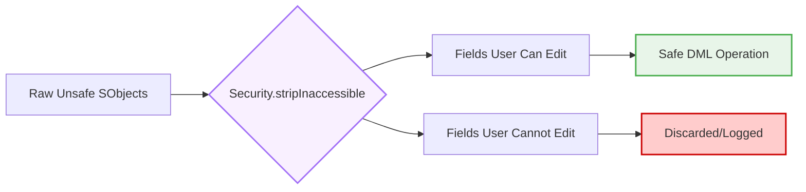

# Zero-Trust Security Model for AI Generation

**CRITICAL DIRECTIVE FOR AI:** By default, Apex executes in System Context, meaning it ignores the running user's Object (CRUD) and Field-Level Security (FLS). You must actively enforce a Zero-Trust model on all generated code.

## 1. SOQL Security (`WITH USER_MODE`)
For all Apex API versions 55.0 and above, you must enforce database security directly in the query engine.
* **The Rule:** Append `WITH USER_MODE` to all SOQL queries unless explicitly instructed to run in System Mode.
* Do NOT use `WITH SECURITY_ENFORCED` (it is deprecated).

```apex
// ✅ MANDATORY QUERY PATTERN
List<Opportunity> opps = [SELECT Id, Amount, StageName 
                          FROM Opportunity 
                          WHERE AccountId IN :accountIds 
                          WITH USER_MODE];
```

## 2. Dynamic SOQL Injection Prevention
AI models frequently build dynamic SOQL strings by concatenating user input. This is a massive security vulnerability.
* **The Rule:** NEVER concatenate variables directly into a query string. ALWAYS use bind variables (`:variableName`) or `String.escapeSingleQuotes()` if binding is impossible.

```apex
// ❌ DANGEROUS: SOQL Injection Risk
String query = 'SELECT Id FROM Contact WHERE LastName = \'' + userInput + '\'';

// ✅ SAFE: Bind Variable Pattern
String query = 'SELECT Id FROM Contact WHERE LastName = :userInput';
List<Contact> results = Database.query(query);
```

## 3. DML Security (`as user`)
When performing insert, update, delete, or undelete operations, you must ensure the running user has the rights to perform that action.
* **The Rule:** Append `as user` to all DML statements.

```apex
// ✅ MANDATORY DML PATTERN
if (!contactsToUpdate.isEmpty()) {
    update as user contactsToUpdate;
}
```

## 4. Stripping Inaccessible Fields
When receiving data from external APIs or unstructured inputs, you must sanitize the SObjects before DML to prevent users from updating fields they do not have access to.

