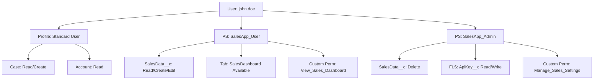

# Salesforce Permission and Sharing Skill

**Permission Sets, Custom Permissions, Org-Wide Defaults, sharing rules, role hierarchy, FLS, CRUD enforcement, and least-privilege design.**

## Core Principle

Least privilege always. Grant only what the user needs to do their job. Design sharing from the most restrictive OWD upward, then open up selectively via rules and Permission Sets.

**Reference:** [Well-Architected: Trusted](https://architect.salesforce.com/well-architected/trusted/secure)

---

## Profiles vs Permission Sets

**Profiles are frozen for access.** Salesforce is moving toward Permission Set-only. Only manage on Profiles:
- Default record types per object
- Page layouts per object
- Login hours and IP restrictions

**Everything access-related goes on Permission Sets:**
- Object CRUD
- Field-Level Security (FLS)
- App access
- System permissions (e.g. "Modify All Data")
- Custom Permissions

**Reference:** [Permission Sets vs Profiles](https://help.salesforce.com/s/articleView?id=sf.perm_sets_overview.htm)

### Permission Set Groups

Bundle related Permission Sets for a role:

```
Sales Rep PSG
  ├── Sales_App_User        (base CRM read access)
  ├── Sales_App_Editor      (create/edit leads and opportunities)
  └── Bypass_Flows_Integration  (for admin scripts and migrations)
```

### Naming

```
API name:  Sales_App_User           (PascalCase, descriptive)
Label:     Sales App User           (Title Case, audience-clear)
```

---

## Muting Permission Sets

Use Muting Permission Sets to remove specific permissions from a Permission Set Group without modifying the individual sets.

```
Sales Manager PSG
  ├── Sales_App_User       (includes Export Reports permission)
  ├── Sales_App_Manager
  └── [Muting PS]          mutes: Export Reports
```

```xml
<!-- permissionsets/Mute_Export_Reports.permissionset-meta.xml -->
<PermissionSet xmlns="http://soap.sforce.com/2006/04/metadata">
    <label>Mute Export Reports</label>
    <hasActivationRequired>false</hasActivationRequired>
    <mutingPermissions>
        <enabled>true</enabled>
        <name>ExportReport</name>
    </mutingPermissions>
</PermissionSet>
```

**Reference:** [Muting Permission Sets](https://help.salesforce.com/s/articleView?id=sf.perm_set_groups_muting.htm)

---

## Custom Permissions

Use Custom Permissions for feature flags and bypass logic -- not Profile fields or Custom Settings.

```xml
<!-- customPermissions/Bypass_Flows.customPermission-meta.xml -->
<CustomPermission>
    <description>Assign to integration or migration users to skip record-triggered Flow logic.</description>
    <label>Bypass Flows</label>
</CustomPermission>
```

**Bypass pattern in every record-triggered Flow (first element):**
```
Decision: "Check Bypass"
  IF {!$Permission.Bypass_Flows} = TRUE -> END
  ELSE -> Continue
```

**Bypass pattern in Apex trigger handlers:**
```apex
public void onBeforeInsert(List<Account> newRecords) {
    if (FeatureManagement.checkPermission('Bypass_Account_Trigger')) return;
    // logic here
}
```

**Reference:** [Custom Permissions](https://developer.salesforce.com/docs/atlas.en-us.apexcode.meta/apexcode/apex_custom_permissions.htm)

---

## Sharing Model -- Design from Most Restrictive

### Org-Wide Defaults (OWD)

Start most restrictive. You can always open up via rules -- locking down after data exists is dangerous.

| OWD Setting | Who Can See Records |
|---|---|
| Private | Owner + role hierarchy above owner only |
| Public Read Only | Everyone reads; only owner + hierarchy can edit |
| Public Read/Write | Everyone reads and edits |
| Controlled by Parent | Inherits from master-detail parent's OWD |

Rule of thumb:
- Sensitive objects (HR, financial, patient data): Private
- Collaborative objects (Accounts, Cases): Public Read Only
- Child objects in master-detail: Controlled by Parent

### External OWD (for Experience Cloud)

External OWD controls default access for community users independently from internal users:

```
Setup -> Sharing Settings -> External Org-Wide Defaults
  Object: Case
  Internal Default: Public Read Only
  External Default: Private
```

- External OWD can be equal to or more restrictive than internal OWD
- Never set External OWD to Public Read/Write on sensitive objects
- Customer Community users without roles rely on External OWD + Sharing Sets

### Sharing Rules

```
Criteria-based sharing rule:
  Object: Case
  Share with: Public Group -- Support_Agents
  Access: Read Only
  Criteria: Priority__c = 'High'
```

### Apex Managed Sharing

```apex
Case__Share share = new Case__Share(
    ParentId      = caseId,
    UserOrGroupId = targetUserId,
    AccessLevel   = 'Read',
    RowCause      = Schema.Case__Share.RowCause.Manual
);
insert share;
// use a custom RowCause for programmatic shares
// Manual RowCause shares are deleted when the record owner changes
```

**Reference:** [Apex Managed Sharing](https://developer.salesforce.com/docs/atlas.en-us.apexcode.meta/apexcode/apex_bulk_sharing_creating_with_apex.htm)

---

## FLS and CRUD Enforcement in Apex

FLS and CRUD are NOT auto-enforced in Apex. You must enforce them explicitly.

### CRUD Checks

```apex
if (!Schema.sObjectType.Account.isCreateable()) {
    throw new SecurityException('Insufficient privileges to create Account');
}
if (!Schema.sObjectType.Account.isUpdateable()) {
    throw new SecurityException('Insufficient privileges to update Account');
}
```

### FLS Checks

```apex
// WITH SECURITY_ENFORCED - throws if user can't read a queried field
List<Account> accs = [
    SELECT Id, Name, SSN__c FROM Account WITH SECURITY_ENFORCED
];

// Security.stripInaccessible - removes inaccessible fields instead of throwing
SObjectAccessDecision decision = Security.stripInaccessible(
    AccessType.READABLE,
    [SELECT Id, Name, SSN__c FROM Account]
);
List<Account> safeAccs = (List<Account>) decision.getRecords();
```

When to use which:
- `WITH SECURITY_ENFORCED` -- user context where missing fields should hard-fail
- `Security.stripInaccessible` -- return partial data, suppress inaccessible fields

---

## with sharing vs without sharing vs inherited sharing

```apex
// always default to with sharing
public with sharing class AccountService { }

// only when explicitly needed -- must document why
public without sharing class IntegrationService {
    // REASON: Inbound webhook creates records on behalf of integration user
    // who has no role. Approved: [architect name, date]
}

// preferred for selector/service layers called from both user and system contexts
public inherited sharing class AccountSelector {
    // shares the calling context -- user context from LWC Apex, system from Batch
}
```

---

## Permission Set Licenses (PSLs)

Permission Set Licenses are required for add-on products. Assign PSL before assigning the related Permission Set.

| Add-On Product | Permission Set License |
|---|---|
| Einstein Platform / AI | EinsteinGPTUserPsl |
| Agentforce / Copilot | EinsteinGPTUserPsl |
| Salesforce Field Service | FieldService |
| Salesforce CPQ | SalesforceCPQ |

---

## Guest User / Experience Cloud Security

Guest users are unauthenticated -- treat them as untrusted:
- OWD must be Private for all sensitive objects
- Guest profile: read-only access to only the objects they need
- All `@AuraEnabled` and `@RestResource` accessible to guest must use `with sharing`

**Never:**
- Grant "Modify All" or "View All" to the guest profile
- Expose internal record IDs in public URLs without access checks
- Use `without sharing` on classes callable from Experience Cloud

---

## Permission Set Metadata Template

```xml
<!-- permissionsets/Sales_App_User.permissionset-meta.xml -->
<PermissionSet xmlns="http://soap.sforce.com/2006/04/metadata">
    <label>Sales App User</label>
    <description>Base access for Sales App -- view accounts and opportunities.</description>

    <objectPermissions>
        <object>Opportunity</object>
        <allowCreate>false</allowCreate>
        <allowDelete>false</allowDelete>
        <allowEdit>false</allowEdit>
        <allowRead>true</allowRead>
        <modifyAllRecords>false</modifyAllRecords>
        <viewAllRecords>false</viewAllRecords>
    </objectPermissions>

    <fieldPermissions>
        <field>Opportunity.Amount</field>
        <readable>true</readable>
        <editable>false</editable>
    </fieldPermissions>

    <customPermissions>
        <enabled>false</enabled>
        <name>Bypass_Flows</name>
    </customPermissions>
</PermissionSet>
```

---

## Permission Hierarchy Diagram



---

## Permission Audit Commands

```bash
# list all permission sets in org
sf org list metadata --metadata-type PermissionSet --target-org <your-org-alias>

# retrieve a specific PS for review
sf project retrieve start --metadata PermissionSet:Sales_App_User --target-org <your-org-alias>

# check which users have a permission set assigned
sf data query --query "SELECT Assignee.Name FROM PermissionSetAssignment WHERE PermissionSet.Name = 'Sales_App_User'" --target-org <your-org-alias>
```

---

## Permission Design Checklist

- [ ] OWD set to most restrictive for each object
- [ ] External OWD reviewed for any object exposed to Experience Cloud users
- [ ] No new object/field permissions on Profiles -- use Permission Sets
- [ ] Custom Permissions created for trigger and Flow bypass (one per object)
- [ ] Every record-triggered Flow has a bypass decision at the top
- [ ] Every Apex trigger handler checks `FeatureManagement.checkPermission('Bypass_...')`
- [ ] All Apex classes declare `with sharing` or have documented exception
- [ ] All SOQL uses `WITH SECURITY_ENFORCED` or `Security.stripInaccessible()`
- [ ] All DML has explicit CRUD checks
- [ ] Guest profile has minimum permissions reviewed
- [ ] Permission Set names follow `PascalCase` API naming convention
- [ ] Muting Permission Sets used where PSG inherits unwanted permissions
- [ ] PSLs assigned before related Permission Sets

---

## Sources

- [Permission Sets Overview](https://help.salesforce.com/s/articleView?id=sf.perm_sets_overview.htm)
- [Permission Set Groups](https://help.salesforce.com/s/articleView?id=sf.perm_set_groups.htm)
- [Muting Permission Sets](https://help.salesforce.com/s/articleView?id=sf.perm_set_groups_muting.htm)
- [Custom Permissions](https://developer.salesforce.com/docs/atlas.en-us.apexcode.meta/apexcode/apex_custom_permissions.htm)
- [Org-Wide Sharing Defaults](https://help.salesforce.com/s/articleView?id=sf.sharing_model_fields.htm)
- [Sharing Rules](https://help.salesforce.com/s/articleView?id=sf.security_sharing_rules_manage.htm)
- [Apex Managed Sharing](https://developer.salesforce.com/docs/atlas.en-us.apexcode.meta/apexcode/apex_bulk_sharing_creating_with_apex.htm)
- [WITH SECURITY_ENFORCED](https://developer.salesforce.com/docs/atlas.en-us.apexcode.meta/apexcode/apex_classes_with_security_enforced.htm)
- [Guest User Security](https://help.salesforce.com/s/articleView?id=sf.networks_security_guest_user.htm)
- [Well-Architected: Trusted](https://architect.salesforce.com/well-architected/trusted/secure)
