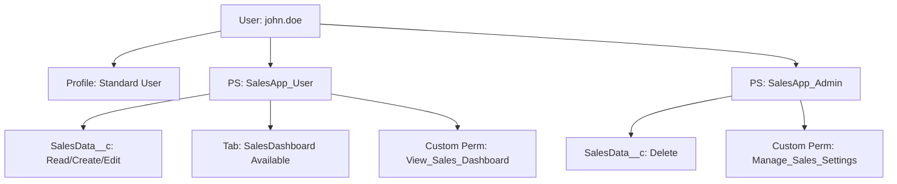

# Salesforce Permission and Sharing Skill

**Permission Sets, Custom Permissions, Org-Wide Defaults, sharing rules, role hierarchy, FLS, CRUD enforcement, and least-privilege design.**

## Core Principle

Least privilege always. Grant only what the user needs to do their job. Design sharing from the most restrictive OWD upward, then open up selectively via rules and Permission Sets.

---

## Profiles vs Permission Sets

**Profiles are frozen for access.** Only manage on Profiles:
- Default record types per object
- Page layouts per object
- Login hours and IP restrictions

**Everything access-related goes on Permission Sets:**
- Object CRUD
- Field-Level Security (FLS)
- App access
- System permissions
- Custom Permissions

### Permission Set Groups

```
Sales Rep PSG
  ├── Sales_App_User        (base CRM read access)
  ├── Sales_App_Editor      (create/edit leads and opportunities)
  └── Bypass_Flows_Integration
```

### Naming

```
API name:  Sales_App_User    (PascalCase)
Label:     Sales App User    (Title Case)
```

---

## Muting Permission Sets

Use to remove specific permissions from a Permission Set Group without modifying the individual sets.

```xml
<PermissionSet xmlns="http://soap.sforce.com/2006/04/metadata">
    <label>Mute Export Reports</label>
    <hasActivationRequired>false</hasActivationRequired>
    <mutingPermissions>
        <enabled>true</enabled>
        <name>ExportReport</name>
    </mutingPermissions>
</PermissionSet>
```

---

## Custom Permissions

Use for feature flags and bypass logic.

```xml
<CustomPermission>
    <description>Assign to integration or migration users to skip record-triggered Flow logic.</description>
    <label>Bypass Flows</label>
</CustomPermission>
```

Bypass pattern in every record-triggered Flow (first element):
```
Decision: "Check Bypass"
  IF {!$Permission.Bypass_Flows} = TRUE -> END
  ELSE -> Continue
```

Bypass pattern in Apex trigger handlers:
```apex
public void onBeforeInsert(List<Account> newRecords) {
    if (FeatureManagement.checkPermission('Bypass_Account_Trigger')) return;
    // logic here
}
```

---

## Sharing Model -- Design from Most Restrictive

### Org-Wide Defaults

| OWD Setting | Who Can See Records |
|---|---|
| Private | Owner + role hierarchy above owner only |
| Public Read Only | Everyone reads; only owner + hierarchy can edit |
| Public Read/Write | Everyone reads and edits |
| Controlled by Parent | Inherits from master-detail parent |

Rule of thumb:
- Sensitive objects (HR, financial, patient data): Private
- Collaborative objects (Accounts, Cases): Public Read Only
- Child objects in master-detail: Controlled by Parent

### External OWD (for Experience Cloud)

```
Setup -> Sharing Settings -> External Org-Wide Defaults
  Object: Case
  Internal Default: Public Read Only
  External Default: Private
```

### Apex Managed Sharing

```apex
Case__Share share = new Case__Share(
    ParentId      = caseId,
    UserOrGroupId = targetUserId,
    AccessLevel   = 'Read',
    RowCause      = Schema.Case__Share.RowCause.Manual
);
insert share;
```

---

## FLS and CRUD Enforcement in Apex

```apex
// CRUD checks
if (!Schema.sObjectType.Account.isCreateable()) {
    throw new SecurityException('Insufficient privileges to create Account');
}

// FLS - WITH SECURITY_ENFORCED (throws if user can't read a field)
List<Account> accs = [SELECT Id, Name, SSN__c FROM Account WITH SECURITY_ENFORCED];

// FLS - stripInaccessible (removes inaccessible fields instead of throwing)
SObjectAccessDecision decision = Security.stripInaccessible(
    AccessType.READABLE,
    [SELECT Id, Name, SSN__c FROM Account]
);
List<Account> safeAccs = (List<Account>) decision.getRecords();
```

---

## with sharing vs without sharing vs inherited sharing

```apex
// always default to with sharing
public with sharing class AccountService { }

// only when explicitly needed -- must document why
public without sharing class IntegrationService {
    // REASON: Inbound webhook - no user context available
    // Approved: [architect name, date]
}

// preferred for selector/service layers called from multiple contexts
public inherited sharing class AccountSelector { }
```

---

## Permission Set Metadata Template

```xml
<PermissionSet xmlns="http://soap.sforce.com/2006/04/metadata">
    <label>Sales App User</label>
    <description>Base access for Sales App.</description>

    <objectPermissions>
        <object>Opportunity</object>
        <allowCreate>false</allowCreate>
        <allowDelete>false</allowDelete>
        <allowEdit>false</allowEdit>
        <allowRead>true</allowRead>
        <modifyAllRecords>false</modifyAllRecords>
        <viewAllRecords>false</viewAllRecords>
    </objectPermissions>

    <fieldPermissions>
        <field>Opportunity.Amount</field>
        <readable>true</readable>
        <editable>false</editable>
    </fieldPermissions>

    <customPermissions>
        <enabled>false</enabled>
        <name>Bypass_Flows</name>
    </customPermissions>
</PermissionSet>
```

---

## Permission Hierarchy Diagram



---

## Permission Audit Commands

```bash
sf org list metadata --metadata-type PermissionSet --target-org <your-org-alias>
sf project retrieve start --metadata PermissionSet:Sales_App_User --target-org <your-org-alias>
sf data query --query "SELECT Assignee.Name FROM PermissionSetAssignment WHERE PermissionSet.Name = 'Sales_App_User'" --target-org <your-org-alias>
```

---

## Permission Design Checklist

- [ ] OWD set to most restrictive for each object
- [ ] External OWD reviewed for objects exposed to Experience Cloud
- [ ] No new access permissions on Profiles -- use Permission Sets
- [ ] Custom Permissions created for trigger and Flow bypass
- [ ] Every record-triggered Flow has a bypass decision at the top
- [ ] Every Apex trigger handler checks `FeatureManagement.checkPermission()`
- [ ] All Apex classes declare `with sharing` or have documented exception
- [ ] All SOQL uses `WITH SECURITY_ENFORCED` or `Security.stripInaccessible()`
- [ ] Guest profile has minimum permissions reviewed
- [ ] PSLs assigned before related Permission Sets

---

## Sources

- [Permission Sets Overview](https://help.salesforce.com/s/articleView?id=sf.perm_sets_overview.htm)
- [Permission Set Groups](https://help.salesforce.com/s/articleView?id=sf.perm_set_groups.htm)
- [Muting Permission Sets](https://help.salesforce.com/s/articleView?id=sf.perm_set_groups_muting.htm)
- [Custom Permissions](https://developer.salesforce.com/docs/atlas.en-us.apexcode.meta/apexcode/apex_custom_permissions.htm)
- [Org-Wide Sharing Defaults](https://help.salesforce.com/s/articleView?id=sf.sharing_model_fields.htm)
- [WITH SECURITY_ENFORCED](https://developer.salesforce.com/docs/atlas.en-us.apexcode.meta/apexcode/apex_classes_with_security_enforced.htm)
- [Guest User Security](https://help.salesforce.com/s/articleView?id=sf.networks_security_guest_user.htm)
- [Well-Architected: Trusted](https://architect.salesforce.com/well-architected/trusted/secure)
